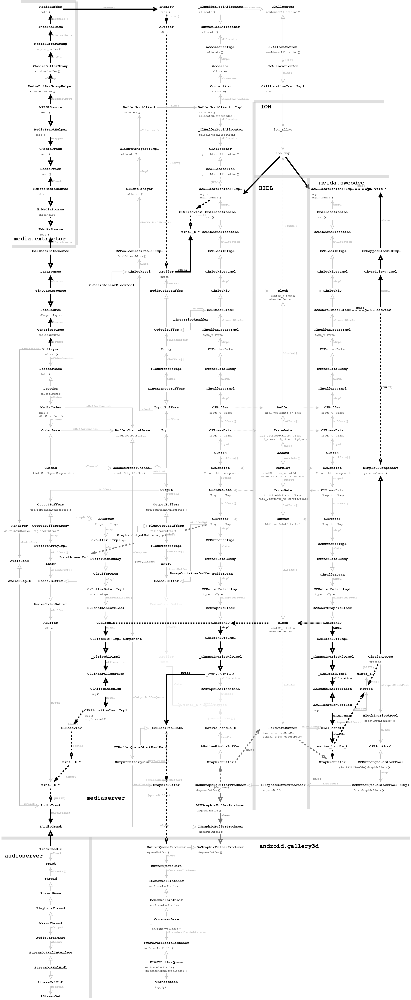

- [版本及环境说明](#版本及环境说明)
- [声明](#声明)
- [概念](#概念)
- [话术](#话术)
- [配图](#配图)
  - [基本调用流程](#基本调用流程)
  - [数据流转](#数据流转)
- [部分类的简要说明](#部分类的简要说明)
- [应用层的播放器`MediaPlayer`](#应用层的播放器mediaplayer)
  - [初始化](#初始化)
  - [设置数据源](#设置数据源)
    - [播放服务`MediaPlayerService`](#播放服务mediaplayerservice)
    - [播放服务中的播放器`NuPlayer`](#播放服务中的播放器nuplayer)
  - [播放器准备工作](#播放器准备工作)
    - [`MediaPlayerService`中数据源`IDataSource`的创建](#mediaplayerservice中数据源idatasource的创建)
    - [`MediaExtractorService`中数据源探测前的准备](#mediaextractorservice中数据源探测前的准备)
    - [数据源探测插件的加载](#数据源探测插件的加载)
    - [数据源的探测](#数据源的探测)
    - [媒体文件元数据信息`MetaData`的获取](#媒体文件元数据信息metadata的获取)
    - [媒体源`IMediaSource`](#媒体源imediasource)
      - [媒体源元数据的获取](#媒体源元数据的获取)
      - [媒体源数据组的创建](#媒体源数据组的创建)
      - [媒体源数据的读取](#媒体源数据的读取)
  - [播放器显示的设置](#播放器显示的设置)
  - [播放的开始](#播放的开始)
    - [`MediaCodec`解码器的创建及初始化](#mediacodec解码器的创建及初始化)
      - [`Codec 2`解码框架解码器`CCodec`](#codec-2解码框架解码器ccodec)
        - [`CCodec`的创建](#ccodec的创建)
        - [`CCodec`事件监听的注册](#ccodec事件监听的注册)
        - [`CCodec`的实例化](#ccodec的实例化)
        - [`CCodec`视频解码插件加载](#ccodec视频解码插件加载)
        - [`CCodec`视频解码组件`Component`的查找](#ccodec视频解码组件component的查找)
    - [`MediaCodec`的配置](#mediacodec的配置)
    - [`MediaCodec`的启动](#mediacodec的启动)
      - [`CCodec`的启动](#ccodec的启动)
      - [`CCodec`解码](#ccodec解码)
        - [编码数据缓存准备`C2LinearBlock`](#编码数据缓存准备c2linearblock)
        - [编码数据缓存的填充](#编码数据缓存的填充)
        - [解码工作描述`C2Work`以及编码数据描述`C2Buffer`的创建](#解码工作描述c2work以及编码数据描述c2buffer的创建)
        - [`media.swcodec`对解码工作的接收以及解码数据的获取](#mediaswcodec对解码工作的接收以及解码数据的获取)
        - [VPx视频解码](#vpx视频解码)
        - [视频解码图形缓存描述`C2GraphicBlock`的创建](#视频解码图形缓存描述c2graphicblock的创建)
        - [视频解码返回图形缓存](#视频解码返回图形缓存)
        - [图形缓存的接收](#图形缓存的接收)
    - [音频解码与视频解码的差异](#音频解码与视频解码的差异)
  - [音画同步](#音画同步)
  - [视频渲染](#视频渲染)
    - [`mediaserver`中的队列](#mediaserver中的队列)
    - [应用中的队列`BLASTBufferQueue`](#应用中的队列blastbufferqueue)
- [附录](#附录)
  - [`MediaPlayer`将收到的通知类型](#mediaplayer将收到的通知类型)
  - [`NuPlayer`接受底层的消息主要有以下集中类型](#nuplayer接受底层的消息主要有以下集中类型)
  - [部分举证](#部分举证)
    - [`IMediaExtractor`](#imediaextractor)
    - [`IMediaSource`](#imediasource)
    - [`C2GraphicBlock`](#c2graphicblock)

# 版本及环境说明
* `Android`源码版本:`android-12.0.0_r3`
* `Android`源码来源:`https://mirrors.tuna.tsinghua.edu.cn/git/AOSP/platform/manifest`
* `Android`源码编译配置: `aosp_crosshatch-userdebug`
* 设备型号: `Google Pixel 3 XL (crosshatch)`
* 设备驱动: [`SP1A.210812.016.A1`](https://developers.google.com/android/drivers/#crosshatchsp1a.210812.016.a1)
* 主机环境: `Ubuntu 22.04 LTS`

`Codeless`表示尽可能少的代码.

# 声明
* 本位所有的内容均为个人理解, **由于能力一般, 水平有限**, 文章中难免有疏漏及错误, 望体谅
* 为了求证大部分流程的正确性, 本文的撰写进行了一些繁琐的调试工作, 可以在[部分举证](#部分举证)中看到这部分内容, 但受限于篇幅, 本文未列出所有的调试细节
* 由于本文的所有的内容均来自`Android Open Source Project`的开源代码, 因此本文的内容也有以下原则:
  * 本文的内容可以任意的复制修改和分发, 包括本 `声明`
  * 本文的编写者不对本文的内容承担任何责任
  * 本文的内容可能随时更新

# 概念
媒体文件解码流程:
```
媒体文件 --> |--> 视频流 -> 解码 --|          | --> 视频渲染
            |                   |--> 同步 --|
            └--> 音频流 -> 解码 --|          | --> 音频渲染
```

媒体文件在 Android 系统回放时设计的进程:
```
media.extractor -> mediaserver --| --> |media.swcodec
                                 | <-- |
                                 | --> surfaceflinger
                                 | --> audioserver
```
至此已经掌握音视频所有的媒体文件播放流程了, 以下是正文

# 话术
* 引用: 指的是一个类通过一个指针指向另一个类
* 实例: 一个接口的实现, 一个具体的对象
* 实例化/例化: 创建一个类的具体对象

# 配图
## 基本调用流程
本文有些枯燥和乏味, 为了降低阅读难度, 在流程上, 特别准备了一张顺序图:  

## 数据流转
解码以及渲染过程中会涉及一些数据流转, 特别准备了一张类图:  


# 部分类的简要说明
* 运行于应用进程中:
  * `MediaPlayer`: 播放器, 泛指`Java`层和`Native(C++)`层的播放器
* 运行于`media.extractor`中
  * `MediaExtractorService`: 实现`IMediaExtractorService`接口, 对外提供创建解封装的接口
  * `DataSource`: 描述一个数据源头, 一个文件, 一个流等, 通常以`IDataSource`向外提供数据源的操作接口,有以有以下几种实现:
    * `DataURISource`
    * **`FileSource`**: 数据来自文件
    * `HTTPBase`: 数据来自`HTTP`链接
    * `NuCachedSource2`
  * `MediaExtractor`: 表示一个解封装器, 其通过`IMediaExtractor`的实现`RemoteMediaExtractor`对外提供服务,, 其子类实现为`MediaExtractorCUnwrapper`, 这是一个`CMediaExtractor`的`Wrapper`, 该类其实是`MPEG4Extractor`对外的抽象
  * `MediaTrack`: 表示一个未解码的流, 通常以`IMediaSource`的实现`RemoteMediaSource`对外提供接口, 其子类实现为`MediaTrackCUnwrapper`, 这是一个`CMediaTrack`的`Wrapper`, 该类其实是`MPEG4Source`对外的抽象
* 运行于`mediaserver`进程中
  * `MediaPlayerService`: 播放器服务, 运行在`mediaserver`中, 以`IMediaPlayerService`接口提供服务
  * `MediaPlayerService::Client`: 每个请求播放器服务的进程在`MediaPlayerService`中的描述
  * `MediaPlayerFactory`: 用于创建播放器实例的工厂类, 它负责通过实现`IFactory`接口的工厂类创建播放器
  * `NuPlayerFactory`: `NuPlayerDriver`的工厂类
  * `NuPlayerDriver`: 播放器实例的驱动类, 负责部分同步操作到`NuPlayer`异步的转换
  * `NuPlayer`: `MediaPlayerService`中实际的播放器实例, 负责完成播放相关的大部分异步操作
  * `NuPlayer::Source`: 表示一个来源, 来源可能有很多种:
    * **`NuPlayer::GenericSource`**: 来源是本地文件, 其引用:
      * `TinyCacheSource`: 通过`TinyCacheSource`(`DataSource`)::`mSource` -> `CallbackDataSource`(`DataSource`)访问`IDataSource`接口
      * `IMediaSource`: 被成员`mVideoSource`和`mAudioSource`所引用
    * `NuPlayer::StreamingSource`: 来源是一个流
    * `NuPlayer::HTTPLiveSource`: 来源是一个`HTTP`直播流
    * `NuPlayer::RTSPSource`: 来源是一个`RTSP`流
    * `NuPlayer::RTPSource`: 来源是一个`RTP`流
  * `NuPlayer::Decoder`: `NuPlayer`的解码器对象, 有`NuPlayer::Decoder`和`NuPlayer::DecoderPassThrough`两种实现, 本例只关注前者
  * `MediaCodec`: 实际的解码器接口, 其负责将部分上层的同步操作转换为异步操作, 其引用一个`CodecBase`
  * `CodecBase`: 表示一个解码器实例, 其引用一个`CodecBase`, 通常有`ACodec`, `CCodec`, `MediaFilter`几种实现:
    * **`CCodec`**: 采用 Codec 2 框架的解码器实现
    * `ACodec`: 采用 OMX 框架的解码器实现
  * `CodecCallback`: 用于响应解码器的消息, 由``CodecBas`的实现
  * `BufferCallback`: 用于响应缓冲区队列的消息, 由`BufferChannelBase`的实现回调该接口
  * `BufferChannelBase`: 负责处理所有解码相关的输入输出缓冲区队列管理, 其有两个实现
    * **`CCodecBufferChannel`**: Codec 2 框架实现缓冲区管理的实现
    * `ACodecBufferChannel`: OMX 框架实现缓冲区管理的实现
  * `MediaCodecBuffer`用于描述一个解码器使用的缓冲区, 其有几种扩展实现
    * **`Codec2Buffer`** Codec 2 框架下的缓冲区描述, 该类有多种实现:
      * `LocalLinearBuffer`: 本地线性缓存, 可写入
      * **`DummyContainerBuffer`**: 空缓存, 在解码器没有配置`Surface`且应用试图获取数据时返回空缓存
      * `LinearBlockBuffer`: 可写入的线性块缓存, 一般提供一个写入视图`C2WriteView`, 同样引用一个线性数据块`C2LinearBlock`(父类为`C2Block1D`)
      * **`ConstLinearBlockBuffer`**: 只读的线性块缓存, 一般提供一个读取试图`C2ReadView`, 同样引用一个`C2Buffer`(子类为`LinearBuffer`)作为缓冲区的描述
      * `GraphicBlockBuffer`: 图形数据块缓存描述, 一般提供一个视图`C2GraphicView`(用于写入), 同样引用一个`C2GraphicBlock`(父类为`C2Block2D`)
      * `GraphicMetadataBuffer`: 图形元数据数据块, 
      * `ConstGraphicBlockBuffer`: 只读图形数据块, 其提供一个视图`C2GraphicView`(用于读取), 同样引用一个`C2Buffer`或`ABuffer`
      * `EncryptedLinearBlockBuffer`: 加密线性数据块
    * `SharedMemoryBuffer`: 共享内存方式
    * `SecureBuffer`: 安全缓冲区
  * `Codec2Client`: 负责通过`HIDL`完成到 Codec 2 解码组件库所在进程`meida.codec`或`media.swcodec`的各种请求
  * `Codec2Client::Component`: 负责通过`HIDL`完成到 Codec 2 解码组件库所在进程`meida.codec`或`media.swcodec`的各种请求
  * `Codec2Client::Interface`: 为组建接口, 其引用一个远程的`IComponentInterface`接口, 它集成自`Codec2Client::Configurable`, 意为可配置
  * `Codec2Client::Listener`: 负责监听来自组件`HIDL`接口的消息, 其有一个实现`CCodec::ClientListener`, 负责通知`CCodec`
  * `Component::HidlListener`: 负责监听来自组件的消息, 其实现了`IComponentListener`接口, 有消息产生后通过`Codec2Client::Listener`通知`CCodec`
  * `Renderer`: 渲染器
  * `NuPlayerAudioSink`: 音频输出, 其实现: `AudioOutput`
  * `AudioTrack`: 音频输出流, 通过`IAudioTrack`访问`audioserver`中的`TrackHandle`
* 运行于`media.swcodec`中(本文以软解为例)
  * `ComponentStore`: 组件库, 运行与`media.codec`和`media.swcodec`两个进程, 通过`IComponentStore`接口提供 Codec 2 框架的解码器实现
  * `android::hardware::media::c1::V1_2::Component`为 CCodec 2 框架解码器组件对于`HIDL`的实现, 其通过`IComponent`向其它进程的`Codec2Client::Component`提供服务, 后端实现为`C2Component`
  * `C2Component`为 CCodec 2 框架解码器组的实现, 其有多种具体的实现:
    * `V4L2DecodeComponent`: `V4L2`解码组件
    * `V4L2EncodeComponent`: `V4L2`编码组件
    * **`SimpleC2Component`**: Google 实现的软解组件, 简单列出几种实现:
      * 视频
        * `C2SoftAvcDec`
        * `C2SoftHevcDec`
        * **`C2SoftVpxDec`**
      * 音频
        * `C2SoftFlacDec`
        * **`C2SoftAacDec`**
    * `SampleToneMappingFilter`: ??
    * `WrappedDecoder`: ??
  * `android::hardware::media::c1::V1_2::utils::ComponentInterface`: 组件接口类, 负责描述一个 Codec 2 组件的各种信息, 其通过`IComponentInterface`向对端(`Codec2Client`)提供查询服务, 该接口类也被`Component`所引用, 后端实现为`C2ComponentInterface`
  * `C2Component::Listener`: 为组件中, 客户端的回调实现, 其持有一个`IComponentListener`接口, 用于通知客户端组件的消息, 其有一个实现: `Component::Listener`, 持有父类的`IComponentListener`接口
* Codec 2 框架中的工作类
  * `C2Work`: 表示一个解码工作(播放器中)
  * `C2FrameData`: 表示一个帧的数据, 其中有一组`C2Buffer`
  * `C2Buffer`: 一个缓冲区的描述, 其包含其数据的描述`C2BufferData`
  * `C2BufferData`: 描述一个缓冲区的数据, 以及它包含的块`C2Block[1|2]D`
  * `C2Block1D`: 描述一个一维的缓冲区, 有如下实现:
    * **`C2LinearBlock`**: 可写一个线性缓冲区
    * `C2ConstLinearBlock`: 只读线性缓冲区
    * **`C2CircularBlock`**: 环形缓冲区(环形缓冲区是"首尾相接"的线性缓冲区)
  * `C2Block2D`: 描述一个二维的缓冲区有如下实现:
    * **`C2GraphicBlock`**: 描述一个二维图形缓冲区
    * `C2ConstGraphicBlock`: 描述一个只读的图形缓冲区(本例不涉及)

# 应用层的播放器`MediaPlayer`
## 初始化
`MediaPlayer`(Java)对象有自己的本地方法, 其位于`frameworks/base/media/jni/android_media_MediaPlayer.cpp`中, 这些方法均以`android_media_MediaPlayer_`开头, 因此`"native_init"`对应`android_media_MediaPlayer_native_init()`.

`MediaPlayer`在构造时会做两件事情:
* 在加载`libmedia_jni.so`并执行`native_init()`, 这个步骤只获取`MediaPlayer`类相关的一些信息, 并不会初始化 C++ 对象
* 其`native`方法`native_setup()`接下来被调用, 这个步骤负责实例化一个`MediaPlayer`(C++)类, 并生成一个集成自`MediaPlayerListener`的`JNIMediaPlayerListener`用于监听来自播放器的消息. 新创建的`MediaPlayer`(C++)对象将被保存在`MediaPlayer`(Java)的`mNativeContext`中用于后续的下行调用.

`MediaPlayer`的初始化比较简单, 只有设置数据源之后才能开始 解封装 / 解码 / 渲染 等的工作.

## 设置数据源
数据源是媒体的数据来源, 可能来自一个文件, 可能来自一个网络流. 媒体源是数据源中的一个未解码的流, 例如视频流 / 音频流 / 字幕流等.
在 Android Multimedia中主要以`IMediaSource`接口体现(和`MediaSource`不同, `MediaSource`用于描述一个未编码的媒体流). 该类别通常针对一个具体的类型, 比如一个符合`VP9`编码规范的数据源, 从该数据源读取的数据应是编码过的数据.  
通常一个媒体文件中会包含很多个部分:
* 视频: 通常是指定的编码格式, 如: `VP9`, `H264`, `H265` 等
* 音频: 可能存在多条音轨, 每条音轨的编码不同, 可能的有`PCM`, `G711`, `FLAC`, `APE`, `AAC`等
* 字幕: 多语言字母等

以上信息都会经过具体的封装格式进行封装, 例如常见的`MP4`, 本文的视频封装以及音视频编码参考信息:
```
  Metadata:
    major_brand     : isom
    minor_version   : 512
    compatible_brands: isomiso2mp41
    encoder         : Lavf58.29.100
  Duration: 00:00:01.75, start: 0.000000, bitrate: 291 kb/s
    Stream #0:0(eng): Video: vp9 (Profile 0) (vp09 / 0x39307076), yuv420p(tv, progressive), 1080x1920, 216 kb/s, 30.13 fps, 30.13 tbr, 90k tbn, 90k tbc (default)
    Metadata:
      handler_name    : VideoHandle
    Stream #0:1(eng): Audio: aac (LC) (mp4a / 0x6134706D), 48000 Hz, mono, fltp, 73 kb/s (default)
    Metadata:
      handler_name    : SoundHandle
```
接下来播放器要通过`MeidaExtractor`(最终的工作位于`media.extractor`中)找到响应的数据源. 那么首先从封装信息中确定音视频`Track`数量, 其对应的编码格式, 然后再根据每条具体的`Track`构造`IMediaSource`(媒体源).

`MediaPlayer.setDataSource`的Java部分过程比较复杂, 涉及`ContentResolver`, 本文不讨论, 对于本地文件, 其最终配置到底层的`android_media_MediaPlayer_setDataSourceFD()` -> `MediaPlayer::setDataSource(int fd,...)`, 此时一个问题出现了:  
`MediaPlayer`是本地播放的么? 并不是, 它请求远程服务完成播放, 执行播放任务的是`MediaPlayerService`, 该服务运行在`mediaserver`中, 那么`mediaserver`中构造的播放器是什么? 接下来一起看看`MediaPlayer::setDataSource(int fd,...)`时发生了什么? 首先我们需要了解一个重要的服务: `MediaPlayerService`.

### 播放服务`MediaPlayerService`
`mediaserver`创建`IMediaPlayerService`接口的`MediaPlayerService`实现, 该类将处理来自`MediaPlayer`的请求. 在`MediaPlayerService`创建时, 会注册多个`MediaPlayerFactory::IFactory`实现, 目前主要有两种:
* `NuPlayerFactory`: 主要的工厂类, 用于创建播放器实例: `NuPlayerDriver`, 其更底层的实现是`NuPlayer`
* `TestPlayerFactory`: 测试目的, 不关注
**注:**: 以前的版本还有一种`AwesomePlayer`(被`stagefrightplayer`封装), 已经过时了.

`MediaPlayer`设置数据源之前要先完成实际的播放器实例的创建, 它通过`IMediaPlayerService`接口向`MediaPlayerService`服务申请创建播放器, 创建播放器后, 本地的`MediaPlayer`将通过`IMediaPlayer`接口引用服务器为其创建的播放器实例. 显然该`Client`实现了`BnMediaPlayer`并在创建后返回给应用, 它将作为一个引用传递给`MediaPlayer`并作为后续所有的请求的代理, `setDataSource()`也在其中.

`MediaPlayerService`要具备通知`MediaPlayer`的能力才行, 后者实现了`BnMediaPlayerClient`, 将通过`IMediaPlayerClient`在创建`Client`时被设置在`Client`的`mClient`中

在创建`Client`是也创建了`MediaPlayerService::Listener`, 该类是继承自`MediaPlayerBase::Listener`, 显然该`Listener`将负责从底层的`MediaPlayerBase`监听播放时的各种消息, 从这里, 也知道了在`MediaPlayerService`中, 负责播放任务的实现是集成自`MediaPlayerBase`的, 本例中的继承: `MediaPlayerBase` -> `MediaPlayerInterface` -> `NuPlayerDriver`, `Listener`本身持有了`Client`的引用, 因此`Listener::notify()`将通知到`Client::notify()`, 而这时调用上文的`MediaPlayerService::Listener`的`notify()`将完成通过`IMediaPlayerClient`完成对对端`MediaPlayer`的通知(见附录: `MediaPlayer`将收到的通知类型).  

### 播放服务中的播放器`NuPlayer`
`Client`负责响应来自`MediaPlayer`的请请求, 现在`Client`已经创建, `MediaPlayer`该通过`IMediaPlayer`接口通过它发起`setDataSource()`操作了, 这里分两个步骤:
* 设置数据源需要创建实际的播放器: `NuPlayerDriver`
* 对`NuPlayerDriver`执行`setDataSource()`

创建播放器的实例`NuPlayerDriver`, 这将在`MediaPlayerService::Client`响应`createPlayer()`消息时通过`MediaPlayerFactory::createPlayer()`静态方法从`NuPlayerFactory`构建.  

此时创建的是`NuPlayerDriver`, 但该类会马上创建`NuPlayer`类.
`NuPlayer`后续则会通过`MediaPlayerService::Client` -> `NuPlayerDriver`响应来自应用中`MediaPlayer`的很多事件. 

因此`NuPlayer`最终完成所有播放请求, 请求的类型很多,我们只讨论传统本地视频文件的播放,关注以下几种类型:
* `kWhatSetDataSource`: 设置数据源头  
  对应`MediaPlayer.setDataSource()`, 支持各种各样的数据源, 例如: URI/文件/数据源等等
* `kWhatPrepare`: 准备播放器
  对应`MediaPlayer.prepare()`
* `kWhatSetVideoSurface`: 设置视频输出
  对应`MediaPlayer.setDisplay()`或者`MediaPlayer.setSurface()`, 它们的参数不同
* `kWhatStart`: 开始播放
  对应`MediaPlayer.start()`
* `kWhatSeek`: seek操作
* 对应`MediaPlayer.seekTo()`, 该方法可以设置`seek`(跳转到)的方式, `seek`时需要的参数:
  * `"seekTimeUs"`: `seek`的目标事件, 单位`us`
  * `"mode"`: `seek`的模式(向前/向后/最近等)
  * `"needNotify"`: 是否需要通知上层, 如果需要, `NuPlayer`将通过父类`MediaPlayerInterface`的`sendEvent()`方法通知上层.
* `kWhatPause`: 暂停操作
* `kWhatResume`: 恢复播放

`NuPlayer`不但需要负责完成各种下行的控制, 还要通过`AMessage`响应来自底层的一系列消息(见附录).  

`NuPlayer`在创建完成后会保存在`NuPlayerDriver`的`mPlayer`中, 而`NuPlayerDriver`作为`MediaPlayerInterface`(父类`MediaPlayerBase`)被`Client`的`mPlayer`引用, 因此总结

下行整体的调用流程:  
`MediaPlayer`(Java) -> `MediaPlayer`(C++) --[`binder`]--> [`IMediaPlayer` => `MediaPlayerService::Client`] -> `NuPlayerDriver` -> `NuPlayer`

上行消息流程:  
`NuPlayer` -> [`MediaPlayerBase::Listener` => `MediaPlayerService::Client::Listener`] -> `MediaPlayerService::Client` --[`binder`]--> [`IMediaPlayerClient` => `MediaPlayer`] -> [`MediaPlayerListener` => `JNIMediaPlayerListener`] -> `MediaPlayer`(Java)

后续所有的流程将按照总结的过程默认, 有特殊情况再进行标记.

`NuPlayer::setDataSourceAsync(int fd, ...)`在(`NuPlayer::setDataSourceAsync(int fd, ...)`被转换为异步处理)如何处理接下来的工作呢?, 数据类型如果是文件文件描述符, 则创建`GenericSource`(实现自:`NuPlayer::Source`), 除了该类型, 对于`NuPlayer::Source`还有几种主要类型:
    * `StreamingSource`
    * `HTTPLiveSource`
    * `RTSPSource`
    * `RTPSource`
    * **`GenericSource`** 

对于本地文件的简单情形, `GenericSource`创建后直接配置数据源就可以了, 数据源被创建后是否开始解析数据文件呢? 没有, 这部分工作将在`MediaPlayer.prepare()`时开始.

## 播放器准备工作
`MediaPlayer.prepare(...)`最终都是通过`MediaPlayer::prepare()`完成工作的, 而最后也都是通过`MediaPlayer::prepareAsync_l()` --[Binder]--> `Client::prepareAsync()` -> `NuPlayerDriver::prepareAsync()` -> `NuPlayer::prepareAsync()`, 既然是异步, 所以`NuPlayer`给自己的异步线程发送了`kWhatPrepare`消息, 上文说到, `GenericSource`不会开始解析文件, 知道`prepare()`开始, 此处`NuPlayer`也确实在`prepare()`时只调用了`GenericSource::prepareAsync()`, 同样`GenericSource`通过`kWhatPrepareAsync`异步处理这个消息.

### `MediaPlayerService`中数据源`IDataSource`的创建
Android 中, 原则上都是通过`MediaExtractorService`处理, `MediaExtractorService`运行在`media.extractor`进程中, 其通过`IMediaExtractorService`为其它进程提供服务. 

需求方`GenericSource`通过`IMediaExtractorService::makeIDataSource()`请求创建数据源, 提供了文件描述符, `MediaExtractorService`通过工厂类`DataSourceFactory`完成从文件描述符到`DataSource`的创建, 但`DataSource`本身**不是**继承自`IDataSource`接口, 无法为需求方提供服务, 因此`DataSource`最终还是要通过`RemoteDataSource`, 而`RemoteDataSource`继承自`BnDataSource`响应后续对端的请求. 对于本地文件`DataSourceFactory`创建的`DataSource`是`FileSource`.

`IDataSource`接口通过`Binder`从`MediaExtractorService`返回给应用后通过`TinyCacheSource`(`DataSource`)::`mSource` -> `CallbackDataSource`(`DataSource`)::`mIDataSource`引用. 

### `MediaExtractorService`中数据源探测前的准备
数据源有了, 那么需要从数据源中接封装出媒体流, 它可能是音频/视频/字幕等, 这个过程需要 对数据源中的数据进行解封装, 找到各种媒体数据所对应的流, `MediaExtractorFactory::Create()`仍然是本地工作的, 它负责通过`IMediaExtractorService::makeExtractor()`向`MediaExtractorService`请求创建`IMediaExtractor`过程, 对应的服务端实现是:`MediaExtractorService::makeExtractor()`. 

但是这这个过程中, 上文的`TinyCacheDataSource`作为`DataSource`通过`CreateIDataSourceFromDataSource()`转换成了`IDataSource`接口的`RemoteDataSource`又发回给`MediaExtracotrService`了?

**不是的**, 在`RemoteDataSource::wrap()`不一定创建实现新的`IDataSource`的`RemoeDataSource`, 如果传入的`DataSource`本身及持有`IDataSource`, 那就直接返回了, 没有重新创建的必要, 所以返回的仍然是`TinyCacheSource`(`DataSource`)::`mSource` -> `CallbackDataSource`(`DataSource`)::`mIDataSource`所保存的来自`MediaExtractor`的`IMediaSource`.

请求发给服务端`MediaExtractorService`, 又会被如何处理呢? 这里仍然是通过`CreateDataSourceFromIDataSource()`创建了本地的`DataSource`, 这和上文应用中的操作完全一样? 是的, 完全一样, 最后本地曾经创建过的`RemoteDataSource`(`IDataSource`接口)也是被`MediaExtractorService`本地的`TinyCacheSource`(`DataSource`)::`mSource` -> `CallbackDataSource`(`DataSource`)::`mIDataSource`所引用.  

`MediaExtractorService`将通过`MediaExtractorFactory`的`CreateFromService()`方法完成`MediaExtractor`的创建, 从名字可以看到创建自服务端, 和上文`MediaExtractorFactory::Create()`不一样了. 

创建具体的`MediaExtractor`之前, 需要从`DataSource`中读取一些数据, 然后对读取到的数据机型探测. 在继续之前先了解`Extractor`的插件加载.

### 数据源探测插件的加载
`media.extractor`在启动时, 创建`MediaExtractorService`服务, `MediaExtractorService`实例化是通过`MediaExtractorFactory::LoadExtractors()`装载插件.

`MediaExtractorFactory`首先通过`RegisterExtractors()`, 它完成单个路径下的所有插件的加载, 例如`"/apex/com.android.media/lib64/extractors/"`, 通常情况下形如`lib[aac|amr|flac||midi|mkv|mp3|mp4|mpeg2|ogg|wav]extractor.so`, 对于本例, 关注`libmp4extractor.so`, 首先从动态库中寻找`"GETEXTRACTORDEF"`符号, 因此`getDef()`就是`GETEXTRACTORDEF`函数, 函数被调用后, 返回一个`ExtractorDef`被用于构造`ExtractorPlugin`, `ExtractorPlugin::def`将在上文提到的`sniff()`函数中被获取. 而`RegisterExtractor()`为插件的注册. 最终插件的`MPEG4Extractor.cpp:Sniff()`函数将保存在:`MediaService::gPlugins[...].m_ptr.def.u.v3.sniff`中等待后续被调用.

### 数据源的探测
`MediaExtractorFactory::CreateFromService()`通过`sniff()`函数主要完成`DataSource`中流媒体文件格式的探测工作, 这将调用上文的`MPEG4Extractor.cpp:Sniff()`, 如果`MPEG4Extractor.cpp:Sniff()`判定为是自己能解析的格式, 则返回`MPEG4Extractor.cpp:CreateExtractor()`用于后续接封装器的创建. `MediaExtractorFactory::CreateFromService()`中, `((CreatorFunc)creator)(source->wrap(), meta)`将调用该函数. 该函数创建解封装器之前, `TinyCacheSource`通过其父类`DataSource`被`wrap()`成了`CDataSource`, 其被`DataSourceHelper`引用, 供`MPEG4Extractor`创建时使用. `MPEG4Extractor`在被构造后, 也通过父类`MediaExtractorPluginHelper`的`wrap()`包装为`CMediaExtractor`给`MediaExtractorFactory`进一步封装为`MediaExtractorCUnwrapper`(父类`MediaExtractor`), 而`MediaExtractorCUnwrapper`最终通过`RemoteMediaExtractor`包装, 最后作为`IMediaExtractor`返回给`mediaserver`

总结:  
`TinyDataSource`被设置到了:`MediaExtractorService::makeExtractor()`中的`extractor->mExtractor->plugin->data->mDataSource->mSource->handle`

其中:  
* `extractor`: `IMediaExtractor` -> `RemoteMediaExtractor`
* `extractor->mExtractor`: `MediaExtractor` -> `MediaExtractorCUnwrapper`
* `extractor->mExtractor->plugin`: `CMediaExtractor`
* `extractor->mExtractor->plugin->data`: `void *` -> `MediaExtractorPluginHelper` -> `MPEG4Extractor`
* `extractor->mExtractor->plugin->data->mDataSource`: `DataSourceHelper`
* `extractor->mExtractor->plugin->data->mDataSource->mSource`: `CDataSource`
* `extractor->mExtractor->plugin->data->mDataSource->mSource->handle`: `DataSource` -> `TinyDataSource`

### 媒体文件元数据信息`MetaData`的获取
解封装器`IMediaExtractor`返回给`MediaPlayerService`后, 可以开始获取元数据了, 包括有多少条Track等等, `IMediaExtractor::getMetaData()`负责完成到`RemoteMediaExtractor`的请求. 

`MPEG4Extractor::readMetaData()`比较复杂, 放弃分析, 该函数负责将获取到的元数据保存在`MPEG4Extracotr`的`mFileMetaData`(类型为`AMediaFormat`)成员中, 该信息将在`MPEG4Extractor::getMetaData)`函数中通过`AMediaFormat_copy()`方法拷贝到调用方`MediaExtractorCUnwrapper::getMetaData()`的临时变量`format`中.

在`MediaExtractorCUnwrapper::getMetaData()`函数中, 获取到的`AMediaFormat`需要通过`convertMessageToMetaData()`函数转化到`MetaData`类型, 此处过程较长, 本文不分析.

`MetaData`通过`binder`返回给`mediaserver`时是通过``MetaDataBase::writeToParcel()完成序列化的, 不文也不分析该过程.

获取元数据后, 获取`Track`的数量, 通过接口`IMediaExtractor::countTracks()`完成请求, 这里略去.

### 媒体源`IMediaSource`
`Track`的获取通过如下过程: `IMediaExtractor::getTrack(size_t index)` --[Binder]--> `RemoteMediaExtractor::getTrack()` -> `MediaExtractorCUnwrapper::getTrack()` -> `MPEG4Extractor::getTrack()`, 此时`MPEG4Source`被创建, 其实现是`MediaTrackHelper`, 类似的, 它也通过`MediaTrackHelper::wrap()`被包装为`CMediaTrack`, 由`MediaTrackCUnwrapper`引用, 而`MediaTrackCUnwrapper`被`RemoteMediaSource`引用, `RemoteMediaSource`作为`IMediaSource`返回给`MediaPlayerService`, 该过程和上文返回`IMediaExtractor`的过程是一样的.

总结:  
`MPEG4Source`作为`MediaTrackHelper`被设置在: `RemoteMediaSource.mTrack->wrapper->data`, 其中:
* `RemoteMediaSource.mTrack`: `MediaTrackCUnwrapper`
* `RemoteMediaSource.mTrack->wrapper`: `CMediaTrack`
* `RemoteMediaSource.mTrack->wrapper->data`: `MediaTrackHelper` -> `MPEG4Source`

#### 媒体源元数据的获取
媒体元也有源数据信息, 标记了该媒体源的编码类型等: 通过接口`IMediaExtractor::getTrackMetaData()`完成请求.

最后`IMediaSource`被保存到`GenericSource`的`mVideoSource`或者`mAudioSource`(类型为`GenericSource::Tracks`)的`mSource`成员中, 后续将用于音频/视频流数据的获取.

#### 媒体源数据组的创建
当`GenericSource`的准备工作完成后, 相应的媒体源也已经获取到, 则开始这些媒体源的工作, 这是会创建一个`BufferGroup`, 用户缓冲数据等, 调用的顺序: `GenericSource::startSources()` --[Binder]-> `IMediaSource::startSources()` => `RemoteMediaSource::start()` -> `MediaTrackCUnwrapper::start()` -> `MediaBufferGroup::MediaBufferGroup()` -> `CMediaBufferGroup::CMediaBufferGroup()`, 在媒体源开始后, `CMediaBufferGroup`完成对`MediaBufferGroupHelper`的创建.

总结:  
* `MPEG4Source.mBufferGroup`: `MediaBufferGroupHelper`
* `MPEG4Source.mBufferGroup->mGroup`: `CMediaBufferGroup`
* `MPEG4Source.mBufferGroup->mGroup->handle` : `MediaBufferGroup`

#### 媒体源数据的读取
媒体源开始工作后, `GenericSource`即刻开始从媒体源读取数据.该读取过程是异步的, `GenericSource`给其异步线程发送了`kWhatReadBuffer`消息, 异步线程读取数据的调用过程为: `GenericSource::onReadBuffer()` -> `GenericSource::readBuffer()` -> `IMediaSource::readMultiple()` --[Binder]--> `BnMediaSource::onTransact()` => `RemoteMediaSource::read()` -> `MediaTrackCUnwrapper::read()` -> `MPEG4Source::read()` -> `MediaBufferGroupHelper::acquire_buffer()` -> `MediaBufferGroup::acquire_buffer()` -> `MediaBuffer::MediaBuffer()` -> `MemoryDealer::allocate()`.

上述过程, `MediaBuffer`根据其`size`的要求, 自行确定了是否使用**共享内存**的方式创建, 创建完成后, 数据指针被保存到其自身的`mData`成员中, 创建完成后`MediaBuffer`被封装到`newHelper->mBuffer->handle`中返回给上层
在`CMediaBufferGroup::acquire_buffer()`中, `newHelper`:
`newHelper`: `MediaBufferHelper`
`newHelper->mBuffer`: `CMediaBuffer`
`newHelper->mBuffer->handle`: `MediaBufferBase` -> `MediaBuffer`  

对于上述过程的最后一个函数, 也就是`MediaBufferGroup::acquire_buffer()`中, 只有`for (auto it = mInternal->mBuffers.begin(); it != mInternal->mBuffers.end(); ++it)`没有找到合适的`buffer`, 才会申请新的`buffer`

至此, 可以知道`mediaserver`所获取到的数据结构即`MediaBufferBase`

`BnMediaSource::onTransact()`是循环通过`RemoteMediaSource::read()`读取到`MediaBuffer`的, 读取后判断解析出来的`MediaBuffer`, 分两种情况:
* `MediaBuffer`能用`binder`传递, 直接到最后一个`else`的位置通过`reply->writeByteArray()`写入数据到`binder`
* `MediaBuffer`不能通过`binder`传递, 这里又分两种情况:
  * 返回的`MediaBuffer`未使用共享内存, 此时抱怨一下, 然后从`RemoteMediaSource`的父类`BnMediaSource`所持有的`MediaBufferGroup`中分配一个共享内存的`MediaBuffer`, 然后获取解码器返回的数据, 拷贝到新分配的共享内存中
  * 返回的`MediaBuffer`使用的为共享内存, 则直接向后传递, 传递到后面, 如果是共享内存还分两种情况:
    * 共享内存形式的`MediaBuffer`中的`IMemory`是否有缓存在`BnMediaSource`的`mIndexCache`(类型为`IndexCache`)中, 如果没有, `mIndexCache.lookup()`返回的`index`就是`0`, 所以插入到缓存当中, 等待后续获取.

所以, 最终返回给`MediaPlayerService`的数据可能是`ABuffer`也可能是`IMemory`所创建的`ABuffer`, 那我们看看`MediaPlayerService`读取数据完成后, 是如何通过`IMediaSource`的实现`BpMediaSource`处理的. 

`BpMediaSource`根据返回的类型判断, 如果是`IMemory`的缓冲, 则构造了`RemoteMediaBufferWrapper`(其继承关系:`RemoteMediaBufferWrapper` -> `MediaBuffer` -> `MediaBufferBase`), 如果是`ABuffer`的类型, 那就直接构造一个`ABuffer`.

但是最终`NuPlayer::GenericSource::readBuffer()`将通过`mediaBufferToABuffer()`从`MediaBufferBase`(类型可能为`RemoteMediaBufferWrapper`或者`MediaBuffer`)的`data()`返回的指针, 然后构造(注意**不是拷贝**)一个新的`ABuffer`, 并将`ABuffer`插入`GenericSource`的`track->mPackets`(音频/视频).

那么这些从`IMediaSource`中读取到的数据合适被读取呢? 它们将在`NuPlayer::Decoder::fetchInputData()`是, `NuPlayer::Decoder`通过`GenericSource::dequeueAccessUnit()`被提取.

## 播放器显示的设置
系统相册在播放视频时会创建一个`SurfaceView`, 该类在构造是通过其`Java`层: `updateSurface()` -> `createBlastSurfaceControls()`构造了`BLASTBufferQueue`类, 此时会触发`Native`层构造`BLASTBufferQueue`, 该过程将创建一对消费这和生产者:
* `IGraphicBufferProducer` => `BufferQueueProducer` => `BBQBufferQueueProducer`
* `IGraphicBufferConsumer` => `BufferQueueConsumer` => `BufferQueueConsumer`

然后在上层`updateSurface()`过程, 通过`copySurfac()`方法构造`Surface`(`Java`层), 构造的方式是:`Surface.copyFrom()`, 这将通过底层的`BLASTBufferQueue::getSurface()`获取一个`Native`的`Surface`, 而`BLASTBufferQueue`的生产者将被记录在这个`Surfac`中.

`MediaPlayer.setDisplay()` -> `MediaPlayer._setVideoSurface()` -> `android_media_MediaPlayer_setVideoSurface()` -> `MediaPlayer::setVideoSurfaceTexture()`.

通过`android_view_Surface_getSurface()`将上层的`Surface`(Java)转换为底层的`Surface`(Native), 然后将该`Surface`(Native)指针记录在`MediaPlayer.mNativeSurfaceTexture`(Java)中, 最后通过`mp->setVideoSurfaceTexture()`也就是`MediaPlayer::setVideoSurfaceTexture()`设置从`Surface`(Native)调用`getIGraphicBufferProducer()`获得的`IGraphicBufferProducer`, 这个`IGraphicBufferProducer`正是上文`BLASTBufferQueue`中的, 该接口最终配置给底层的`MediaPlayer`(Native).

`mPlayer->setVideoSurfaceTexture()`通过Binder调用到`MediaPlayerService::Client::setVideoSurfaceTexture()`, 通过上层传递的`bufferProducer`创建了新的`Surface`, 又通过`disconnectNativeWindow_l()`断开了`bufferProducer`与应用持有的`Surface`(Native)的联系, 然后将新创建的`Surface`保存到`Client::mConnectedWindow`, 这意味着, `mediaserver`直接负责获取并填充`GraphicBuffer`给原本属于应用持有的`Surface`. 进一步, 将`Surface`配置给`NuPlayerDriver`, `NuPlayerDriver`通过`kWhatSetVideoSurface`将`Surface`发个给异步线程.`NuPlayer`保存上层的`Surface`即`mediaserver`使用应用传递的`IGraphicBufferProducer`所创建的`Surface`到`mSurface`, 并调用`NuPlayerDriver::notifySetSurfaceComplete()`告知`NuPlayerDriver::setVideoSurfaceTexture()`可以返回.

## 播放的开始
开始过程和上文的几个操作类似, 受限于篇幅, 仅给出简化的流程`MediaPlayer.start()` -> `MediaPlayer._start()` -> `android_media_MediaPlayer_start()` -> `MediaPlayer::start()` --[Binder]--> `NuPlayerDriver::start()` -> `NuPlayerDriver::start_l()` -> `NuPlayer::start()`.

`NuPlayer::start()`通过`kWhatStart`通知异步线程启动, `NuPlayer::onStart()`负责相应`kWhatStart`消息, 其创建了`NuPlayer::Rennderer`, 但**并没有**设置给`mVideoDecoder`(类型为`NuPlayer::Decoder`), 因为此时还没有创建`mVideoDecoder`和`mAudioDecoder`. 

这个`Renderer`后续通过其`queueBuffer()`接受`MediaCodecBuffer`, 它完成处理后, 通过`kWhatRenderBuffer`通知`NuPlayer::Decoder`进行`MediaCodecBuffer`的释放.

### `MediaCodec`解码器的创建及初始化
在`NuPlayer`中, 解码器由`NuPlayer::Decoder`进行抽象. 在`NuPlayer`开始后, 如上文所述, 其首先完成了`IMediaSource`的开始, 然后通过置身的`postScanSources()`异步发出了`kWhatScanSources`消息, 该消息被异步线程收到后, 开始执行`NuPlayer::instantiateDecoder()`实例化解码器, 如果是音频解码器, 分两种情况:
* `DecoderPassThrough`
* `Decoder`  

如果是视频解码器则只创建: `Decoder`

`Decoder`被创建后, 其`init()`和`configure()`方法被分别调用

初始化没有太多内容, 略去. 在`DecoderBase::configure()`是`DecoderBase`通过异步消息`kWhatConfigure`调用到子类`Decoder`的`onConfigure()`, `Decoder`需要创建实际的解码器, 因此通过`MediaCodec::CreateByType()`创建`MediaCodec`, `MediaCodecList::findMatchingCodecs()`负责查找支持当前解码格式解码器的名字, 其定义在`MediaCodecList.cpp`, 如果找到解码器则创建`MediaCodec`, 创建`MediaCodec`时, 其`mGetCodecBase`被初始化为一个`std::function<>`对象, 后文的`MediaCodec::init()`会调用此`lambada`.

MediaCodec`创建完成后通过`init()`调用上文的`mGetCodecBase`也就是`MediaCodec::GetCodecBase()`创建更底层的`CodecBase`, `CodecBase`的实现有多种:
* **`CCodec`**
* `ACodec`
* `MediaFilter`

#### `Codec 2`解码框架解码器`CCodec`
##### `CCodec`的创建
`Android Q`以后的版本采用`CCodec`的方式加载解码插件, 此处仅仅是创建了`Codecbase`(这里是`CCodec`), 确定了解码器的名字, 但还没有初始化`CCodec`. 

##### `CCodec`事件监听的注册
而`MediaCodec`在初始化完`CCodec`(`CodecBase`)后:
* 构造了`CodecCallback`, 其实现了`CodecBase::CodecCallback`接口, 而`CCodec::setCallback()`是在父类`CodecBase`实现的
* 构造了`BufferCallback`, 其实现了`CodecBase::BufferCallback`接口, 用于监听来自`CCodecBufferChannel`的消息. 而`mBufferChannel`的类型是`CCodecBufferChannel`, 其`setCallback()`是在父类`BufferChannelBase`实现的, 最后`MediaCodec::BufferCallback`作为`CodecBase::BufferCallback`设置在了`CCodecBufferChannel`的`mCallback`方法

##### `CCodec`的实例化
初始化过程仍在`MediaCodec::init()`中继续, 该函数后续发出了`kWhatInit`消息, 并传递了解码器的名字给异步线程,`kWhatInit`由`CodecBase::initiateAllocateComponent()`响应, 其对解码器进行实例化. 在`CCodec`创建时`CCodecBufferChannel`也被创建, 其继承自`BufferChannelBase`, 并设置在`CCodec`的`mChannel`中

`CCodec`再次发出异步消息`kWhatAllocate`, 由`CCodec::allocate()`响应. CCodec通过`Codec2Client::CreateFromService()`创建了`Codec2Client`, `Codec2Client`持有`IComponentStore`接口, 并通过其访问`media.swcodec`的`ComponnetStore`.

`CCodec`后续通过`Codec2Client::CreateComponentByName()`创建了`Codec2Client::Component`, 大体的过程是: `Codec2Client::CreateComponentByName()` -> `Codec2Client::createComponent()` --[`Binder`]--> [`IComponentStore::createComponent_1_2()` => `ComponentStore::createComponent_1_2()`]. 该过程涉及解码器插件的加载和解码器组件的查找, 先了解接加载过程.

##### `CCodec`视频解码插件加载
`C2SoftVpxDec`的加载过程:
* `libcodec2_soft_vp9dec.so`对应的`ComponentModule`创建
  * `media.swcodec`启动时, 通过`RegisterCodecServices`注册`ComponentStore`服务, 此时会创建`C2PlatformComponentStore`, 其集成关系:`C2PlatformComponentStore ` -> `C2ComponentStore`
  * `C2PlatformComponentStore`将创建`mLibPath`为`libcodec2_soft_vp9dec.so`的`ComponentLoader`类型
  * 最后通过`C2ComponentStore`创建实现了`IComponentStore`的`V1_2::utils::ComponentStore`实例, 返回给了`Codec2Client`

##### `CCodec`视频解码组件`Component`的查找
  * `Codec2Client`在通过`createComponent()`方法创建组件时, `ComponentStore`首先找到匹配的`ComponentLoader`, 在Loader的初始化过程中欧给你, 将创建`ComponentModule`对象  
  * `ComponentLoader`对象从对应的`libcodec2_soft_vp9dec.so`中查找`CreateCodec2Factory`符号
  * 调用`CreateCodec2Factory`符号将返回`C2ComponentFactory`类型, 其实现为`C2SoftVpxFactory`
  * 然后调用工厂类的`createInterface`方法, 返回一个`C2ComponentInterface`接口, 其实现为`SimpleC2Interface`模板类
  * 调用`C2ComponentFactory`的`createInterface`方法, 也就是`C2SoftVpxFactory::createInterface`, 这将欻功能键一个`C2ComponentInterface`接口, 实现为`SimpleC2Interface`模板类, 对于`Vpx9`该类的实现为`C2SoftVpxDec::IntfImpl`, 其将被记录在`C2Component::Traits`中
* 组件的创建
  * 查找组件的工作完成后, `ComponentModule`组件的`createComponent`方法被调用, 该方法将调用上文`CreateCodec2Factory`的对应方法, 而`CreateCodec2Factory::createComponent`负责创建`C2SoftVpxDec`, 继承关系: `C2SoftVpxDec` -> `SimpleC2Component` -> `C2Component`, 而该`C2Component`最后由`ComponentStore`创建的`Component`对象持有, 而`Component`对象实现了`IComponent`, 其后续将被返回给`Codec2Client`.

此时`IComponent`被设置在`Codec2Client::Component`后续被设置给上文`CCodec`的`CCodecBufferChannel`中. 

### `MediaCodec`的配置
`MediaCodec`通过`kWhatConfigure`通知异步线程执行配置, 该消息由`CCodec::initiateConfigureComponent()`负责响应, 该方法继续发出`kWhatConfigure`消息给`CCodec`的异步线程, 并由`CCodec::configure()`响应.

`doConfig`是个非常复杂的`lambada`, 作为`std::fucntion`传递给`tryAndReportOnError()`, 该部分代码做了大量配置工作, 完成配置后, `mCallback->onComponentConfigured()`回调到上文设置的`MediaCodec::CodecCallback::onComponentConfigured()`

### `MediaCodec`的启动
`Decoder::onConfigure()`最后负责启动`MediaCodec`, `MediaCodec`通过`kWhatStart`通知异步线程执行配置, 该消息由`CCodec::initiateStart()`负责响应.

#### `CCodec`的启动
该方法继续发出`kWhatStart`消息给`CCodec`的异步线程, 并由`CCodec::start()`响应. 而`CCodec::start()`也调用了`CCodecBufferChannel::start()`, 上文说到`CCodecBufferChannel`保存了`Codec2Client::Component`, 此处`Conponent::setOutputSurface()`被调用. `mOutputBufferQueue`的类型是`OutputBufferQueue`, 因此不管那个分支, 都调用了`OutputBufferQueue::configure()`, 因此`IGraphicBufferProducer`被设置到了`OutputBufferQueue`的`mIgbp`, 在后文`OutputBufferQueue::outputBuffer()`时会用到. `OutputBufferQueue`是视频解码器的输出队列, 当解码器有`GraphicBuffer`通过`C2Block2D`描述返回给`CCodecBufferChannel`, 会注册到`Codec2Client::Component`的`OutputBufferQueue`中, 等待后续渲染时提取并送出.

`postPendingRepliesAndDeferredMessages("kWhatStartCompleted")`完成后, `MediaCodec::start()`返回

#### `CCodec`解码
`CCodec`在启动`CCodecBufferChannel`后立刻调用其`requestInitialInputBuffers()`开始从数据源读取数据. 该方法从当前类的`input->buffers`中请求缓冲, 其类型为`LinearInputBuffers`, 继承关系: `LinearInputBuffers` -> `InputBuffers` -> `CCodecBuffers`, `requestNewBuffer()`正是由`InputBuffers`提供. 在请求时, 如果缓冲区没有申请过, 则通过`LinearInputBuffers::createNewBuffer()` -> `LinearInputBuffers::Alloc()`进行申请, 申请的类型为`Codec2Buffer`(父类`MediaCodecBuffer`), 其实现是`LinearBlockBuffer`, 在`LinearBlockBuffer::Allocate()`创建`LinearBlockBuffer`时, 首先从`C2LinearBlock::map()`获取一个写入视图`C2WriteView`, 该试图的`data()`将返回`C2LinearBlock`底层对应的`ION`缓冲区的指针, 该指针在创建`LinearBlockBuffer`时直接构造了`ABuffer`并保存到了`LinearBlockBuffer`父类`Codec2Buffer`的父类`MediaCodecBuffer`的`mBuffer`成员中用于后续写入未解码数据时引用.

##### 编码数据缓存准备`C2LinearBlock`
对于编码数据, 其用线性数据块`C2LinearBlock`(实现自`C2Block1D`), 底层的实现是`ION`, 其引用关系:  
* `C2LinearBlock` => `C2Block1D`  
  * `mImpl`: `_C2Block1DImpl` => `C2Block1D::Impl`
    * `mAllocation`: `C2LinearAllocation` => `C2AllocationIon`
      * `mImpl`: `C2AllocationIon::Impl`

`C2Block1D`是从`C2BlockPool`分配的, 其引用关系:
* `C2BlockPool::mBase`: `C2PooledBlockPool::Impl`
* `mBufferPoolManager.mImpl`: `ClientManager::Impl`
* `mClients[x].mImpl`: `BufferPoolClient::Impl`
* `mLocalConnection`: `Connectoin`
* `mAccessor.mImpl`: `Accessor::Impl`
* `mAllocator`: `_C2BufferPoolAllocator` => `BufferPoolAllocator`
* `mAllocator`: `C2Allocator` => `C2AllocatorIon`
* `mImpl`: `C2AllocationIon::Impl`
* `ion_alloc()`

`C2AllocatorIon::newLinearAllocation()` 创建了上文的`C2AllocationIon`极其实现`C2AllocationIon::Impl`, 创建完成后进行的分配.

##### 编码数据缓存的填充
`Codec2Buffer`申请完成后保存到`mImpl`(也就是`BuffersArrayImpl`), 最后作为`MediaCodecBuffer`(父类)返回. 请求成功之后立马通知上层, 输入缓冲可用, 该时间是通过`BufferCallback::onInputBufferAvailable()`, 上文提到`BufferCallback`是`MediaCodec`用来监听`BufferChannelBase`(也就是`CCodecBufferChannel`)消息的, 所以, `BufferCallback`会通过`kWhatCodecNotify`的`AMessaage`通知通知`MediaCodec`, 具体通知的消息为`kWhatFillThisBuffer`.

`kWhatFillThisBuffer`消息由`MediaCodec::onInputBufferAvailable()`响应, `MediaBuffer`继续通过`mCallback`(类型为`AMessage`)通知上层的`NuPlayer::Decoder`, 具体的消息类型为`MediaCodec::CB_INPUT_AVAILABLE`, 播放器在得知底层输入缓冲可用时, 试图提取一段输入数据.

`NuPlayer::Decoder`通过基类`NuPlayer::DecoderBase`的`onRequestInputBuffers()`去拉取数据, 这个过程将通过`GenericSource`的`dequeueAccessUnit()`方法完成, **注意**: 此处`dequeueAccessUnit()`需要一个判断读取音频还是视频的参数, 继而判断通过`mAudioTrack`还是`mVideoTrack`来获取数据, 这两个成员上文已经介绍过. `GenericSource::dequeueAccessUnit()`上文已经讲过. 当该函数无法从缓冲区读取到数据时会通过`postReadBuffer()`从拉流, 该函数调用的`GenericSource::readBuffer()`上文已经讲过, 此处略去.

`dequeueAccessUnit`得到`ABuffer`是上文`GenericSource`给出的, 其所有权属于`media.extractor`, 其指针指向的是该进程中的共享内存, 但`MediaCodecBuffer`才是解码器需要的缓冲区描述, 上面说到, 该缓存其实是`ION`缓冲区, 已经通过写入视图(`C2WriteView`)映射到`ABuffer`, 那么什么何时从`ABuffer`拷贝到`MediaCodecBuffer::mBuffer`的`ABuffer`中的呢? 是在`DecoderBase::onRequestInputBuffers()` -> `Decoder::doRequestBuffers()` -> `Decoder::onInputBufferFetched()`完成`GenericSource::dequeueAccessUnit()`后执行的. 至此编码数据已经填充到`LinearBlockBuffer`的`C2Block1D`(也就是`C2LinearBlock`)中.

##### 解码工作描述`C2Work`以及编码数据描述`C2Buffer`的创建
通过`objcpy()`完成`C2Work`到`Work`的转换, 后者支持序列化, 便于通过Binder发送:  
* `C2Work[]` -> `WorkBundle`
  * `C2Work` -> `Work`  
    * `C2FrameData` -> `FrameData`
      * `C2InfoBuffer` -> `InfoBuffer`
      * `C2Buffer` -> `Buffer`
        * `C2Block` -> `Block`
    * `C2Worklet` -> `Worklet`
      * `C2FrameData` -> `FrameData`
        * `C2InfoBuffer` -> `InfoBuffer`
        * `C2Buffer` -> `Buffer`
          * `C2Block[1|2]D` -> `Block`

##### `media.swcodec`对解码工作的接收以及解码数据的获取
`mediaserver`通过`IComponent::queue()`发送`C2Work`到`media.swcodec`, 在服务端, `objcpy()`负责`WorkBundle`中的`Work`到`C2Work`的转换, 大概的层级关系:    
* `WorkBundle` -> `C2Work[]`
  *`Work` -> `C2Work`  
    * `FrameData` -> `C2FrameData`
      * `InfoBuffer` -> `C2InfoBuffer`
      * `Buffer` -> `C2Buffer`
        * `Block` -> `C2Block`
    * `Worklet` -> `C2Worklet`
      * `FrameData` -> `C2FrameData`
        * `InfoBuffer` -> `C2InfoBuffer`
        * `Buffer` -> `C2Buffer`
          * `Block` -> `C2Block[1|2]D`

这里`C2Block1D`的实现是`C2LinearBlock`, 通过底层的`C2AllocationIon::Impl::map()`可完成对`ION`缓存的映射, 获取待解码的数据.

解码器所在进程通过`SimpleC2Component::queue_nb()`响应binder请求, 并获取`C2Block1D`描述后, 发送`kWhatProcess`消息, 该消息由`SimpleC2Component::processQueue()`响应, 该方法直接调用子类的实现, 本文视频采用`VP9`的编码, 因此子类实现为`C2SoftVpxDec::process()`, 其同构`work->input.buffers[0]->data().linearBlocks().front().map().get()`获取输入数据, 这个调用可分如下步骤看待:  
* `work->input.buffers[0]->data()`返回`C2BufferData`类型
* `C2ConstLinearBlock::linearBlocks()`返回`C2ConstLinearBlock`类型, 该类型本质上是`C2Block1D`
* `C2ConstLinearBlock::map()`返回`C2ReadView`, 此时`C2ConstLinearBlock`通过实现`C2Block1D::Impl`所保存的`C2LinearAllocation`对`ION`的缓存进行映射, 映射完成后创建`AcquirableReadViewBuddy`(父类为`C2ReadView`)并将数据保存到它的`mImpl`(类型为: `ReadViewBuddy::Impl`, 实际上就是`C2ReadView::Impl`)中.  

接下来`uint8_t *bitstream = const_cast<uint8_t *>(rView.data() + inOffset`, 是通过`C2ReadView::data()`获取数据指针, 正式从上面的`C2ReadView::Impl.mData`获取的.

##### VPx视频解码
`vpx_codec_decode()`完成解码工作, 前提是输入数据长度有效.

##### 视频解码图形缓存描述`C2GraphicBlock`的创建

解码完成后解码器从`C2BlockPool`中通过`fetchGraphicBlock()`拉取一个`C2GraphicBlock`, 此时将触发`GraphicBuffer`的创建. 这里`C2BlockPool`的实现是`BlockingBlockPool`, 通过`mImpl`引用`C2BufferQueueBlockPool::Impl`, 从这个实现开始:
* 通过`android::hardware::graphics::bufferqueue::V2_0::IBufferQueueProducer`(实现为`BpHwBufferQueueProducer`)获取一个`HardwareBuffer`
* 使用`h2b()`将`HardwareBuffer`通过`AHardwareBuffer_createFromHandle()`将`HardwareBuffer`转化为`AHardwareBuffer`
* 最后通过`GraphicBuffer::fromAHardwareBuffer()`通过`AHardwareBuffer`创建`GraphicBuffer`
* 此时创建`GraphicBuffer`是通过`native_handle_t`创建的, 那么将涉及`GraphicBuffer`的导入, `GraphicBuffer`通过`GraphicBufferMapper::importBuffer()`(后端实现是`Gralloc2Mapper`)完成导入.

这里的`android::hardware::graphics::bufferqueue::V2_0::IBufferQueueProducer`实现是`BpHwGraphicBufferProducer`, 该方法的对端为`mediaserver`进程中的`BnHwGraphicBufferProducer`, 最后处理消息的类为`B2HGraphicBufferProducer`, 而该方法中的`mBase`类型为`android::IGraphicBufferProducer`, 其实现为`android::BpGraphicBufferProducer`. 该方法将跨进程从应用系统相册一侧的`BnGraphicBufferProducer` => `BufferQueueProducer` => `BBQBufferQueueProducer`提取一个`GraphicBuffer`, 该对象将通过`b2h()`转换为一个`IGraphicBufferProducer::QueueBufferOutput`, 该类继承自`Flattenable<QueueBufferOutput>`是可序列化的, 最终`b2h()`转化`GraphicBuffer`得到的`HardwareBuffer`将通过`Binder`传递给`media.swcodec`的解码器.

`GraphicBuffer`创建后被`C2Handle`所引用, `C2Handle`通过`WrapNativeCodec2GrallocHandle()`创建, 在为视频时, 实现为`C2HandleGralloc`, 通过`C2Handle`进一步分配了`C2GraphicAllocation`, 此时`C2BufferQueueBlockPoolData`被创建, 主要保存`GraphicBuffer`的信息.
`_C2BlockFactory::CreateGraphicBlock()`则负责创建`C2GraphicBlock`, 上文的创建的`C2GraphicAllocation`(子类`C2AllocationGralloc`)和`C2BufferQueueBlockPoolData`(类型为`_C2BlockPoolData`)保存到`C2GraphicBlock`的父类`C2Block2D`的`mImpl`(类型为`C2Block2D::Impl`)中. 直到此时`GraphicBuffer`中的数据指针还没有被获取. **但是**, `C2Block2D`已经被创建. 

那么解码器是如何通过`C2Block2D`获取到`GraphicBuffer`中的数据指针呢?
* 首先`block->map().get()`通过`C2Block2D::Impl`, 也就是`_C2MappingBlock2DImpl`创建一个`Mapped`, 这个`Mapped`通过`C2GraphicAllocation`执行映射, 这个过程中`mHidlHandle.getNativeHandle()`将获得`native_handle_t`(其中`mHidlHandle`的类型是上文创建的`C2Handle`). 只要有`native_handle_t`就可以通过`GraphicBufferMapper::lockYCbCr()`去锁定`HardwareBuffer`中的数据, 将获取`PixelFormat4::YV12`格式的`GraphicBuffer`中各数据分量的布局地址信息, 这些地址信息会保存到`mOffsetData`, 后面会通过`_C2MappingBlock2DImpl::Mapped::data()`获取. 最后`C2GraphicBlock::map()`返回的是`C2Acquirable<C2GraphicView>`, 而`C2Acquirable<>`返回的是`C2GraphicView`. 
* 然后`wView.data()`获取数据指针, 该过程通过`C2GraphicView`:
  * `mImpl`: `_C2MappedBlock2DImpl`
  * `_C2MappedBlock2DImpl::mapping()`: `Mapped`
  * `Mapped::data()`: 为上文保存的各数据分量的地址.

最后通过`copyOutputBufferToYuvPlanarFrame()`完成解码后数据到`GraphicBuffer`的拷贝. `createGraphicBuffer()`负责从填充过的包含`GraphicBuffer`的`C2GraphicBlock`包装为`C2Buffer`, 然后通过`fillWork`代码块将`C2Buffer`打包到`C2Work`中, 等待返回. (举证请参见附件 [`C2GraphicBlock`](#c2graphicblock))

##### 视频解码返回图形缓存
解码完成后, 解码器填充数据到`C2Buffer`, 该结构将被描述到`C2Work` -> `C2Worklet` -> `C2FrameData` -> `C2Buffer`(以及`C2BufferInfo`)中, 按照上文的描述通过`Binder`返回给`mediaserver`, 该过程将通过`objcpy()`完成从`C2Work[]`到`WorkBundle`的转换, 该过程略去.

##### 图形缓存的接收
`mediaserver`通过`HidlListener`(实现了接口`IComponentListener`)来接收`WorkBundle`(也就是`Work[]`), 上文提到`objcpy()`可完成`Work`到`C2Work`的转换, 该过程同样包含了各个阶段相应对象的创建, 这里只提及几个地方:
* `CreateGraphicBlock()`负责创建`C2GraphicBlock`, 并配置给了`dBaseBlocks[i]`(类型为`C2BaseBlock`)的`graphic`成员
* `createGraphicBuffer()`负责从`C2ConstGraphicBlock`到`GraphicBuffer`的转化(导入), 并保存到`OutputBufferQueue`的`mBuffers[oldSlot]`. 而`C2ConstGraphicBlock`来子上文转化后的`C2FrameData::buffers(C2Buffer)::mImpl(C2Buffer::Impl)::mData(BufferDataBuddy)::mImpl(C2BufferData::Impl)::mGraphicBlocks(C2ConstGraphicBlock)`
至此, `GraphicBuffer`已经完成从`IComponent`到`mediaserver`的传递.

继续向上层通知, 通知路径有两条: 
* `HidlListener::onWorkDone()` -> 
  * `Codec2Client::Component::handleOnWorkDone()`, 这条路径未执行
  * **`Codec2Client::Listener`** => **`CCodec::ClientListener::onWorkDone()`** -> 
    * `CCodec` -> 
      * `CCodecBufferChannel::onWorkDone()` ->
        * `BufferCallback::onOutputBufferAvailable()`

`Buffercallback`上文提到过是`MediaCodec`用来监听`BufferChannelBase`(也就是`CCodecBufferChannel`)的, 所以这里`BufferCallback`通过`kWhatDrainThisBuffer`通知`MediaCodec`, `MediaCodec::onOutputBufferAvailable()`负责响应该消息, 该方法有进一步通过`CB_OUTPUT_AVAILABLE`消息, 通知到`NuPlayer::Decoder`, `NuPlayer::Decoder::handleAnOutputBuffer()`需要处理返回的视频帧, 解码器收到视频帧后推如渲染器, 也就是`NuPlayer::Renderer`, 这个过程会对`Renderer`发出`kWhatQueueBuffer`消息, `Renderer::onQueueBuffer()`负责响应该消息.

### 音频解码与视频解码的差异
音频解码输入的部分与视频解码并没有特别大的不同, 但输出的缓冲区类型也是`C2LinearBlock`, 且该输出缓存的来源和上文在解码数据的分配过程是一样的.

## 音画同步

## 视频渲染
### `mediaserver`中的队列
上文讲过, `GraphicBuffer`的跨进程经历了很多步骤, 它通过`BnHwGraphicBufferProducer::dequeueBuffer()`响应`media.swcodec`被转化为`HardwareBuffer`通过`Binder`获取, 通过`h2b()`转化为`GraphicBuffer`, 在数据填充完成后, 又通过`Binder`传回, 在`mediaserver`中通过`h2b`转化回`GraphicBuffer`, 并通过`Codec2Buffer`作为`MediaCodecBuffer`给到`MediaCodec`通知上层同步, 同步完成后它最终将由`MediaCodec`触发渲染, `NuPlayer::Renderer`确定可以渲染时, 将通过`kWhatReleaseOutputBuffer`消息告知`MediaCodec`渲染, 响应该消息的是:`MediaCodec::onReleaseOutputBuffer()`, 显然`MediaCodec`将调用`CCodecBufferChannel`执行`Codec2Buffer`的渲染, `Codec2Buffer`原本是保存在`CCodecBufferChannel`的`OutputBufferQueue`中, 在渲染时`GraphicBuffer`将通过`BpGraphicBufferProducer::queueBuffer()`被推出.

### 应用中的队列`BLASTBufferQueue`
上文说到`GraphicBuffer`通过`CCodecBufferChannel`的`OutputBufferQueue`由`IGraphicBufferProducer::queueBuffer()`被推送到系统相册里, `Surface`表面内嵌缓冲队列`BLASTBufferQueue`的生产者`BBQBufferQueueProducer`, 然后`BLASTBufferQueue`的消费者`BufferQueueConsumer`将通过父类接口`ConsumerBase::FrameAvailableListener()`通知对应的实现为:`BLASTBufferQueue::onFrameAvailable()`进行 进一步处理.

<!-- ### SurfaceFlinger合成

### 硬件合成器送显

## 音频渲染

### AudioTrack 共享内存写入数据

### SurfaceFlinger 重采样及混音

### Audio HAL 回放数据

## Seek操作 -->

# 附录
## `MediaPlayer`将收到的通知类型
* `MEDIA_NOP`
* `MEDIA_PREPARED`: 来自`Source::kWhatPrepared`
* `MEDIA_PLAYBACK_COMPLETE`: `kWhatScanSources`操作完成后
* `MEDIA_BUFFERING_UPDATE`: 来自`Source::kWhatBufferingUpdate`
* `MEDIA_SEEK_COMPLETE`: `kWhatSeek`完成后
* `MEDIA_SET_VIDEO_SIZE`: 来自`DecoderBase::kWhatVideoSizeChanged`或者`Source::kWhatVideoSizeChanged`
* `MEDIA_STARTED`: 来自`Renderer::kWhatMediaRenderingStart`
* `MEDIA_PAUSED`: 主要来自`pause()`和`seekTo()`两个操作
* `MEDIA_STOPPED`: 主要来来自`stop()`操作
* `MEDIA_SKIPPED`: **未使用**
* `MEDIA_NOTIFY_TIME`: 主要来自`MediaClock`回调
* `MEDIA_TIMED_TEXT`: 来自`Source::kWhatTimedTextData`
* `MEDIA_ERROR`: `ext1`类型为`media_error_type`
  * `MEDIA_ERROR_UNKNOWN`: 1, 具体的类型关注`ext2`:
    * `ERROR_ALREADY_CONNECTED`
    * `ERROR_NOT_CONNECTED`
    * ...
  * `MEDIA_ERROR_SERVER_DIED`: 100
  * `MEDIA_ERROR_NOT_VALID_FOR_PROGRESSIVE_PLAYBACK`: 200
* `MEDIA_INFO`: `ext1`类型为`media_info_type`
  * `MEDIA_INFO_UNKNOWN` = 1
  * `MEDIA_INFO_STARTED_AS_NEXT`: 准备用于下一个的播放
  * `MEDIA_INFO_RENDERING_START`: 首帧已播放, 来自`Renderer::kWhatVideoRenderingStart`
  * `MEDIA_INFO_VIDEO_TRACK_LAGGING`: 待解码的数据过于复杂可能会延迟较大
  * `MEDIA_INFO_BUFFERING_START`: 播放器内部已暂停, 等待更多的数据, 来自`Source::kWhatPauseOnBufferingStart`
  * `MEDIA_INFO_BUFFERING_END`: 播放器等待足够多的数据后恢复播放, 来自`Source::kWhatResumeOnBufferingEnd`
  * `MEDIA_INFO_NETWORK_BANDWIDTH`: 网络带宽统计信息, 来自`Source::kWhatCacheStats`
  * `MEDIA_INFO_BAD_INTERLEAVING`: 错误的数据插入?
  * `MEDIA_INFO_NOT_SEEKABLE`: 媒体不允许SEEK操作
  * `MEDIA_INFO_METADATA_UPDATE`: 有新的原数据, 来自`Source::kWhatTimedMetaData`
  * `MEDIA_INFO_PLAY_AUDIO_ERROR`: 无法播放音频数据, 来自`DecoderBase::kWhatError`
  * `MEDIA_INFO_PLAY_VIDEO_ERROR`: 无法播放视频数据, 来自`DecoderBase::kWhatError`
  * `MEDIA_INFO_TIMED_TEXT_ERROR`
* `MEDIA_SUBTITLE_DATA`: 来自`Source::kWhatSubtitleData`
* `MEDIA_META_DATA`: 来自`Source::kWhatTimedMetaData`
* `MEDIA_DRM_INFO`: 来自`Source::kWhatDrmInfo`
* `MEDIA_TIME_DISCONTINUITY`: 来自`kWhatMediaClockNotify`, `MediaClock`回调
* `MEDIA_IMS_RX_NOTICE`: 来自RTP流的`Source::kWhatIMSRxNotice`
* `MEDIA_AUDIO_ROUTING_CHANGED`: 在音频通路输出切换时, 将通过该消息通知上层

## `NuPlayer`接受底层的消息主要有以下集中类型 
* `kWhatMediaClockNotify`: 负责监听来自`MediaClock`的消息, 消息中有如下三种信息:
  * `"anchor-media-us"`
  * `"anchor-real-us"`
  * `"playback-rate"`
* `kWhatSourceNotify`: 负责处理来自`NuPlayer::Source`的消息, 有以下信息:
    * `"what"`: 具体的数据源消息类型, 又分以下几种类型:
      * `Source::kWhatInstantiateSecureDecoders`: 数据源是安全类型, 通知创建安全类型的解码器
        * `"reply"`: 等待消息的`AMesage`对象, 用于通知数据源安全解码器的创建完成
      * `kWhatPrepared`: 数据源已准备好, 可以读取数据
        * `"err"`: 准备结束不代表成功, 该字段返回具体的状态码
      * `Source::kWhatDrmInfo`: 有关于`DRM`信息
        * `"drmInfo"`一个类型为`ABuffer`的对象
      * `kWhatFlagsChanged`播放标识改变
        * `"flags"`改变的标识
      * `Source::kWhatVideoSizeChanged`: 播放源表示播放的解码信息发生改变
        * `"format"`为具体改变的格式信息, 一`AMessage`体现, 其中主要的信息有
          * `"width"`
          * `"height"`  
            可能包含的信息:
          * `"sar-width"`
          * `"sar-height"`
          * `"display-width"`
          * `"display-height"`
          * `"rotation-degrees"`
      * `Source::kWhatBufferingUpdate`
        * `"percentage"`
      * `Source::kWhatPauseOnBufferingStart`
      * `Source::kWhatResumeOnBufferingEnd`
      * `Source::kWhatCacheStats`
        * `"bandwidth"`
      * `Source::kWhatSubtitleData`: 字幕数据
        * `"buffer"`: `ABuffer`
      * `Source::kWhatTimedMetaData`: 元数据
        * `"buffer"`: `ABuffer`
      * `Source::kWhatTimedTextData`: 文本数据?
        * `"generation"`
        * `"buffer"`: `ABuffer`
          * `"timeUs"`
      * `Source::kWhatQueueDecoderShutdown`
        * `"audio"`
        * `"video"`
        * `"reply"`
      * `Source::kWhatDrmNoLicense`: 没有`DRM`的License
      * `Source::kWhatIMSRxNotice`
        * "message": `AMessage`
* `kWhatRendererNotify`: 来自渲染器`ALooper`的消息, 提供以下信息:
  * `"generation"`
  * `"what"`: 有多种类型:
    * `Renderer::kWhatEOS`
      * `"audio"`
      * `"finalResult"`
    * `Renderer::kWhatFlushComplete`
      * `"audio"`
    * `Renderer::kWhatVideoRenderingStart`
    * `Renderer::kWhatMediaRenderingStart`
      * `"audio"`
    * `Renderer::kWhatAudioTearDown`
      * `"reason"`: 原因
      * `"positionUs"`: 多久
* `kWhatClosedCaptionNotify`
* `kWhatAudioNotify`和`kWhatVideoNotify`负责相应来自音视频`NuPlayer::Decoder`的消息, 主要有以下信息:
  * `"generation"`
  * `"reply"`
  * `"what"`, 有以下类型:
    * `DecoderBase::kWhatInputDiscontinuity`: 输入不连续, 可能需要重新扫描数据源
    * `DecoderBase::kWhatEOS`: 码流结束
      * `"err"`
    * `DecoderBase::kWhatFlushCompleted`: Flush操作结束
    * `DecoderBase::kWhatVideoSizeChanged`: 解码时格式改变
      * `"format"`: `AMessage`形式的格式描述
    * `DecoderBase::kWhatShutdownCompleted`: 停止播放
    * `DecoderBase::kWhatResumeCompleted`: 恢复播放
    * `DecoderBase::kWhatError`: 解码遇到错误
      * `"err"`: 错误原因, 错误码将通过`MEDIA_INFO`类型报给上层

## 部分举证
### `IMediaExtractor`
`MediaExtractorService::makeExtractor()`下断点:  
```
p *((TinyCacheSource *)((RemoteMediaExtractor *)0x0000007d68639df0)->mSource.m_ptr->mWrapper->handle)
warning: `this' is not accessible (substituting 0). Couldn't load 'this' because its value couldn't be evaluated
(android::TinyCacheSource) $35 = {
  android::DataSource = {
    mWrapper = 0x0000007d4864b410
  }
  mSource = {
    m_ptr = 0x0000007d58647640
  }
  mCache = "..."...
  mCachedOffset = 405144
  mCachedSize = 2048
  mName = (mString = "TinyCacheSource(CallbackDataSource(4894->4875, RemoteDataSource(FileSource(fd(/storage/emulated/0/Movies/VID_20220317_221515.mp4), 0, 4948142))))")
}
```

对于地址`0x0000007d58647640`, 已经知道其类型为`CallbackDataSource`, 因此:  
```
p *(CallbackDataSource *)0x0000007d58647640
warning: `this' is not accessible (substituting 0). Couldn't load 'this' because its value couldn't be evaluated
(android::CallbackDataSource) $37 = {
  android::DataSource = {
    mWrapper = nullptr
  }
  mIDataSource = (m_ptr = 0x0000007d88645ab0)
  mMemory = (m_ptr = 0x0000007d68639cd0)
  mIsClosed = false
  mName = (mString = "CallbackDataSource(4894->4875, RemoteDataSource(FileSource(fd(/storage/emulated/0/Movies/VID_20220317_221515.mp4), 0, 4948142)))")
}
```
通过`mName`确认到以上所有类型行的总结都是正确的

### `IMediaSource`
为了验证该总结的正确性, 通过调试器:  
```
p track
(const android::sp<android::IMediaSource>) $79 = (m_ptr = 0x0000007d98639b10)
得到的 track 的类型应为 RemoteMediaSource, 因此:

p *(android::RemoteMediaSource *)0x0000007d98639b10
(android::RemoteMediaSource) $80 = {
  mExtractor = {
    m_ptr = 0x0000007d68639fd0
  }
  mTrack = 0x0000007d3863c290
  mExtractorPlugin = (m_ptr = 0x0000007d7863d9b0)
}
```
得到的 mTrack 类型应为 MediaTrackCUnwrapper, 因此
```
p *(android::MediaTrackCUnwrapper *)0x0000007d3863c290
(android::MediaTrackCUnwrapper) $81 = {
  wrapper = 0x0000007d586463d0
  bufferGroup = nullptr
}
```
得到的 wrapper 类型应为 CMediaTrack, 因此
```
p *(CMediaTrack *)0x0000007d586463d0
(CMediaTrack) $83 = {
  data = 0x0000007de8638ed0
  free = 0x0000007d143696b8 (libmp4extractor.so`android::wrap(android::MediaExtractorPluginHelper*)::'lambda'(void*)::__invoke(void*) + 4)
  start = 0x0000007d143696bc (libmp4extractor.so`android::wrap(android::MediaTrackHelper*)::'lambda'(void*)::__invoke(void*) + 4)
  stop = 0x0000007d143696c0 (libmp4extractor.so`android::wrap(android::MediaTrackHelper*)::'lambda0'(void*)::__invoke(void*))
  getFormat = 0x0000007d143696c8 (libmp4extractor.so`android::wrap(android::MediaExtractorPluginHelper*)::'lambda'(void*, AMediaFormat*)::__invoke(void*, AMediaFormat*) + 4)
  read = 0x0000007d143696cc (libmp4extractor.so`android::wrap(android::MediaTrackHelper*)::'lambda'(void*, AMediaFormat*)::__invoke(void*, AMediaFormat*) + 4)
  supportsNonBlockingRead = 0x0000007d143696d0 (libmp4extractor.so`__typeid__ZTSFbPvE_global_addr)
}
```
得到的 data 的类型为: MPEG4Source, 因此:
```
p *((android::MPEG4Source *)0x0000007de8638ed0)
(android::MPEG4Source) $67 = {
  android::MediaTrackHelper = {
    mBufferGroup = nullptr
  }
  mLock = {
    mMutex = {
      __private = ([0] = 0, [1] = 0, [2] = 0, [3] = 0, [4] = 0, [5] = 0, [6] = 0, [7] = 0, [8] = 0, [9] = 0)
    }
  }
  mFormat = 0x0000007d586489a0
  mDataSource = 0x0000007d2863b850
  mTimescale = 90000
  ...
}
```
此时关注 mFormat 我们打印其内容:
```
p *(AMediaFormat *)0x0000007d586489a0
(AMediaFormat) $87 = {
  mFormat = {
    m_ptr = 0x0000007d686398b0
  }
  mDebug = (mString = "")
}
```
此处 mFormat 的类型为 android::AMessage, 因此:
```
p *(android::AMessage *)0x0000007d686398b0
(android::AMessage) $89 = {
  android::RefBase = {
    mRefs = 0x0000007d3863c230
  }
  mWhat = 0
  mTarget = 0
  mHandler = {
    m_ptr = nullptr
    m_refs = nullptr
  }
  mLooper = {
    m_ptr = nullptr
    m_refs = nullptr
  }
  mItems = size=16 {
    [0] = {
      u = {
        int32Value = 946061584
        int64Value = 537816973584
        sizeValue = 537816973584
        floatValue = 0.0000543008209
        doubleValue = 2.6571689039816359E-312
        ptrValue = 0x0000007d3863c110
        refValue = 0x0000007d3863c110
        stringValue = 0x0000007d3863c110
        rectValue = (mLeft = 946061584, mTop = 125, mRight = 0, mBottom = 0)
      }
      mName = 0x0000007d2863c270 "mime"
      mNameLength = 4
      mType = kTypeString
    }
    ...
  }
  ...
}
```
AMessage 中, mItems 的第一个 Item 类型中的 stringValue 类型为: AString *, 因此可以求 "mime" 的值:
```
p *(android::AString *)0x0000007d3863c110
(android::AString) $91 = (mData = "video/avc", mSize = 9, mAllocSize = 32)
```
可以清晰的看到, 有一个`Track`的`mime`类型为`"video/avc"`, 而另一个通过同样的方法可得知为: `"audio/mp4a-latm"`.

### `C2GraphicBlock`
断点:`C2BufferQueueBlockPool::Impl::fetchFromIgbp_l()`(`C2BqBuffer.cpp:463:13`):
```
(lldb) p *block
(std::shared_ptr<C2GraphicBlock>) $36 = std::__1::shared_ptr<C2GraphicBlock>::element_type @ 0x0000006fa2dbbcd0 strong=1 weak=1 {
  __ptr_ = 0x0000006fa2dbbcd0
}

(lldb) p *(C2GraphicBlock *)0x0000006fa2dbbcd0 
(C2GraphicBlock) $38 = {
  C2Block2D = {
    _C2PlanarSectionAspect = {
      _C2PlanarCapacityAspect = (_mWidth = 320, _mHeight = 240)
      mCrop = (width = 320, height = 240, left = 0, top = 0)
    }
    mImpl = std::__1::shared_ptr<C2Block2D::Impl>::element_type @ 0x0000006ff2dbc5e8 strong=1 weak=2 {
      __ptr_ = 0x0000006ff2dbc5e8
    }
  }
}

(lldb) p *(C2Block2D::Impl *)0x0000006ff2dbc5e8
(C2Block2D::Impl) $39 = {
  _C2MappingBlock2DImpl = {
    _C2Block2DImpl = {
      _C2PlanarSectionAspect = {
        _C2PlanarCapacityAspect = (_mWidth = 320, _mHeight = 240)
        mCrop = (width = 320, height = 240, left = 0, top = 0)
      }
      mAllocation = std::__1::shared_ptr<C2GraphicAllocation>::element_type @ 0x0000006ff2db7cf0 strong=2 weak=1 {
        __ptr_ = 0x0000006ff2db7cf0
      }
      mPoolData = std::__1::shared_ptr<_C2BlockPoolData>::element_type @ 0x0000006ff2dbabc8 strong=2 weak=2 {
        __ptr_ = 0x0000006ff2dbabc8
      }
    }
... ...

// C2GraphicAllocation 的类型实际上是 C2AllocationGralloc
(lldb) p *(android::C2AllocationGralloc *)0x0000006ff2db7cf0
(android::C2AllocationGralloc) $40 = {
  C2GraphicAllocation = {
    _C2PlanarCapacityAspect = (_mWidth = 320, _mHeight = 240)
  }
  mWidth = 320
  mHeight = 240
  mFormat = 842094169
  mLayerCount = 1
  mGrallocUsage = 2355
  mStride = 320
  mHidlHandle = {
    mHandle = {
       = {
        mPointer = 0x0000006fe2db5b40
        _pad = 480547396416
      }
    }
...

// mHidlHandle.mHandle 的类型是 native_handle_t 
(lldb) p *((android::C2AllocationGralloc *)0x0000006ff2db7cf0)->mHidlHandle.mHandle.mPointer
(const native_handle) $64 = (version = 12, numFds = 2, numInts = 22, data = int [] @ 0x0000000008a61a0c)
```

这里多扯一句, `native_handl`(也就是`natvie_handle_t`)其实是高通的私有的`private_handle_t`, 该数据的幻数是`'msmg'`, 其也保存了宽高, 其定义在`hardware/qcom/sdm845/display/gralloc/gr_priv_handle.h`文件中, 名称为:`private_handle_t`, 其数据:
```
(lldb) x -c64 0x0000006fe2db5b40
0x6fe2db5b40: 0c 00 00 00 02 00 00 00 16 00 00 00 3e 00 00 00  ............>...
0x6fe2db5b50: 3f 00 00 00 6d 73 6d 67 08 02 10 14 40 01 00 00  ?...msmg....@...
0x6fe2db5b60: f0 00 00 00 40 01 00 00 f0 00 00 00 59 56 31 32  ....@.......YV12
0x6fe2db5b70: 01 00 00 00 01 00 00 00 84 05 00 00 00 00 00 00  ................
```
可自行对比.