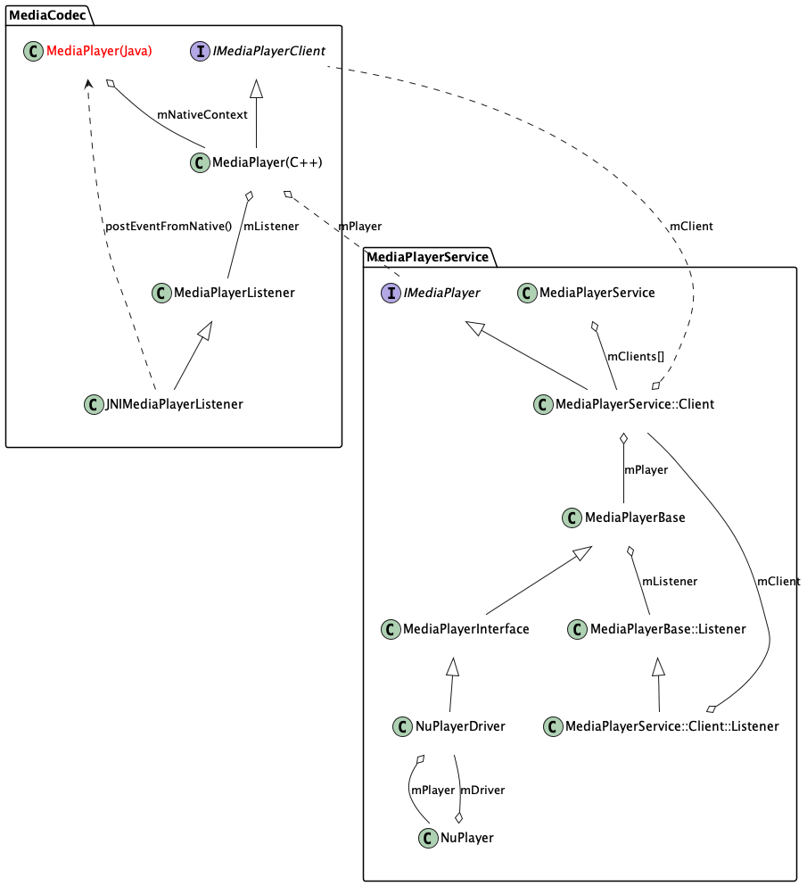
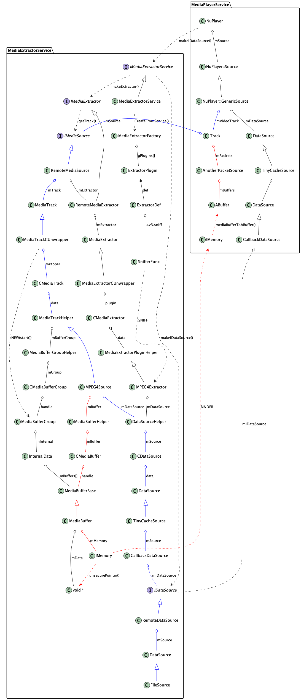

- [播放器的创建](#播放器的创建)
  - [依赖](#依赖)
  - [初始化](#初始化)
  - [数据源的设置(DataSource)](#数据源的设置datasource)
- [媒体播放服务(MediaPlayerService)](#媒体播放服务mediaplayerservice)
    - [设置播放器数据源时对播放器的创建](#设置播放器数据源时对播放器的创建)
    - [播放器实例(NuPlayer)](#播放器实例nuplayer)
    - [播放器设置媒体源前对的音频渲染输出](#播放器设置媒体源前对的音频渲染输出)
- [播放器的准备工作](#播放器的准备工作)
    - [解封装服务对数据源的创建](#解封装服务对数据源的创建)
    - [数据源的创建(GenericDataSource)](#数据源的创建genericdatasource)
  - [MediaExtractorService](#mediaextractorservice)
    - [数据源探测插件的加载](#数据源探测插件的加载)
    - [对数据源的嗅探(Sniffer)](#对数据源的嗅探sniffer)
    - [解封装服务对媒体源的创建](#解封装服务对媒体源的创建)
    - [读取数据源的媒体元数据(MetaData)](#读取数据源的媒体元数据metadata)
  - [媒体源(MediaSource)](#媒体源mediasource)
    - [媒体源元数据的获取](#媒体源元数据的获取)
    - [媒体源对 buffer 的管理](#媒体源对-buffer-的管理)
    - [读取媒体源的数据](#读取媒体源的数据)
- [播放器的显示设置](#播放器的显示设置)
  - [关于图形缓存队列](#关于图形缓存队列)
- [播放的开始](#播放的开始)
  - [解码器的创建和初始化(MediaCOdec)](#解码器的创建和初始化mediacodec)
    - [Codec2 解码器的创建(CCodec)](#codec2-解码器的创建ccodec)
    - [CCodec 对事件的监听](#ccodec-对事件的监听)
    - [CCodec 的实例化](#ccodec-的实例化)
    - [CCodec 对插件的加载](#ccodec-对插件的加载)
    - [`CCodec`解码器组件的创建](#ccodec解码器组件的创建)
    - [`CCodec`解码器接口](#ccodec解码器接口)
    - [`CCodec`视频解码组件`Component`的查找](#ccodec视频解码组件component的查找)
  - [解码器的配置](#解码器的配置)
  - [CCodec 的启动](#ccodec-的启动)
    - [获取解码器的接口](#获取解码器的接口)
    - [通过解码器接口获取解码器的配置](#通过解码器接口获取解码器的配置)
    - [通过解码器接口配置解码器](#通过解码器接口配置解码器)
    - [通过解码器组件创建解码缓存的内存池](#通过解码器组件创建解码缓存的内存池)
  - [CCodec 的解码过程](#ccodec-的解码过程)
    - [解码器对编码数据的请求](#解码器对编码数据的请求)
    - [解封装服务对编码数据请求的响应](#解封装服务对编码数据请求的响应)
    - [编码数据缓存的创建(ion\_alloc)](#编码数据缓存的创建ion_alloc)
    - [编码数据缓存的映射(ion\_map)](#编码数据缓存的映射ion_map)
    - [编码数据缓存的填充(C2WriteView)](#编码数据缓存的填充c2writeview)
    - [解码工作的提交(C2Work)](#解码工作的提交c2work)
  - [解码进程(media.codec)](#解码进程mediacodec)
    - [解码进程对音视频编码数据的导入(ion\_map)](#解码进程对音视频编码数据的导入ion_map)
    - [解码进程对音视频编码数据的读取(C2ReadView)](#解码进程对音视频编码数据的读取c2readview)
    - [VPx视频解码](#vpx视频解码)
    - [解码器对图形解码缓存的导入(HardwareBuffer)](#解码器对图形解码缓存的导入hardwarebuffer)
    - [解码进程创建音频解码缓存(ion\_alloc)](#解码进程创建音频解码缓存ion_alloc)
    - [音频解码组件映射音频解码缓存(ion\_map)](#音频解码组件映射音频解码缓存ion_map)
    - [视频解码组件映射解码图形缓存(GrallocMapper)](#视频解码组件映射解码图形缓存grallocmapper)
    - [解码进程填充解音视频码缓存(C2WriteView)](#解码进程填充解音视频码缓存c2writeview)
    - [图形解码工作的返回](#图形解码工作的返回)
  - [解码器对解码数据的处理(mediaserver)](#解码器对解码数据的处理mediaserver)
    - [解码器对图形解码数据的导入](#解码器对图形解码数据的导入)
    - [解码器对音频解码数据的拷贝](#解码器对音频解码数据的拷贝)
    - [解码器对解码数据的上报](#解码器对解码数据的上报)
    - [音频解码数据的缓存](#音频解码数据的缓存)
    - [视频解码数据的缓存](#视频解码数据的缓存)
    - [解码数据的同步(Render)](#解码数据的同步render)
    - [视频解码数据的渲染](#视频解码数据的渲染)
    - [音频解码数据的选渲染](#音频解码数据的选渲染)
- [播放过程中的 Seek 操作](#播放过程中的-seek-操作)
  - [对编码数据的 Flush 操作](#对编码数据的-flush-操作)
  - [对解码工作的恢复](#对解码工作的恢复)


# 播放器的创建
## 依赖
`MediaPlayer` (Java) 继承自`MediaPlayerBaase`, 后者内部创建一个 `PlayerIdCard`, 该对象内部创建了一个`IPlayerWrapper`(继承自`IPlayer`)用于处理远程的操作, `PlayerIdCard`会提交给`AudioService`, `AudioService`获取`PlayerIdCard`中的`IPlayer`进行一些回调操作, 本文这部分不详细讨论.

`MediaPlayer`类在加载时会通过`System.loadLibrary()`加载`libmedia_jni`库, 以便于调用 Native 实现. `libmedia_jni`来自于`frameworks/base/media/jni/Android.bp`, 因此所有加载了该库的 Java 类的 Native C++ 实现均在上述目录.

## 初始化
`MediaPlayer`(Java)对象拥有一些本地方法, 它们被定义在`frameworks/base/media/jni/android_media_MediaPlayer.cpp`中, 均以`android_media_MediaPlayer_`开头,例如`private static native final void native_init();`对应`frameworks/base/media/jni/android_media_MediaPlayer.cpp::static void android_media_MediaPlayer_native_init(JNIEnv *env)`, 其余的方法不再一一介绍.

`native_init()`不会创建实际的`MediaPlayer`(C++)对象, 但会提前获取一些 Java 层class 的讯息.

`MediaPlayer`(Java)在其构造函数中调用了`native_setup`, 该步骤创建了一个`MediaPlayer`(C++)对象, 进一步创建了一个`MediaPlayerListener`, `MediaPlayerListener`, `MediaPlayerListener`继承自`JNIMediaPlayerListener`(实现了`MediaPlayerListener`接口), 该对象负责监听来自播放器的消息, 例如`MEDIA_PREPARED`, `MEDIA_DRM_INFO`, `MEDIA_STARTED`等.

注: `MediaPlayer`在创建时, 通过`AudioSystem::newAudioUniqueId()`申请了一个`audio_session_t`的 ID , 该对象将用于获取播放器的一些音频内容, 该部分属于 Audio System, 本文不做讨论.

## 数据源的设置(DataSource)
数据源是媒体的数据来源, 可能来自一个文件, 可能来自一个网络流. 媒体源是数据源中的一个未解码的流, 例如视频流 / 音频流 / 字幕流等. 在 Android Multimedia中主要以`IMediaSource`接口体现(和`MediaSource`不同, `MediaSource`用于描述一个未编码的媒体流). 该类别通常针对一个具体的类型, 比如一个符合VP9编码规范的数据源, 从该数据源读取的数据应是编码过的数据.
通常一个媒体文件中会包含很多个部分:
* 视频: 通常是指定的编码格式, 如: `VP9`, `H264`, `H265` 等
* 音频: 可能存在多条音轨, 每条音轨的编码不同, 可能的有 `PCM`, `G711`, `FLAC`, `APE`, `AAC` 等
* 字幕: 多语言字母等

以上信息都会经过具体的封装格式进行封装, 例如常见的MP4, 本文的视频封装以及音视频编码参考信息:
```
  Metadata:
    ...
  Duration: 00:00:01.75, start: 0.000000, bitrate: 291 kb/s
    Stream #0:0(eng): Video: vp9 (Profile 0) (vp09 / 0x39307076), yuv420p(tv, progressive), 1080x1920, 216 kb/s, 30.13 fps, 30.13 tbr, 90k tbn, 90k tbc (default)
    ...
    Stream #0:1(eng): Audio: aac (LC) (mp4a / 0x6134706D), 48000 Hz, mono, fltp, 73 kb/s (default)
    ...
```
`MediaPlayer`(Java)的`public void setDataSource(FileDescriptor fd, long offset, long length)`负责设置数据源, 对的 Native 方法为:`android_media_MediaPlayer_setDataSourceFD`, 主要调用`MediaPlayer::setDataSource()`, 主要的步骤为:
* 通过`getMediaPlayerService`获取`IMediaPlayerService`接口用于访问`MediaPlayerService`服务.
* 通过`IMediaPlayerService::start()`向`MediaPlayerService`申请创建播放器, `MediaPlayerService`创建播放器成功后返回`IMediaPlayer`接口用于后续操作
* 通过`IMediaPlayer::setDataSource()`向`MediaPlayerService`中的播放器设置数据源
* 最后调用`attachNewPlayer()`将`IMediaPlayer`记录在`Me嗲Player`(C++)对象中

# 媒体播放服务(MediaPlayerService)
`mediaserver`创建`IMediaPlayerService`接口的`MediaPlayerService`实现, 该类将处理来自`MediaPlayer`的请求. 在`MediaPlayerService`创建时, 会注册多个`MediaPlayerFactory::IFactory`实现, 目前主要有两种:
* `NuPlayerFactory`: 主要的工厂类, 用于创建播放器实例: NuPlayerDriver, 其更底层的实现是`NuPlaye`r
* `TestPlayerFactory`: 测试目的, 不关注 注:: 以前的版本还有一种`AwesomePlayer`(被`stagefrightplayer`封装), 已经过时了.

### 设置播放器数据源时对播放器的创建
`MediaPlayer`设置数据源之前要先完成实际的播放器实例的创建, 它通过`IMediaPlayerService::create()`接口向`MediaPlayerService`服务申请创建播放器, 创建播放器后, 本地的`MediaPlayer`将通过`IMediaPlayer`接口引用服务器为其创建的播放器实例. 显然该`Client`实现了`BnMediaPlayer`并在创建后返回给应用, 它将作为一个`IMediaPlayer`接口传递给`MediaPlayer`并作为后续所有的请求的代理, 接下来看下`IMediaPlayer`是如何被创建的, 又做了哪些工作.

`MediaPlayerService`要具备通知`MediaPlayer`的能力才行, 后者实现了`BnMediaPlayerClient`, 将通过`IMediaPlayerClient`在`MediaPlayerService`创建`Client`时被设置在`Client`的`mClient`中

在创建`Client`是也创建了`MediaPlayerService::Listener`, 该类是继承自`MediaPlayerBase::Listener`, `MediaPlayerBase::Listener`将负责监听底层`MediaPlayerBase`的消息并传递给子类`MediaPlayerService::Listener`.

从这里, 也知道了在`MediaPlayerService`中, 负责播放任务的实现必须是集成自`MediaPlayerBase`的, 本例中的继承: `MediaPlayerBase` -> `MediaPlayerInterface` -> `NuPlayerDriver`, 因此消息的传递流程:
`NuPlayer` -> [`MediaPlayerBase::Listener` => `MediaPlayerService::Client::Listener`] -> `MediaPlayerService::Client` –[`binder`]–> [`IMediaPlayerClient` => `MediaPlayer`] -> [`MediaPlayerListener` => `JNIMediaPlayerListener`] -> `MediaPlayer`(Java)

消息类型如上文提到的: `MEDIA_PREPARED`, `MEDIA_DRM_INFO`, `MEDIA_STARTED`等.

至此, 实现了`IMediaPlayer`接口的`MediaPlayerService::Client`将被返回给 APP 的`MediaPlayer`(C++), 而`MediaPlayer`(C++)作为`IMediaPlayerClient`接口被保存到了`MediaPlayerService::Client`用于响应回调消息.

### 播放器实例(NuPlayer)
现在我们可以回答`MediaPlayer::setDataSource()`的上下文, 看看`IMediaPlayer::setDataSource()`的执行过程了.

这里`MediaPlayerService::Client::setDataSource()`的处理有如下步骤:
* 通过`MediaPlayerFactory::getPlayerType()`获取实际的播放器类型:`player_type`, 有如下三种:
  * `STAGEFRIGHT_PLAYER`
  * `NU_PLAYER`
  * `TEST_PLAYER`  
  具体获取的是那种取决于播放器工厂类(实现了`IFactory`的类, 例如`NuPlayerFactory`)对数据源的评分:`IFactory::scoreFactory()`, 那种类型播放器处理数据源的分数高就用哪个, 这和后续解封装器对数据源的嗅探过程是一致的.
* 在`setDataSource_pre()`的工作:
  * 创建实际的播放器: `NuPlayerDriver`, 这将在`MediaPlayerService::Client`响应`createPlayer()`消息时通过`MediaPlayerFactory::createPlayer()`静态方法从`NuPlayerFactory`构建. `NuPlayerDriver`在创建后会马上创建`NuPlayer`类. `NuPlayer`后续则会通过`MediaPlayerService::Client` -> `NuPlayerDriver`响应来自应用中`MediaPlayer`的很多事件.
  这里做了个检查, 只有`Client`中的`mPlayer`(`MediaPlayerBase`)为空才创建播放器(因为`setDataSource()`可能执行多次).
  创建播放器时通过`setNotifyCallback()`将继承`MediaPlayerBase::Listener`接口的`MediaPlayerService::Client::Listener`设置在了`MediaPlayerBase`的`mListener`
* 对`NuPlayerDriver`执行`setDataSource()`


`NuPlayerDriver`创建后将完成所有播放请求, 请求的类型很多, 且这些类型将通过`NuPlayer`进行异步处理. 我们只讨论传统本地视频文件的播放,关注以下几种`NuPlayer`的异步消息类型:
* `kWhatSetDataSource`: 设置数据源头
对应`MediaPlayer.setDataSource()`, 支持各种各样的数据源, 例如: URI/文件/数据源等等
* `kWhatPrepare`: 准备播放器 对应`MediaPlayer.prepare()`
* `kWhatSetVideoSurface`: 设置视频输出 对应`MediaPlayer.setDisplay()`或者* `MediaPlayer.setSurface()`, 它们的参数不同
* `kWhatStart`: 开始播放 对应`MediaPlayer.start()`
* `kWhatSeek`: `seek`操作
  对应`MediaPlayer.seekTo()`, 该方法可以设置seek(跳转到)的方式, seek时需要的参数:
    * "seekTimeUs": seek的目标事件, 单位`us`
    * "mode": `seek`的模式(向前/向后/最近等)
    * "needNotify": 是否需要通知上层, 如果需要, NuPlayer将通过父类MediaPlayerInterface的sendEvent()方法通知上层.
* `kWhatPause`: 暂停操作
* `kWhatResume`: 恢复播放
注意: `kWhatSetDataSource`我们还未开始调用, 请参考下文, 此时仅仅创建了`NuPlayer`
`NuPlayer`不但需要负责完成各种下行的控制, 还要通过AMessage响应来自底层的一系列消息

下行整体的调用流程:
`MediaPlayer`(Java) -> `MediaPlayer`(C++) –[binder]–> [`IMediaPlayer` => `MediaPlayerService::Client`] -> `NuPlayerDriver` -[Async]-> `NuPlayer`

回顾一下上行的消息流程:
`NuPlayer` -> [`MediaPlayerBase::Listener` => `MediaPlayerService::Client::Listener`] -> `MediaPlayerService::Client` –[binder]–> [`IMediaPlayerClient` => `MediaPlayer`] -> [`MediaPlayerListener` => `JNIMediaPlayerListener`] -> `MediaPlayer`(Java)

截止到目前, 上述类的关系大体如下:


### 播放器设置媒体源前对的音频渲染输出
在`MediaPlayerService::Client::setDataSource()` -> `MediaPlayerService::Client::setDataSource_pre()`中创建了用于音频输出的`AudioOutput`, 但此时`AudioTrack`(通过`mTrack`引用)还为创建(将在`AudioOutput::open()`时创建)

上文说到通过`MediaPlayerService::Client::setDataSource()`做了前期的工作(`NuPlayerDriver`的创建等), 最终`NuPlayerDriver::setDataSource()`被调用开始设置数据源. 

首先创建了`NuPlayer::GenericSource`(继承自`NuPlayer::Source`), 将回复消息`kWhatSourceNotify`的`AMessage`设置给`GenericSource`(数据源准备好, 后者将通过该消息通知`NuPlayer`), 然后调用`GenericSource::setDataSource()`保存`fd`, 此时`GenericSource`还没有实际的读取数据源的数据.

`NuPlayer::setDataSourceAsync(int fd, ...)`在`(NuPlayer::setDataSourceAsync(int fd, ...)`被转换为异步处理)如何处理接下来的工作呢?, 数据类型如果是文件文件描述符, 则创建`GenericSource`(实现自:`NuPlayer::Source`), 除了该类型, 对于`NuPlayer::Source`还有几种主要类型: 
* StreamingSource 
* HTTPLiveSource 
* RTSPSource 
* RTPSource 
* **GenericSource**

注意: `NuPlayer::setDataSourceAsync()`发出异步消息`kWhatSetDataSource`将上文创建的`GenericSource`配置给 NuPlayer, 这个异步过程需要等待操作完成(具体过程较为简单, 略去), 数据源被创建后是否开始解析数据文件将在`MediaPlayer.prepare()`时开始.

# 播放器的准备工作
`MediaPlayer.prepare(...)`最终都是通过`MediaPlayer::prepare()`完成工作的, 而最后也都是通过`MediaPlayer::prepareAsync_l()` –[Binder]–> `Client::prepareAsync()` -> `NuPlayerDriver::prepareAsync()` -> `NuPlayer::prepareAsync()`, 既然是异步, 所以`NuPlayer`给自己的异步线程发送了`kWhatPrepare`消息, 上文说到, `GenericSource`不会开始解析文件, 直到`prepare()`开始, 此处`NuPlayer`也确实在`prepare()`时只调用了`GenericSource::prepareAsync()`, 同样`GenericSource`通过`kWhatPrepareAsync`异步处理这个消息(通过`NuPlayer::GenericSource::onPrepareAsync()`响应).

`NuPlayer::GenericSource::onPrepareAsync()`的处理分以下几种情况:
* 如果数据源为空
  * 如果`mUri`不为空
    * 如果是`HTTP`协议, 则通过`PlayerServiceDataSourceFactory::CreateMediaHTTP()`创建`PlayerServiceMediaHTTP`作为`DataSource`
    * 如果是是普通文件, 则通过`DataSourceFactory::CreateFromURI()`创建`CreateFileSource`等其它类型的`DataSource`
  * 如果`mUri` 为空, 那么`mFd`一定不为空
    * 如果`media.stagefright.extractremote`为`true`, 那么将进行如下步骤:
      * 通过`IServiceManager`获取`IMediaExtractorService`服务接口
      * 通过调用`IMediaExtractorService::makeIDataSource()`请求`MediaExtractorService`创建数据源并返回`IDataSource`
      * 本地调用`CreateDataSourceFromIDataSource()`创建`TinyCacheSource`引用`IDataSource`(通过`TinyCacheSource::mSource` -> `CallbackDataSource::mIDataSource` -> `IDataSource`引用, 其中, `CallbackDataSource` 和`TinyCacheSource`均继承自`DataSoure`)
    * `PlayerServiceFileSource`的创建则有如下三种情况:
      * 如果`media.stagefright.extractremote`为`false`
      * 如果`MediaExtractorService`未能成功则创建数据源
      * 如果数据源要求`DRM`支持(这是必须的, 至于为什么这里不做解释)

注意: 本文的案例属于`mUri`为空但`mFd`不为空的情形, 那么`MediaExtractorService`是如何处理创建`IDataSource`的请求的呢?

`Android` 中, 原则上都是通过`MediaExtractorService`处理, `MediaExtractorService`运行在`media.extractor`进程中, 正如上文搜书其通过`IMediaExtractorService`为其它进程提供服务.

### 解封装服务对数据源的创建
需求方`GenericSource`通过`IMediaExtractorService::makeIDataSource()`请求创建数据源, 提供了文件描述符, `MediaExtractorService`通过工厂类`DataSourceFactory`完成从文件描述符到`DataSource`的创建, 但`DataSource`本身不是继承自`IDataSource`接口, 无法为需求方提供服务, 因此`DataSource`最终还是要通过`RemoteDataSource`, 而`RemoteDataSource`继承自BnDataSource响应后续对端的请求. 对于本地文件`DataSourceFactory`创建的`DataSource`是`FileSource`.

### 数据源的创建(GenericDataSource)


然后在`NuPlayer::GenericSource::initFromDataSource()`中, `MediaExtractorFactory::Create()`负责请求通过`IDataSource`创建`MediaExtracotor`, 对应的服务端实现是:`MediaExtractorService::makeExtractor()`

## MediaExtractorService
这个过程中, 上文的`TinyCacheDataSource`作为`DataSource`通过`CreateIDataSourceFromDataSource()`转换成了`IDataSource`接口的`RemoteDataSource`又发回给`MediaExtracotrService`了?

**并不是**, 在`RemoteDataSource::wrap()`不一定创建实现新的`IDataSource`的`RemoeDataSource`, 如果传入的`DataSource`本身及持有`IDataSource`(就是此前`IMediaExtractorService::makeIDataSource()`创建的`IDataSource`), 那就直接返回了, 没有重新创建的必要, 所以返回的仍然是`TinyCacheSource`(`DataSource`)::`mSource` -> `CallbackDataSource`(`DataSource`)::`mIDataSource`所保存的来自`MediaExtractor`的`IMediaSource`.

请求发给服务端`MediaExtractorService`, 又会被如何处理呢? 这里仍然是通过`CreateDataSourceFromIDataSource()`创建了本地的`DataSource`, 这和上文应用中的操作完全一样? 是的, 完全一样, 最后本地曾经创建过的`RemoteDataSource`(`IDataSource`接口)也是被`MediaExtractorService`本地的`TinyCacheSource`(`DataSource`)::`mSource` -> `CallbackDataSource`(`DataSource`)::`mIDataSource`所引用.

`MediaExtractorService`将通过`MediaExtractorFactory`的`CreateFromService()`方法完成`MediaExtractor`的创建, 从名字可以看到创建自服务端, 和上文`MediaExtractorFactory::Create()`不一样了.

创建具体的`MediaExtractor`之前, 需要从`DataSource`中读取一些数据, 然后对读取到的数据机型探测. 在继续之前先了解`Extractor`的插件加载.

### 数据源探测插件的加载
`media.extractor`在启动时, 创建`MediaExtractorService`服务, `MediaExtractorService`实例化是通过`MediaExtractorFactory::LoadExtractors()`装载插件.

`MediaExtractorFactory`首先通过`RegisterExtractors()`, 它完成单个路径下的所有插件的加载, 例如`"/apex/com.android.media/lib64/extractors/"`, 通常情况下形如`lib[aac|amr|flac||midi|mkv|mp3|mp4|mpeg2|ogg|wav]extractor.so`, 对于本例, 关注`libmp4extractor.so`, 首先从动态库中寻找`"GETEXTRACTORDEF"`符号, 因此`getDef()`就是`GETEXTRACTORDEF`函数, 函数被调用后, 返回一个`ExtractorDef`被用于构造`ExtractorPlugin`, `ExtractorPlugin::def`将在上文提到的`sniff()`函数中被获取. 而`RegisterExtractor()`为插件的注册. 最终插件的`MPEG4Extractor.cpp:Sniff()`函数将保存在:`MediaService::gPlugins[...].m_ptr.def.u.v3.sniff`中等待后续被调用.

### 对数据源的嗅探(Sniffer)
`MediaExtractorFactory::CreateFromService()`通过`sniff()`函数主要完成`DataSource`中流媒体文件格式的探测工作, 这将调用上文的`MPEG4Extractor.cpp:Sniff()`, 如果`MPEG4Extractor.cpp:Sniff()`判定为是自己能解析的格式, 则返回`MPEG4Extractor.cpp:CreateExtractor()`用于后续接封装器的创建. 

### 解封装服务对媒体源的创建
`MediaExtractorFactory::CreateFromService()`中, `((CreatorFunc)creator)(source->wrap(), meta)`将调用该函数. 该函数创建解封装器之前, `TinyCacheSource`通过其父类`DataSource`被`wrap()`成了`CDataSource`, 其被`DataSourceHelper`引用, 供`MPEG4Extractor`创建时使用. `MPEG4Extractor`在被构造后, 也通过父类`MediaExtractorPluginHelper`的`wrap()`包装为`CMediaExtractor`给`MediaExtractorFactory`进一步封装为`MediaExtractorCUnwrapper`(父类`MediaExtractor`), 而`MediaExtractorCUnwrapper`最终通过`RemoteMediaExtractor`包装, 最后作为`IMediaExtractor`返回给`mediaserver`

总结:  
`TinyDataSource`被设置到了:`MediaExtractorService::makeExtractor()`中的`extractor->mExtractor->plugin->data->mDataSource->mSource->handle`

其中:  
* `extractor`: `IMediaExtractor` -> `RemoteMediaExtractor`
* `extractor->mExtractor`: `MediaExtractor` -> `MediaExtractorCUnwrapper`
* `extractor->mExtractor->plugin`: `CMediaExtractor`
* `extractor->mExtractor->plugin->data`: `void *` -> `MediaExtractorPluginHelper` -> `MPEG4Extractor`
* `extractor->mExtractor->plugin->data->mDataSource`: `DataSourceHelper`
* `extractor->mExtractor->plugin->data->mDataSource->mSource`: `CDataSource`
* `extractor->mExtractor->plugin->data->mDataSource->mSource->handle`: `DataSource` -> `TinyDataSource`

### 读取数据源的媒体元数据(MetaData)
解封装器`IMediaExtractor`返回给`MediaPlayerService`()后(回到`NuPlayer::GenericSource::initFromDataSource()`方法中), 可以开始获取元数据了, 包括有多少条Track等等, `IMediaExtractor::getMetaData()`负责完成到`RemoteMediaExtractor`的请求. 

`MPEG4Extractor::readMetaData()`比较复杂, 限于篇幅读者可自行分析, 该函数负责将获取到的元数据保存在`MPEG4Extracotr`的`mFileMetaData`(类型为`AMediaFormat`)成员中, 该信息将在`MPEG4Extractor::getMetaData)`函数中通过`AMediaFormat_copy()`方法拷贝到调用方`MediaExtractorCUnwrapper::getMetaData()`的临时变量`format`中.

在`MediaExtractorCUnwrapper::getMetaData()`函数中, 获取到的`AMediaFormat`需要通过`convertMessageToMetaData()`函数转化到`MetaData`类型, 此处过程较长, 本文不分析.

`MetaData`通过`binder`返回给`mediaserver`时是通过`MetaDataBase::writeToParcel()`完成序列化的, 不文也不分析该过程.

获取元数据后, 获取`Track`的数量, 通过接口`IMediaExtractor::countTracks()`完成请求, 这里略去.

## 媒体源(MediaSource)
`Track`的获取通过如下过程: `IMediaExtractor::getTrack(size_t index)` --[Binder]--> `RemoteMediaExtractor::getTrack()` -> `MediaExtractorCUnwrapper::getTrack()` -> `MPEG4Extractor::getTrack()`, 此时`MPEG4Source`被创建, 其实现是`MediaTrackHelper`, 类似的, 它也通过`MediaTrackHelper::wrap()`被包装为`CMediaTrack`, 由`MediaTrackCUnwrapper`引用, 而`MediaTrackCUnwrapper`被`RemoteMediaSource`引用, `RemoteMediaSource`作为`IMediaSource`返回给`MediaPlayerService`, 该过程和上文返回`IMediaExtractor`的过程是一样的.

总结:  
`MPEG4Source`作为`MediaTrackHelper`被设置在: `RemoteMediaSource.mTrack->wrapper->data`, 其中:
* `RemoteMediaSource.mTrack`: `MediaTrackCUnwrapper`
* `RemoteMediaSource.mTrack->wrapper`: `CMediaTrack`
* `RemoteMediaSource.mTrack->wrapper->data`: `MediaTrackHelper` -> `MPEG4Source`

### 媒体源元数据的获取
媒体元也有源数据信息, 标记了该媒体源的编码类型等: 通过接口`IMediaExtractor::getTrackMetaData()`完成请求.

最后`IMediaSource`被保存到`GenericSource`的`mVideoSource`或者`mAudioSource`(类型为`GenericSource::Tracks`)的`mSource`成员中, 后续将用于音频/视频流数据的获取.

### 媒体源对 buffer 的管理
当`GenericSource`的准备工作完成后, 相应的媒体源也已经获取到, 则开始这些媒体源的工作, 这是会创建一个`BufferGroup`, 用户缓冲数据等, 调用的顺序: `GenericSource::startSources()` --[Binder]-> `IMediaSource::startSources()` => `RemoteMediaSource::start()` -> `MediaTrackCUnwrapper::start()` -> `MediaBufferGroup::MediaBufferGroup()` -> `CMediaBufferGroup::CMediaBufferGroup()`, 在媒体源开始后, `CMediaBufferGroup`完成对`MediaBufferGroupHelper`的创建.

总结:  
* `MPEG4Source.mBufferGroup`: `MediaBufferGroupHelper`
* `MPEG4Source.mBufferGroup->mGroup`: `CMediaBufferGroup`
* `MPEG4Source.mBufferGroup->mGroup->handle` : `MediaBufferGroup`

### 读取媒体源的数据
媒体源开始工作后, `GenericSource`即刻开始从媒体源读取数据.该读取过程是异步的, `GenericSource`给其异步线程发送了`kWhatReadBuffer`消息, 异步线程读取数据的调用过程为: `GenericSource::onReadBuffer()` -> `GenericSource::readBuffer()` -> `IMediaSource::readMultiple()` --[Binder]--> `BnMediaSource::onTransact()` => `RemoteMediaSource::read()` -> `MediaTrackCUnwrapper::read()` -> `MPEG4Source::read()` -> `MediaBufferGroupHelper::acquire_buffer()` -> `MediaBufferGroup::acquire_buffer()` -> `MediaBuffer::MediaBuffer()` -> `MemoryDealer::allocate()`.

上述过程, `MediaBuffer`根据其`size`的要求, 自行确定了是否使用**共享内存**的方式创建, 创建完成后, 数据指针被保存到其自身的`mData`成员中, 创建完成后`MediaBuffer`被封装到`newHelper->mBuffer->handle`中返回给上层
在`CMediaBufferGroup::acquire_buffer()`中, `newHelper`:
`newHelper`: `MediaBufferHelper`
`newHelper->mBuffer`: `CMediaBuffer`
`newHelper->mBuffer->handle`: `MediaBufferBase` -> `MediaBuffer`  

对于上述过程的最后一个函数, 也就是`MediaBufferGroup::acquire_buffer()`中, 只有`for (auto it = mInternal->mBuffers.begin(); it != mInternal->mBuffers.end(); ++it)`没有找到合适的`buffer`, 才会申请新的`buffer`

至此, 可以知道`mediaserver`所获取到的数据结构即`MediaBufferBase`

`BnMediaSource::onTransact()`是循环通过`RemoteMediaSource::read()`读取到`MediaBuffer`的, 读取后判断解析出来的`MediaBuffer`, 分两种情况:
* `MediaBuffer`能用`binder`传递, 直接到最后一个`else`的位置通过`reply->writeByteArray()`写入数据到`binder`
* `MediaBuffer`不能通过`binder`传递, 这里又分两种情况:
  * 返回的`MediaBuffer`未使用共享内存, 此时抱怨一下, 然后从`RemoteMediaSource`的父类`BnMediaSource`所持有的`MediaBufferGroup`中分配一个共享内存的`MediaBuffer`, 然后获取解码器返回的数据, 拷贝到新分配的共享内存中
  * 返回的`MediaBuffer`使用的为共享内存, 则直接向后传递, 传递到后面, 如果是共享内存还分两种情况:
    * 共享内存形式的`MediaBuffer`中的`IMemory`是否有缓存在`BnMediaSource`的`mIndexCache`(类型为`IndexCache`)中, 如果没有, `mIndexCache.lookup()`返回的`index`就是`0`, 所以插入到缓存当中, 等待后续获取.

所以, 最终返回给`MediaPlayerService`的数据可能是`ABuffer`也可能是`IMemory`所创建的`ABuffer`, 那我们看看`MediaPlayerService`读取数据完成后, 是如何通过`IMediaSource`的实现`BpMediaSource`处理的. 

`BpMediaSource`根据返回的类型判断, 如果是`IMemory`的缓冲, 则构造了`RemoteMediaBufferWrapper`(其继承关系:`RemoteMediaBufferWrapper` -> `MediaBuffer` -> `MediaBufferBase`), 如果是`ABuffer`的类型, 那就直接构造一个`ABuffer`.

但是最终`NuPlayer::GenericSource::readBuffer()`将通过`mediaBufferToABuffer()`从`MediaBufferBase`(类型可能为`RemoteMediaBufferWrapper`或者`MediaBuffer`)的`data()`返回的指针, 然后构造(注意**不是拷贝**)一个新的`ABuffer`, 并将`ABuffer`插入`GenericSource`的`track->mPackets`(音频/视频).

那么这些从`IMediaSource`中读取到的数据合适被读取呢? 它们将在`NuPlayer::Decoder::fetchInputData()`是, `NuPlayer::Decoder`通过`GenericSource::dequeueAccessUnit()`被提取.

截止到目前, 上述类的关系大体如下:


备注: 蓝色箭头是`NuPlayer`读取数据包的过程, 红色箭头是数据包的管理和传回` NuPlayer`的过程

# 播放器的显示设置
## 关于图形缓存队列
系统相册在播放视频时会创建一个`SurfaceView`, 该类在构造是通过其`Java`层: `updateSurface()` -> `createBlastSurfaceControls()`构造了`BLASTBufferQueue`类, 此时会触发`Native`层构造`BLASTBufferQueue`, 该过程将创建一对消费这和生产者:
* `IGraphicBufferProducer` => `BufferQueueProducer` => `BBQBufferQueueProducer`
* `IGraphicBufferConsumer` => `BufferQueueConsumer` => `BufferQueueConsumer`

然后在上层`updateSurface()`过程, 通过`copySurfac()`方法构造`Surface`(`Java`层), 构造的方式是:`Surface.copyFrom()`, 这将通过底层的`BLASTBufferQueue::getSurface()`获取一个`Native`的`Surface`, 而`BLASTBufferQueue`的生产者将被记录在这个`Surfac`中.

`MediaPlayer.setDisplay()` -> `MediaPlayer._setVideoSurface()` -> `android_media_MediaPlayer_setVideoSurface()` -> `MediaPlayer::setVideoSurfaceTexture()`.

通过`android_view_Surface_getSurface()`将上层的`Surface`(Java)转换为底层的`Surface`(Native), 然后将该`Surface`(Native)指针记录在`MediaPlayer.mNativeSurfaceTexture`(Java)中, 最后通过`mp->setVideoSurfaceTexture()`也就是`MediaPlayer::setVideoSurfaceTexture()`设置从`Surface`(Native)调用`getIGraphicBufferProducer()`获得的`IGraphicBufferProducer`, 这个`IGraphicBufferProducer`正是上文`BLASTBufferQueue`中的, 该接口最终配置给底层的`MediaPlayer`(Native).

`mPlayer->setVideoSurfaceTexture()`通过Binder调用到`MediaPlayerService::Client::setVideoSurfaceTexture()`, 通过上层传递的`bufferProducer`创建了新的`Surface`, 又通过`disconnectNativeWindow_l()`断开了`bufferProducer`与应用持有的`Surface`(Native)的联系, 然后将新创建的`Surface`保存到`Client::mConnectedWindow`, 这意味着, `mediaserver`直接负责获取并填充`GraphicBuffer`给原本属于应用持有的`Surface`. 进一步, 将`Surface`配置给`NuPlayerDriver`, `NuPlayerDriver`通过`kWhatSetVideoSurface`将`Surface`发个给异步线程.`NuPlayer`保存上层的`Surface`即`mediaserver`使用应用传递的`IGraphicBufferProducer`所创建的`Surface`到`mSurface`, 并调用`NuPlayerDriver::notifySetSurfaceComplete()`告知`NuPlayerDriver::setVideoSurfaceTexture()`可以返回.

# 播放的开始
开始过程和上文的几个操作类似, 受限于篇幅, 仅给出简化的流程`MediaPlayer.start()` -> `MediaPlayer._start()` -> `android_media_MediaPlayer_start()` -> `MediaPlayer::start()` --[Binder]--> `NuPlayerDriver::start()` -> `NuPlayerDriver::start_l()` -> `NuPlayer::start()`.

`NuPlayer::start()`通过`kWhatStart`通知异步线程启动, `NuPlayer::onStart()`负责相应`kWhatStart`消息, 其创建了`NuPlayer::Rennderer`, 但**并没有**设置给`mVideoDecoder`(类型为`NuPlayer::Decoder`), 因为此时还没有创建`mVideoDecoder`和`mAudioDecoder`. 

这个`Renderer`后续通过其`queueBuffer()`接受`MediaCodecBuffer`, 它完成处理后, 通过`kWhatRenderBuffer`通知`NuPlayer::Decoder`进行`MediaCodecBuffer`的释放.

## 解码器的创建和初始化(MediaCOdec)
在`NuPlayer`中, 解码器由`NuPlayer::Decoder`进行抽象. 在`NuPlayer`开始后, 如上文所述, 其首先完成了`IMediaSource`的开始, 然后通过置身的`postScanSources()`异步发出了`kWhatScanSources`消息, 该消息被异步线程收到后, 开始执行`NuPlayer::instantiateDecoder()`实例化解码器, 如果是音频解码器, 分两种情况:
* `DecoderPassThrough`
* `Decoder` 

如果是视频解码器则只创建: `Decoder`

`Decoder`被创建后, 其`init()`和`configure()`方法被分别调用

初始化没有太多内容, 略去. 在`DecoderBase::configure()`是`DecoderBase`通过异步消息`kWhatConfigure`调用到子类`Decoder`的`onConfigure()`, `Decoder`需要创建实际的解码器, 因此通过`MediaCodec::CreateByType()`创建`MediaCodec`, `MediaCodecList::findMatchingCodecs()`负责查找支持当前解码格式解码器的名字, 其定义在`MediaCodecList.cpp`, 如果找到解码器则创建`MediaCodec`, 创建`MediaCodec`时, 其`mGetCodecBase`被初始化为一个`std::function<>`对象, 后文的`MediaCodec::init()`会调用此`lambada`.

MediaCodec`创建完成后通过`init()`调用上文的`mGetCodecBase`也就是`MediaCodec::GetCodecBase()`创建更底层的`CodecBase`, `CodecBase`的实现有多种:
* **`CCodec`**
* `ACodec`
* `MediaFilter`

### Codec2 解码器的创建(CCodec)
`Android Q`以后的版本采用`CCodec`的方式加载解码插件, 此处仅仅是创建了`Codecbase`(这里是`CCodec`), 确定了解码器的名字, 但还没有初始化`CCodec`. 

### CCodec 对事件的监听
而`MediaCodec`在初始化完`CCodec`(`CodecBase`)后:
* 构造了`CodecCallback`, 其实现了`CodecBase::CodecCallback`接口, 而`CCodec::setCallback()`是在父类`CodecBase`实现的
* 构造了`BufferCallback`, 其实现了`CodecBase::BufferCallback`接口, 用于监听来自`CCodecBufferChannel`的消息. 而`mBufferChannel`的类型是`CCodecBufferChannel`, 其`setCallback()`是在父类`BufferChannelBase`实现的, 最后`MediaCodec::BufferCallback`作为`CodecBase::BufferCallback`设置在了`CCodecBufferChannel`的`mCallback`方法

### CCodec 的实例化
初始化过程仍在`MediaCodec::init()`中继续, 该函数后续发出了`kWhatInit`消息, 并传递了解码器的名字给异步线程,`kWhatInit`由`CodecBase::initiateAllocateComponent()`响应, 其对解码器进行实例化. 在`CCodec`创建时`CCodecBufferChannel`也被创建, 其继承自`BufferChannelBase`, 并设置在`CCodec`的`mChannel`中

`CCodec`再次发出异步消息`kWhatAllocate`, 由`CCodec::allocate()`响应. CCodec通过`Codec2Client::CreateFromService()`创建了`Codec2Client`, `Codec2Client`持有`IComponentStore`接口, 并通过其访问`media.swcodec`的`ComponnetStore`.

`CCodec`后续通过`Codec2Client::CreateComponentByName()`创建了`Codec2Client::Component`, 大体的过程是: `Codec2Client::CreateComponentByName()` -> `Codec2Client::createComponent()` --[`Binder`]--> [`IComponentStore::createComponent_1_2()` => `ComponentStore::createComponent_1_2()`]. 该过程涉及解码器插件的加载和解码器组件的查找, 先了解接加载过程.

### CCodec 对插件的加载
在`media.swcodec`(`frameworks/av/services/mediacodec/main_swcodecservice.cpp`)启动时, 调用了`RegisterCodecServices()`(位于`libmedia_codecserviceregistrant.so`中, 代码: `frameworks/av/media/module/codecserviceregistrant/CodecServiceRegistrant.cpp`), 该函数立即调用`GetCodec2PlatformComponentStore()`创建`C2ComponentStore`, 可以看到它创建的`ComponentStore`是`C2PlatformComponentStore`(实现自`C2ComponentStore`), 在`C2PlatformComponentStore`的构造函数里, 使用`libcodec2_soft_vp8dec.so`这个路径创建了`ComponentLoader`(自动)并被记录在`C2PlatformComponentStore`的`mComponents`中, 以路径作为索引.

`C2SoftVpxDec`总结如下:
* `libcodec2_soft_vp9dec.so`对应的`ComponentModule`创建
  * `media.swcodec`启动时, 通过`RegisterCodecServices`注册`ComponentStore`服务, 此时会创建`C2PlatformComponentStore`, 其集成关系:`C2PlatformComponentStore ` -> `C2ComponentStore`
  * `C2PlatformComponentStore`将创建`mLibPath`为`libcodec2_soft_vp9dec.so`的`ComponentLoader`类型
  * 最后通过`C2ComponentStore`创建实现了`IComponentStore`的`V1_2::utils::ComponentStore`实例, 返回给了`Codec2Client`.

### `CCodec`解码器组件的创建

### `CCodec`解码器接口

### `CCodec`视频解码组件`Component`的查找
  * `Codec2Client`在通过`createComponent()`方法创建组件时, `ComponentStore`首先找到匹配的`ComponentLoader`, 在Loader的初始化过程中欧给你, 将创建`ComponentModule`对象  
  * `ComponentLoader`对象从对应的`libcodec2_soft_vp9dec.so`中查找`CreateCodec2Factory`符号
  * 调用`CreateCodec2Factory`符号将返回`C2ComponentFactory`类型, 其实现为`C2SoftVpxFactory`
  * 然后调用工厂类的`createInterface`方法, 返回一个`C2ComponentInterface`接口, 其实现为`SimpleC2Interface`模板类
  * 调用`C2ComponentFactory`的`createInterface`方法, 也就是`C2SoftVpxFactory::createInterface`, 这将欻功能键一个`C2ComponentInterface`接口, 实现为`SimpleC2Interface`模板类, 对于`Vpx9`该类的实现为`C2SoftVpxDec::IntfImpl`, 其将被记录在`C2Component::Traits`中
* 组件的创建
  * 查找组件的工作完成后, `ComponentModule`组件的`createComponent`方法被调用, 该方法将调用上文`CreateCodec2Factory`的对应方法, 而`CreateCodec2Factory::createComponent`负责创建`C2SoftVpxDec`, 继承关系: `C2SoftVpxDec` -> `SimpleC2Component` -> `C2Component`, 而该`C2Component`最后由`ComponentStore`创建的`Component`对象持有, 而`Component`对象实现了`IComponent`, 其后续将被返回给`Codec2Client`.

此时`IComponent`被设置在`Codec2Client::Component`后续被设置给上文`CCodec`的`CCodecBufferChannel`中(`mBase1_[0|1|2]`). 

## 解码器的配置
`MediaCodec`通过`kWhatConfigure`通知异步线程执行配置, 该消息由`CCodec::initiateConfigureComponent()`负责响应, 该方法继续发出`kWhatConfigure`消息给`CCodec`的异步线程, 并由`CCodec::configure()`响应.

`doConfig`是个非常复杂的`lambada`, 作为`std::fucntion`传递给`tryAndReportOnError()`, 该部分代码做了大量配置工作, 完成配置后, `mCallback->onComponentConfigured()`回调到上文设置的`MediaCodec::CodecCallback::onComponentConfigured()`

`Decoder::onConfigure()`最后负责启动`MediaCodec`, `MediaCodec`通过`kWhatStart`通知异步线程执行配置, 该消息由`CCodec::initiateStart()`负责响应.

## CCodec 的启动
该方法继续发出`kWhatStart`消息给`CCodec`的异步线程, 并由`CCodec::start()`响应. 而`CCodec::start()`也调用了`CCodecBufferChannel::start()`, 上文说到`CCodecBufferChannel`保存了`Codec2Client::Component`, 此处`Conponent::setOutputSurface()`被调用. `mOutputBufferQueue`的类型是`OutputBufferQueue`, 因此不管那个分支, 都调用了`OutputBufferQueue::configure()`, 因此`IGraphicBufferProducer`被设置到了`OutputBufferQueue`的`mIgbp`, 在后文`OutputBufferQueue::outputBuffer()`时会用到. `OutputBufferQueue`是视频解码器的输出队列, 当解码器有`GraphicBuffer`通过`C2Block2D`描述返回给`CCodecBufferChannel`, 会注册到`Codec2Client::Component`的`OutputBufferQueue`中, 等待后续渲染时提取并送出.

`postPendingRepliesAndDeferredMessages("kWhatStartCompleted")`完成后, `MediaCodec::start()`返回

### 获取解码器的接口
### 通过解码器接口获取解码器的配置
### 通过解码器接口配置解码器
### 通过解码器组件创建解码缓存的内存池

## CCodec 的解码过程
`CCodec`在启动`CCodecBufferChannel`后立刻调用其`requestInitialInputBuffers()`开始从数据源读取数据. 该方法从当前类的`input->buffers`中请求缓冲, 其类型为`LinearInputBuffers`, 继承关系: `LinearInputBuffers` -> `InputBuffers` -> `CCodecBuffers`, `requestNewBuffer()`正是由`InputBuffers`提供. 在请求时, 如果缓冲区没有申请过, 则通过`LinearInputBuffers::createNewBuffer()` -> `LinearInputBuffers::Alloc()`进行申请, 申请的类型为`Codec2Buffer`(父类`MediaCodecBuffer`), 其实现是`LinearBlockBuffer`, 在`LinearBlockBuffer::Allocate()`创建`LinearBlockBuffer`时, 首先从`C2LinearBlock::map()`获取一个写入视图`C2WriteView`, 该试图的`data()`将返回`C2LinearBlock`底层对应的`ION`缓冲区的指针, 该指针在创建`LinearBlockBuffer`时直接构造了`ABuffer`并保存到了`LinearBlockBuffer`父类`Codec2Buffer`的父类`MediaCodecBuffer`的`mBuffer`成员中用于后续写入未解码数据时引用.

### 解码器对编码数据的请求
### 解封装服务对编码数据请求的响应

### 编码数据缓存的创建(ion_alloc)
对于编码数据, 其用线性数据块`C2LinearBlock`(实现自`C2Block1D`), 底层的实现是`ION`, 其引用关系:  
* `C2LinearBlock` => `C2Block1D`  
  * `mImpl`: `_C2Block1DImpl` => `C2Block1D::Impl`
    * `mAllocation`: `C2LinearAllocation` => `C2AllocationIon`
      * `mImpl`: `C2AllocationIon::Impl`

`C2Block1D`是从`C2BlockPool`分配的, 其引用关系:
* `C2BlockPool::mBase`: `C2PooledBlockPool::Impl`
* `mBufferPoolManager.mImpl`: `ClientManager::Impl`
* `mClients[x].mImpl`: `BufferPoolClient::Impl`
* `mLocalConnection`: `Connectoin`
* `mAccessor.mImpl`: `Accessor::Impl`
* `mAllocator`: `_C2BufferPoolAllocator` => `BufferPoolAllocator`
* `mAllocator`: `C2Allocator` => `C2AllocatorIon`
* `mImpl`: `C2AllocationIon::Impl`
* `ion_alloc()`

`C2AllocatorIon::newLinearAllocation()` 创建了上文的`C2AllocationIon`极其实现`C2AllocationIon::Impl`, 创建完成后进行的分配.

### 编码数据缓存的映射(ion_map)
`Codec2Buffer`申请完成后保存到`mImpl`(也就是`BuffersArrayImpl`), 最后作为`MediaCodecBuffer`(父类)返回. 请求成功之后立马通知上层, 输入缓冲可用, 该时间是通过`BufferCallback::onInputBufferAvailable()`, 上文提到`BufferCallback`是`MediaCodec`用来监听`BufferChannelBase`(也就是`CCodecBufferChannel`)消息的, 所以, `BufferCallback`会通过`kWhatCodecNotify`的`AMessaage`通知通知`MediaCodec`, 具体通知的消息为`kWhatFillThisBuffer`.

`kWhatFillThisBuffer`消息由`MediaCodec::onInputBufferAvailable()`响应, `MediaBuffer`继续通过`mCallback`(类型为`AMessage`)通知上层的`NuPlayer::Decoder`, 具体的消息类型为`MediaCodec::CB_INPUT_AVAILABLE`, 播放器在得知底层输入缓冲可用时, 试图提取一段输入数据.

`NuPlayer::Decoder`通过基类`NuPlayer::DecoderBase`的`onRequestInputBuffers()`去拉取数据, 这个过程将通过`GenericSource`的`dequeueAccessUnit()`方法完成, **注意**: 此处`dequeueAccessUnit()`需要一个判断读取音频还是视频的参数, 继而判断通过`mAudioTrack`还是`mVideoTrack`来获取数据, 这两个成员上文已经介绍过. `GenericSource::dequeueAccessUnit()`上文已经讲过. 当该函数无法从缓冲区读取到数据时会通过`postReadBuffer()`从拉流, 该函数调用的`GenericSource::readBuffer()`上文已经讲过, 此处略去.

### 编码数据缓存的填充(C2WriteView)
`dequeueAccessUnit`得到`ABuffer`是上文`GenericSource`给出的, 其所有权属于`media.extractor`, 其指针指向的是该进程中的共享内存, 但`MediaCodecBuffer`才是解码器需要的缓冲区描述, 上面说到, 该缓存其实是`ION`缓冲区, 已经通过写入视图(`C2WriteView`)映射到`ABuffer`, 那么什么何时从`ABuffer`拷贝到`MediaCodecBuffer::mBuffer`的`ABuffer`中的呢? 是在`DecoderBase::onRequestInputBuffers()` -> `Decoder::doRequestBuffers()` -> `Decoder::onInputBufferFetched()`完成`GenericSource::dequeueAccessUnit()`后执行的. 至此编码数据已经填充到`LinearBlockBuffer`的`C2Block1D`(也就是`C2LinearBlock`)中.

### 解码工作的提交(C2Work)
通过`objcpy()`完成`C2Work`到`Work`的转换, 后者支持序列化, 便于通过Binder发送:  
* `C2Work[]` -> `WorkBundle`
  * `C2Work` -> `Work`  
    * `C2FrameData` -> `FrameData`
      * `C2InfoBuffer` -> `InfoBuffer`
      * `C2Buffer` -> `Buffer`
        * `C2Block` -> `Block`
    * `C2Worklet` -> `Worklet`
      * `C2FrameData` -> `FrameData`
        * `C2InfoBuffer` -> `InfoBuffer`
        * `C2Buffer` -> `Buffer`
          * `C2Block[1|2]D` -> `Block`

## 解码进程(media.codec)
### 解码进程对音视频编码数据的导入(ion_map)
`mediaserver`通过`IComponent::queue()`发送`C2Work`到`media.swcodec`, 在服务端, `objcpy()`负责`WorkBundle`中的`Work`到`C2Work`的转换, 大概的层级关系:    
* `WorkBundle` -> `C2Work[]`
  *`Work` -> `C2Work`  
    * `FrameData` -> `C2FrameData`
      * `InfoBuffer` -> `C2InfoBuffer`
      * `Buffer` -> `C2Buffer`
        * `Block` -> `C2Block`
    * `Worklet` -> `C2Worklet`
      * `FrameData` -> `C2FrameData`
        * `InfoBuffer` -> `C2InfoBuffer`
        * `Buffer` -> `C2Buffer`
          * `Block` -> `C2Block[1|2]D`

这里`C2Block1D`的实现是`C2LinearBlock`, 通过底层的`C2AllocationIon::Impl::map()`可完成对`ION`缓存的映射, 获取待解码的数据.

### 解码进程对音视频编码数据的读取(C2ReadView)
解码器所在进程通过`SimpleC2Component::queue_nb()`响应binder请求, 并获取`C2Block1D`描述后, 发送`kWhatProcess`消息, 该消息由`SimpleC2Component::processQueue()`响应, 该方法直接调用子类的实现, 本文视频采用`VP9`的编码, 因此子类实现为`C2SoftVpxDec::process()`, 其同构`work->input.buffers[0]->data().linearBlocks().front().map().get()`获取输入数据, 这个调用可分如下步骤看待:  
* `work->input.buffers[0]->data()`返回`C2BufferData`类型
* `C2ConstLinearBlock::linearBlocks()`返回`C2ConstLinearBlock`类型, 该类型本质上是`C2Block1D`
* `C2ConstLinearBlock::map()`返回`C2ReadView`, 此时`C2ConstLinearBlock`通过实现`C2Block1D::Impl`所保存的`C2LinearAllocation`对`ION`的缓存进行映射, 映射完成后创建`AcquirableReadViewBuddy`(父类为`C2ReadView`)并将数据保存到它的`mImpl`(类型为: `ReadViewBuddy::Impl`, 实际上就是`C2ReadView::Impl`)中.  

接下来`uint8_t *bitstream = const_cast<uint8_t *>(rView.data() + inOffset`, 是通过`C2ReadView::data()`获取数据指针, 正式从上面的`C2ReadView::Impl.mData`获取的.

### VPx视频解码
`vpx_codec_decode()`完成解码工作, 前提是输入数据长度有效.

### 解码器对图形解码缓存的导入(HardwareBuffer)
解码完成后解码器从`C2BlockPool`中通过`fetchGraphicBlock()`拉取一个`C2GraphicBlock`, 此时将触发`GraphicBuffer`的创建. 这里`C2BlockPool`的实现是`BlockingBlockPool`, 通过`mImpl`引用`C2BufferQueueBlockPool::Impl`, 从这个实现开始:
* 通过`android::hardware::graphics::bufferqueue::V2_0::IBufferQueueProducer`(实现为`BpHwBufferQueueProducer`)获取一个`HardwareBuffer`
* 使用`h2b()`将`HardwareBuffer`通过`AHardwareBuffer_createFromHandle()`将`HardwareBuffer`转化为`AHardwareBuffer`
* 最后通过`GraphicBuffer::fromAHardwareBuffer()`通过`AHardwareBuffer`创建`GraphicBuffer`
* 此时创建`GraphicBuffer`是通过`native_handle_t`创建的, 那么将涉及`GraphicBuffer`的导入, `GraphicBuffer`通过`GraphicBufferMapper::importBuffer()`(后端实现是`Gralloc2Mapper`)完成导入.

这里的`android::hardware::graphics::bufferqueue::V2_0::IBufferQueueProducer`实现是`BpHwGraphicBufferProducer`, 该方法的对端为`mediaserver`进程中的`BnHwGraphicBufferProducer`, 最后处理消息的类为`B2HGraphicBufferProducer`, 而该方法中的`mBase`类型为`android::IGraphicBufferProducer`, 其实现为`android::BpGraphicBufferProducer`. 该方法将跨进程从应用系统相册一侧的`BnGraphicBufferProducer` => `BufferQueueProducer` => `BBQBufferQueueProducer`提取一个`GraphicBuffer`, 该对象将通过`b2h()`转换为一个`IGraphicBufferProducer::QueueBufferOutput`, 该类继承自`Flattenable<QueueBufferOutput>`是可序列化的, 最终`b2h()`转化`GraphicBuffer`得到的`HardwareBuffer`将通过`Binder`传递给`media.swcodec`的解码器.

`GraphicBuffer`创建后被`C2Handle`所引用, `C2Handle`通过`WrapNativeCodec2GrallocHandle()`创建, 在为视频时, 实现为`C2HandleGralloc`, 通过`C2Handle`进一步分配了`C2GraphicAllocation`, 此时`C2BufferQueueBlockPoolData`被创建, 主要保存`GraphicBuffer`的信息.
`_C2BlockFactory::CreateGraphicBlock()`则负责创建`C2GraphicBlock`, 上文的创建的`C2GraphicAllocation`(子类`C2AllocationGralloc`)和`C2BufferQueueBlockPoolData`(类型为`_C2BlockPoolData`)保存到`C2GraphicBlock`的父类`C2Block2D`的`mImpl`(类型为`C2Block2D::Impl`)中. 直到此时`GraphicBuffer`中的数据指针还没有被获取. **但是**, `C2Block2D`已经被创建. 

### 解码进程创建音频解码缓存(ion_alloc)
### 音频解码组件映射音频解码缓存(ion_map)
### 视频解码组件映射解码图形缓存(GrallocMapper)
那么解码器是如何通过`C2Block2D`获取到`GraphicBuffer`中的数据指针呢?
* 首先`block->map().get()`通过`C2Block2D::Impl`, 也就是`_C2MappingBlock2DImpl`创建一个`Mapped`, 这个`Mapped`通过`C2GraphicAllocation`执行映射, 这个过程中`mHidlHandle.getNativeHandle()`将获得`native_handle_t`(其中`mHidlHandle`的类型是上文创建的`C2Handle`). 只要有`native_handle_t`就可以通过`GraphicBufferMapper::lockYCbCr()`去锁定`HardwareBuffer`中的数据, 将获取`PixelFormat4::YV12`格式的`GraphicBuffer`中各数据分量的布局地址信息, 这些地址信息会保存到`mOffsetData`, 后面会通过`_C2MappingBlock2DImpl::Mapped::data()`获取. 最后`C2GraphicBlock::map()`返回的是`C2Acquirable<C2GraphicView>`, 而`C2Acquirable<>`返回的是`C2GraphicView`. 
* 然后`wView.data()`获取数据指针, 该过程通过`C2GraphicView`:
  * `mImpl`: `_C2MappedBlock2DImpl`
  * `_C2MappedBlock2DImpl::mapping()`: `Mapped`
  * `Mapped::data()`: 为上文保存的各数据分量的地址.

最后通过`copyOutputBufferToYuvPlanarFrame()`完成解码后数据到`GraphicBuffer`的拷贝. `createGraphicBuffer()`负责从填充过的包含`GraphicBuffer`的`C2GraphicBlock`包装为`C2Buffer`, 然后通过`fillWork`代码块将`C2Buffer`打包到`C2Work`中, 等待返回. (举证请参见附件 [`C2GraphicBlock`](#c2graphicblock))

### 解码进程填充解音视频码缓存(C2WriteView)

### 图形解码工作的返回
解码完成后, 解码器填充数据到`C2Buffer`, 该结构将被描述到`C2Work` -> `C2Worklet` -> `C2FrameData` -> `C2Buffer`(以及`C2BufferInfo`)中, 按照上文的描述通过`Binder`返回给`mediaserver`, 该过程将通过`objcpy()`完成从`C2Work[]`到`WorkBundle`的转换, 该过程略去.

## 解码器对解码数据的处理(mediaserver)
### 解码器对图形解码数据的导入
`mediaserver`通过`HidlListener`(实现了接口`IComponentListener`)来接收`WorkBundle`(也就是`Work[]`), 上文提到`objcpy()`可完成`Work`到`C2Work`的转换, 该过程同样包含了各个阶段相应对象的创建, 这里只提及几个地方:
* `CreateGraphicBlock()`负责创建`C2GraphicBlock`, 并配置给了`dBaseBlocks[i]`(类型为`C2BaseBlock`)的`graphic`成员
* `createGraphicBuffer()`负责从`C2ConstGraphicBlock`到`GraphicBuffer`的转化(导入), 并保存到`OutputBufferQueue`的`mBuffers[oldSlot]`. 而`C2ConstGraphicBlock`来子上文转化后的`C2FrameData::buffers(C2Buffer)::mImpl(C2Buffer::Impl)::mData(BufferDataBuddy)::mImpl(C2BufferData::Impl)::mGraphicBlocks(C2ConstGraphicBlock)`
至此, `GraphicBuffer`已经完成从`IComponent`到`mediaserver`的传递.

继续向上层通知, 通知路径有两条: 
* `HidlListener::onWorkDone()` -> 
  * `Codec2Client::Component::handleOnWorkDone()`, 这条路径未执行
  * **`Codec2Client::Listener`** => **`CCodec::ClientListener::onWorkDone()`** -> 
    * `CCodec` -> 
      * `CCodecBufferChannel::onWorkDone()` ->
        * `BufferCallback::onOutputBufferAvailable()`

### 解码器对音频解码数据的拷贝
音频解码输入的部分与视频解码并没有特别大的不同, 但输出的缓冲区类型也是`C2LinearBlock`, 且该输出缓存的来源和上文在解码数据的分配过程是一样的.

### 解码器对解码数据的上报
`Buffercallback`上文提到过是`MediaCodec`用来监听`BufferChannelBase`(也就是`CCodecBufferChannel`)的, 所以这里`BufferCallback`通过`kWhatDrainThisBuffer`通知`MediaCodec`, `MediaCodec::onOutputBufferAvailable()`负责响应该消息, 该方法有进一步通过`CB_OUTPUT_AVAILABLE`消息, 通知到`NuPlayer::Decoder`, `NuPlayer::Decoder::handleAnOutputBuffer()`需要处理返回的视频帧, 解码器收到视频帧后推入渲染器, 也就是`NuPlayer::Renderer`, 这个过程会对`Renderer`发出`kWhatQueueBuffer`消息, `Renderer::onQueueBuffer()`负责响应该消息.

### 音频解码数据的缓存

### 视频解码数据的缓存

### 解码数据的同步(Render)

### 视频解码数据的渲染
上文讲过, `GraphicBuffer`的跨进程经历了很多步骤, 它通过`BnHwGraphicBufferProducer::dequeueBuffer()`响应`media.swcodec`被转化为`HardwareBuffer`通过`Binder`获取, 通过`h2b()`转化为`GraphicBuffer`, 在数据填充完成后, 又通过`Binder`传回, 在`mediaserver`中通过`h2b`转化回`GraphicBuffer`, 并通过`Codec2Buffer`作为`MediaCodecBuffer`给到`MediaCodec`通知上层同步, 同步完成后它最终将由`MediaCodec`触发渲染, `NuPlayer::Renderer`确定可以渲染时, 将通过`kWhatReleaseOutputBuffer`消息告知`MediaCodec`渲染, 响应该消息的是:`MediaCodec::onReleaseOutputBuffer()`, 显然`MediaCodec`将调用`CCodecBufferChannel`执行`Codec2Buffer`的渲染, `Codec2Buffer`原本是保存在`CCodecBufferChannel`的`OutputBufferQueue`中, 在渲染时`GraphicBuffer`将通过`BpGraphicBufferProducer::queueBuffer()`被推出.

### 音频解码数据的选渲染

# 播放过程中的 Seek 操作
## 对编码数据的 Flush 操作
## 对解码工作的恢复