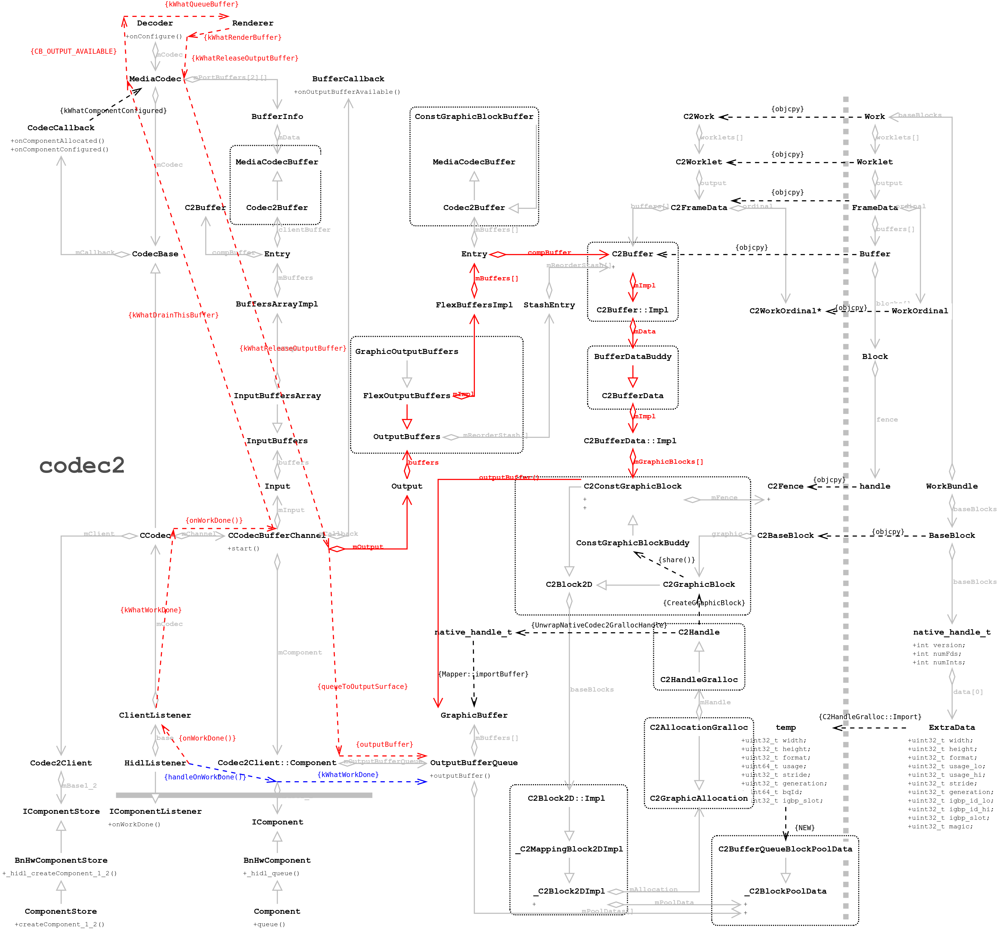

- [本文配图](#本文配图)
  - [整体类图](#整体类图)
  - [Buffer流程](#buffer流程)
  - [C2Buffer类图](#c2buffer类图)
- [`VideoView.openVideo()`](#videoviewopenvideo)
  - [`MediaPlayer`的创建与配置](#mediaplayer的创建与配置)
  - [`mMediaPlayer.setOnPreparedListener()`](#mmediaplayersetonpreparedlistener)
  - [`MediaPlayer.setDataSource()`](#mediaplayersetdatasource)
    - [Native层`MediaPlayer`的创建](#native层mediaplayer的创建)
    - [`MediaPlayer::setDataSource()`](#mediaplayersetdatasource-1)
    - [`MediaPlayerService::create()`创建播放器](#mediaplayerservicecreate创建播放器)
      - [`MediaPlayerService::Client`的创建](#mediaplayerserviceclient的创建)
        - [`NuPlayerDriver`的创建](#nuplayerdriver的创建)
        - [`NuPlayer`的创建与初始化](#nuplayer的创建与初始化)
        - [`AudioOutput`的创建与配置](#audiooutput的创建与配置)
      - [`NuPlayerDriver::setDataSource()`](#nuplayerdriversetdatasource)
      - [`NuPlayer::setDataSourceAsync()`](#nuplayersetdatasourceasync)
      - [`GenericSource`的创建](#genericsource的创建)
  - [`MediaPlayer.setDisplay()`](#mediaplayersetdisplay)
    - [`NuPlayerDriver::setVideoSurfaceTexture()`](#nuplayerdriversetvideosurfacetexture)
    - [`NuPlayer::setVideoSurfaceTextureAsync()`](#nuplayersetvideosurfacetextureasync)
  - [`MediaPlayer.prepareAsync()`](#mediaplayerprepareasync)
    - [`NuPlayerDriver::prepareAsync()`](#nuplayerdriverprepareasync)
    - [`NuPlayer::prepareAsync()`](#nuplayerprepareasync)
  - [`MediaPlayer.start()`](#mediaplayerstart)
    - [`NuPlayerDriver::start()`](#nuplayerdriverstart)
    - [`NuPlayer::instantiateDecoder()`实例化音视频解码器](#nuplayerinstantiatedecoder实例化音视频解码器)
    - [视频解码器](#视频解码器)
      - [音频解码器](#音频解码器)
    - [解码器`NuPlayer::Decoder`的构造](#解码器nuplayerdecoder的构造)
    - [解码器`NuPlayer::Decoder`的初始化](#解码器nuplayerdecoder的初始化)
    - [`NuPlayer::Decoder::onConfigure()`](#nuplayerdecoderonconfigure)
      - [`MediaCodec::CreateByType()`](#mediacodeccreatebytype)
        - [`MediaCodec::MediaCodec()`, `MediaCodec`状态: `UNINITIALIZED`](#mediacodecmediacodec-mediacodec状态-uninitialized)
        - [`MediaCodec::init()`, `MediaCodec`状态: `UNINITIALIZED` -> `INITIALIZING` -> `INITIALIZED`](#mediacodecinit-mediacodec状态-uninitialized---initializing---initialized)
          - [`CCodec`的构造](#ccodec的构造)
          - [`CCodec::setCallback()`配置解码器回调](#ccodecsetcallback配置解码器回调)
          - [`CCodecBufferChannel::setCallback()`配置解码缓冲通道的回调](#ccodecbufferchannelsetcallback配置解码缓冲通道的回调)
          - [`CCodec::initiateAllocateComponent()`, `MediaCodec`状态: `UNINITIALIZED` -> `INITIALIZING`](#ccodecinitiateallocatecomponent-mediacodec状态-uninitialized---initializing)
          - [`CCodec::initiateAllocateComponent()`完成, `MediaCodec`状态: `INITIALIZING` -> `INITIALIZED`](#ccodecinitiateallocatecomponent完成-mediacodec状态-initializing---initialized)
      - [`MediaCodec::configure()`, `MediaCodec`状态: `INITIALIZED` -> `CONFIGURING`](#mediacodecconfigure-mediacodec状态-initialized---configuring)
        - [`CCodec::initiateConfigureComponent()`, `MediaCodec`状态: `CONFIGURING` -> `CONFIGURED`](#ccodecinitiateconfigurecomponent-mediacodec状态-configuring---configured)
      - [`MediaCodec::start()`, `MediaCodec`状态: `CONFIGURED` -> `STARTING`](#mediacodecstart-mediacodec状态-configured---starting)
        - [`CCodec::initiateStart()`, `MediaCodec`状态: `STARTING` -> `STARTED`](#ccodecinitiatestart-mediacodec状态-starting---started)
        - [`CCodec::start()`](#ccodecstart)
        - [`CCodecBufferChannel::start()`对视频输出缓冲队列`IGraphicBufferProducer`的配置](#ccodecbufferchannelstart对视频输出缓冲队列igraphicbufferproducer的配置)
- [来自`Codec2`的`HidlListener::onWorkDone()`](#来自codec2的hidllisteneronworkdone)
  - [`objcpy()`完成`FrameData` -> `C2FrameData`转换](#objcpy完成framedata---c2framedata转换)
  - [`holdBufferQueueBlocks()`完成`C2ConstGraphicBlock` -> `GraphicBuffer`的图形缓存导入](#holdbufferqueueblocks完成c2constgraphicblock---graphicbuffer的图形缓存导入)
  - [`CCodec::onWorkDone()`完成`GraphicBuffer`的输出](#ccodeconworkdone完成graphicbuffer的输出)
    - [`handleOutputFormatChangeIfNeeded()`打开音频输出](#handleoutputformatchangeifneeded打开音频输出)
    - [`onOutputBufferAvailable()`](#onoutputbufferavailable)
      - [`postDrainAudioQueue_l()`回放音频数据](#postdrainaudioqueue_l回放音频数据)
        - [`AudioOutput::write()`输出音频数据](#audiooutputwrite输出音频数据)
          - [`AudioTrack::write()`回放音频](#audiotrackwrite回放音频)
      - [`postDrainVideoQueue()`回放视频数据](#postdrainvideoqueue回放视频数据)
        - [`MediaCodec::onReleaseOutputBuffer()`释放(并输出)视频帧](#mediacodeconreleaseoutputbuffer释放并输出视频帧)
          - [`Codec2Client::Component::queueToOutputSurface()`交换视频帧到应用的`BBQSurface`](#codec2clientcomponentqueuetooutputsurface交换视频帧到应用的bbqsurface)

# 本文配图
## 整体类图


## Buffer流程


## C2Buffer类图


# `VideoView.openVideo()`
用户头一次在相册中点击视频时`MovieActivity`被创建, 因此:
```
// packages/apps/Gallery2/src/com/android/gallery3d/app/MovieActivity.java
    @Override
    public void onCreate(Bundle savedInstanceState) {
        super.onCreate(savedInstanceState);
        ... ...
        mPlayer = new MoviePlayer(rootView, this, intent.getData(), savedInstanceState,
                !mFinishOnCompletion) {
            @Override
            public void onCompletion() {
                if (mFinishOnCompletion) {
                    finish();
                }
            }
        };
```
`MoviePlayer`被构造:
```
// packages/apps/Gallery2/src/com/android/gallery3d/app/MoviePlayer.java
    public MoviePlayer(View rootView, final MovieActivity movieActivity,
            Uri videoUri, Bundle savedInstance, boolean canReplay) {
        mContext = movieActivity.getApplicationContext();
        mRootView = rootView;
        mVideoView = (VideoView) rootView.findViewById(R.id.surface_view);
        ... ...
        mVideoView.setOnErrorListener(this);
        mVideoView.setOnCompletionListener(this);
        mVideoView.setVideoURI(mUri);
        ... ...
    }
```

`mVideoView`为上文提到的`VideoView`, 通过其`setVideoURI()`设置要播放的文件路径:
```
// frameworks/base/core/java/android/widget/VideoView.java
    public void setVideoURI(Uri uri) {
        setVideoURI(uri, null);
    }
    public void setVideoURI(Uri uri, Map<String, String> headers) {
        mUri = uri;
        mHeaders = headers;
        mSeekWhenPrepared = 0;
        openVideo();
        requestLayout();
        invalidate();
    }
```

## `MediaPlayer`的创建与配置
根据上文代码`openVideo()`被调用:
```
// frameworks/base/core/java/android/widget/VideoView.java
    private void openVideo() {
        ... ...
        try {
            ... ...
            mMediaPlayer = new MediaPlayer();
            ... ...
            mMediaPlayer.setOnPreparedListener(mPreparedListener);
            mMediaPlayer.setOnVideoSizeChangedListener(mSizeChangedListener);
            mMediaPlayer.setOnCompletionListener(mCompletionListener);
            mMediaPlayer.setOnErrorListener(mErrorListener);
            mMediaPlayer.setOnInfoListener(mInfoListener);
            mMediaPlayer.setOnBufferingUpdateListener(mBufferingUpdateListener);
            mCurrentBufferPercentage = 0;
            mMediaPlayer.setDataSource(mContext, mUri, mHeaders);
            mMediaPlayer.setDisplay(mSurfaceHolder);
            mMediaPlayer.setAudioAttributes(mAudioAttributes);
            mMediaPlayer.setScreenOnWhilePlaying(true);
            mMediaPlayer.prepareAsync();
            ... ...
            for (Pair<InputStream, MediaFormat> pending: mPendingSubtitleTracks) {
                try {
                    mMediaPlayer.addSubtitleSource(pending.first, pending.second);
                    ... ...
            mCurrentState = STATE_PREPARING;
            attachMediaController();
            ... ...
```

## `mMediaPlayer.setOnPreparedListener()`
```
// frameworks/base/media/java/android/media/MediaPlayer.java
    public void setOnPreparedListener(OnPreparedListener listener)
    {
        mOnPreparedListener = listener;
    }
```
应用设置了`OnPreparedListener`到`MediaPlayer`中, 改监听要等到`MediaPlayer.prepareAsync()`执行完成才会被调用, 后问会讲到.

## `MediaPlayer.setDataSource()`
先看`setDataSource()`:
```
// frameworks/base/media/java/android/media/MediaPlayer.java
    public void setDataSource(@NonNull Context context, @NonNull Uri uri,
            @Nullable Map<String, String> headers)
            throws IOException, IllegalArgumentException, SecurityException, IllegalStateException {
        setDataSource(context, uri, headers, null);
    }
    public void setDataSource(@NonNull Context context, @NonNull Uri uri,
            @Nullable Map<String, String> headers, @Nullable List<HttpCookie> cookies)
            throws IOException {
        ... ...
        if (ContentResolver.SCHEME_FILE.equals(scheme)) {
            ... ...
        } else if (ContentResolver.SCHEME_CONTENT.equals(scheme)
                && Settings.AUTHORITY.equals(authority)) {
            ... ...
        } else {
            if (attemptDataSource(resolver, uri)) {
                return;
            } .. ...
        }
        ... ...

    private boolean attemptDataSource(ContentResolver resolver, Uri uri) {
        ... ...
        try (AssetFileDescriptor afd = optimize
                ? resolver.openTypedAssetFileDescriptor(uri, "*/*", opts)
                : resolver.openAssetFileDescriptor(uri, "r")) {
            setDataSource(afd);
            ... ...

    public void setDataSource(@NonNull AssetFileDescriptor afd)
            throws IOException, IllegalArgumentException, IllegalStateException {
        ... ...
        if (afd.getDeclaredLength() < 0) {
            setDataSource(afd.getFileDescriptor());
            ... ...

    public void setDataSource(FileDescriptor fd)
            throws IOException, IllegalArgumentException, IllegalStateException {
        ... ...
        setDataSource(fd, 0, 0x7ffffffffffffffL);
    }

    public void setDataSource(FileDescriptor fd, long offset, long length)
            throws IOException, IllegalArgumentException, IllegalStateException {
        try (ParcelFileDescriptor modernFd = FileUtils.convertToModernFd(fd)) {
            if (modernFd == null) {
                _setDataSource(fd, offset, length);
            } else ... ...
            ... ...

    private native void _setDataSource(FileDescriptor fd, long offset, long length)
            throws IOException, IllegalArgumentException, IllegalStateException;
```
经过一系列的调用, `_setDataSource()`是个Native的方法, 注意该Native方法有两种实现:
```
// frameworks/base/media/jni/android_media_MediaPlayer.cpp
static const JNINativeMethod gMethods[] = {
    ... ...
    {"_setDataSource",      "(Ljava/io/FileDescriptor;JJ)V",    (void *)android_media_MediaPlayer_setDataSourceFD},
    {"_setDataSource",      "(Landroid/media/MediaDataSource;)V",(void *)android_media_MediaPlayer_setDataSourceCallback },
    ... ...
};

static void
android_media_MediaPlayer_setDataSourceFD(JNIEnv *env, jobject thiz, jobject fileDescriptor, jlong offset, jlong length)
{
    sp<MediaPlayer> mp = getMediaPlayer(env, thiz);
    ... ...
    int fd = jniGetFDFromFileDescriptor(env, fileDescriptor);
    ALOGV("setDataSourceFD: fd %d", fd);
    process_media_player_call( env, thiz, mp->setDataSource(fd, offset, length), "java/io/IOException", "setDataSourceFD failed." );
}
```

### Native层`MediaPlayer`的创建
其`mp`通过``获得, 而其对应的Java层的`MediaPlayer.mNativeContext`是在`MeidaCodec.native_setup()`时设置的:
```
// frameworks/base/media/jni/android_media_MediaPlayer.cpp
static void
android_media_MediaPlayer_native_setup(JNIEnv *env, jobject thiz, jobject weak_this,
                                       jobject jAttributionSource)
{
    ... ...
    sp<MediaPlayer> mp = new MediaPlayer(attributionSource);
    ... ...
    sp<JNIMediaPlayerListener> listener = new JNIMediaPlayerListener(env, thiz, weak_this);
    mp->setListener(listener);
    ... ...
    setMediaPlayer(env, thiz, mp);
}

static sp<MediaPlayer> setMediaPlayer(JNIEnv* env, jobject thiz, const sp<MediaPlayer>& player)
{
    Mutex::Autolock l(sLock);
    sp<MediaPlayer> old = (MediaPlayer*)env->GetLongField(thiz, fields.context);
    ... ...
    env->SetLongField(thiz, fields.context, (jlong)player.get());
    return old;
}
```
此处创建了一个`JNIMediaPlayerListener`, 用于接受`MediaPlayer`的回调, 而该回调是从`mediaerver`通过Binder发回的, 在`mediaserver`中的播放器完成准备工作后会体现到, 此处只关注`mp->setListener()`:
```
// frameworks/av/media/libmedia/mediaplayer.cpp
status_t MediaPlayer::setListener(const sp<MediaPlayerListener>& listener)
{
    ALOGV("setListener");
    Mutex::Autolock _l(mLock);
    mListener = listener;
    return NO_ERROR;
}
```
可以看出`JNIMediaPlayerListener`作为`MediaPlayerListener`被`MediaPlayer`的`mListener`保存.

### `MediaPlayer::setDataSource()`
上文 `env->SetLongField()`设置的正是 `mNativeContext`. 回到`android_media_MediaPlayer_setDataSourceFD()`, 此时`MediaPlayer::setDataSource()`被调用:
```
// frameworks/av/media/libmedia/mediaplayer.cpp
status_t MediaPlayer::setDataSource(int fd, int64_t offset, int64_t length)
{
    ... ...
    const sp<IMediaPlayerService> service(getMediaPlayerService());
    if (service != 0) {
        sp<IMediaPlayer> player(service->create(this, mAudioSessionId, mAttributionSource));
        if ((NO_ERROR != doSetRetransmitEndpoint(player)) ||
            (NO_ERROR != player->setDataSource(fd, offset, length))) {
            player.clear();
        }
        err = attachNewPlayer(player);
    }
    return err;
}
```

### `MediaPlayerService::create()`创建播放器
#### `MediaPlayerService::Client`的创建
首先通过Binder调用`IMediaPlayerService::create()`创建一个`IMediaPlayer`:
```
// frameworks/av/media/libmediaplayerservice/MediaPlayerService.cpp
sp<IMediaPlayer> MediaPlayerService::create(const sp<IMediaPlayerClient>& client,
        audio_session_t audioSessionId, const AttributionSourceState& attributionSource)
{
    ... ...
    sp<Client> c = new Client(
            this, verifiedAttributionSource, connId, client, audioSessionId);
    ... ...
    wp<Client> w = c;
    {
        Mutex::Autolock lock(mLock);
        mClients.add(w);
    }
    return c;
}
```
此处在`mediaserver`中, `Client`被构造:
```
MediaPlayerService::Client::Client(
        const sp<MediaPlayerService>& service, const AttributionSourceState& attributionSource,
        int32_t connId, const sp<IMediaPlayerClient>& client,
        audio_session_t audioSessionId)
        : mAttributionSource(attributionSource)
{
    ALOGV("Client(%d) constructor", connId);
    mConnId = connId;
    mService = service;
    ... ...
    mAudioSessionId = audioSessionId;
    ... ...
    mListener = new Listener(this);
    ... ....
}
```
`mListener`后文再说. `Client`可通过`mService`与`MediaPlayerService`交互. 综上所述`IMediaPlayer`的实现是`MediaPlayerService::Client`, 后续应用中的`MediaPlayer`(Native)将通过Binder与此`Client`通信.回到`MediaPlayer::setDataSource()`中, 创建完`IMediaPlayer`后调用`player->setDataSource()`:
```
// frameworks/av/media/libmediaplayerservice/MediaPlayerService.cpp
status_t MediaPlayerService::Client::setDataSource(int fd, int64_t offset, int64_t length)
{
    ... ...
    player_type playerType = MediaPlayerFactory::getPlayerType(this,
                                                               fd,
                                                               offset,
                                                               length);
    sp<MediaPlayerBase> p = setDataSource_pre(playerType);
    ... ...
    return mStatus = setDataSource_post(p, p->setDataSource(fd, offset, length));
    ... ...
}
```

##### `NuPlayerDriver`的创建
`setDataSource_pre()`时做了很多工作, 但主要还是创建了`MediaPlayerBase`, `playerType`确定了后续需要创建的播放器的类型, Android目前的播放器工厂类默认是`NuPlayerFactory`(还有一种是`TestPlayerFactory`):
```
// frameworks/av/media/libmediaplayerservice/MediaPlayerService.cpp
sp<MediaPlayerBase> MediaPlayerService::Client::setDataSource_pre(
        player_type playerType)
{
    ... ...
    sp<MediaPlayerBase> p = createPlayer(playerType);
    ... ...
    if (!p->hardwareOutput()) {
        mAudioOutput = new AudioOutput(mAudioSessionId, mAttributionSource,
                mAudioAttributes, mAudioDeviceUpdatedListener);
        static_cast<MediaPlayerInterface*>(p.get())->setAudioSink(mAudioOutput);
    }

    return p;
}

sp<MediaPlayerBase> MediaPlayerService::Client::createPlayer(player_type playerType)
{
    sp<MediaPlayerBase> p = getPlayer();
    ... ...
    if (p == NULL) {
        p = MediaPlayerFactory::createPlayer(playerType, mListener,
            VALUE_OR_FATAL(aidl2legacy_int32_t_pid_t(mAttributionSource.pid)));
    }
    ... ...
```
还记得`mListener`么? 在创建`Client`时, 它作为`Listener`被创建, 此时它通过`createPlayer()`设置给了新创建的播放器.

显然`p`在一开始是`nullptr`, `MediaPlayerFactory::createPlayer()`负责创建播放器:
```
// frameworks/av/media/libmediaplayerservice/MediaPlayerFactory.cpp
sp<MediaPlayerBase> MediaPlayerFactory::createPlayer(
        player_type playerType,
        const sp<MediaPlayerBase::Listener> &listener,
        pid_t pid) {
    sp<MediaPlayerBase> p;
    ... ...
    factory = sFactoryMap.valueFor(playerType);
    CHECK(NULL != factory);
    p = factory->createPlayer(pid);
    ... ...
    init_result = p->initCheck();
    if (init_result == NO_ERROR) {
        p->setNotifyCallback(listener);
    } else {
        ALOGE("Failed to create player object of type %d, initCheck failed"
              " (res = %d)", playerType, init_result);
        p.clear();
    }

    return p;
}
```
根据上文`factory`的类型显然是`NuPlayerFactory`, 因此:
```
// frameworks/av/media/libmediaplayerservice/MediaPlayerFactory.cpp
class NuPlayerFactory : public MediaPlayerFactory::IFactory {
    public:
        ... ...
    virtual sp<MediaPlayerBase> createPlayer(pid_t pid) {
        ALOGV(" create NuPlayer");
        return new NuPlayerDriver(pid);
    }
```
显然`NuPlayerDriver`被构造:
```
// frameworks/av/media/libmediaplayerservice/nuplayer/NuPlayerDriver.cpp
NuPlayerDriver::NuPlayerDriver(pid_t pid)
    : ... ...
      mPlayer(new NuPlayer(pid, mMediaClock)),
      ... ...
      mAutoLoop(false) {
    mLooper->setName("NuPlayerDriver Looper");
    mMediaClock->init();
    // set up an analytics record
    mMetricsItem = mediametrics::Item::create(kKeyPlayer);
    mLooper->start(
            false, /* runOnCallingThread */
            true,  /* canCallJava */
            PRIORITY_AUDIO);
    mLooper->registerHandler(mPlayer);
    mPlayer->init(this);
}
```

##### `NuPlayer`的创建与初始化
显然这里有两个调用:
* NuPlayer::NuPlayer()
* NuPlayer::init()

先看`NuPlayer::NuPlayer()`:
```
// frameworks/av/media/libmediaplayerservice/nuplayer/NuPlayer.cpp
NuPlayer::NuPlayer(pid_t pid, const sp<MediaClock> &mediaClock)
    : mUIDValid(false),
      mPID(pid),
      ... ...
      mIsDrmProtected(false),
      mDataSourceType(DATA_SOURCE_TYPE_NONE) {
    CHECK(mediaClock != NULL);
    clearFlushComplete();
}
```

再看`NuPlayer::init()`:
```
// frameworks/av/media/libmediaplayerservice/nuplayer/NuPlayer.cpp
void NuPlayer::init(const wp<NuPlayerDriver> &driver) {
    mDriver = driver;

    sp<AMessage> notify = new AMessage(kWhatMediaClockNotify, this);
    mMediaClock->setNotificationMessage(notify);
}
```
`NuPlayer`通过`mDriver`持有`NuPlayerDriver`. 此时`NuPlayerDriver`构造完成, 且其继承关系:`MediaPlayerBase` -> `MediaPlayerInterface` -> `NuPlayerDriver`, `kWhatMediaClockNotify`本文不讨论.

回到`MediaPlayerFactory::createPlayer()`, 其完成对`NuPlayerDriver`的创建后, 通过`p->setNotifyCallback(listener)`设置了监听, 此时调用的是`NuPlayerDriver`的父类`MediaPlayerInterface`的接口:
```
// frameworks/av/media/libmediaplayerservice/include/MediaPlayerInterface.h

    void        setNotifyCallback(
            const sp<Listener> &listener) {
        Mutex::Autolock autoLock(mNotifyLock);
        mListener = listener;
    }
```
可以看到`MediaPlayerService::Client::Listener`被设置到了`NuPlayerDriver`(父类`MediaPlayerInterface`)的`mListener`上, 因此`NuPlayerDriver`可以通过此对象通知`MediaPlayerService::Client`的`notify()`方法, 在`prepareAsync()`完成后可以看到此类的参与.

##### `AudioOutput`的创建与配置
回到`MediaPlayerService::Client::setDataSource_pre()`中, `AudioOutput`被创建, 且通过`static_cast<MediaPlayerInterface*>(p.get())->setAudioSink(mAudioOutput)`进行配置:
```
// frameworks/av/media/libmediaplayerservice/nuplayer/NuPlayer.cpp
void NuPlayer::setAudioSink(const sp<MediaPlayerBase::AudioSink> &sink) {
    sp<AMessage> msg = new AMessage(kWhatSetAudioSink, this);
    msg->setObject("sink", sink);
    msg->post();
}

void NuPlayer::onMessageReceived(const sp<AMessage> &msg) {
    switch (msg->what()) {
        case kWhatSetDataSource:
        ... ...
        case kWhatSetAudioSink:
        {
            ... ...
            mAudioSink = static_cast<MediaPlayerBase::AudioSink *>(obj.get());
            break;
        }
        ... ...
```
此时`MediaPlayerService::Client`创建的`AudioOutput`被设置在`NuPlayer`的`mAudioSink`.

#### `NuPlayerDriver::setDataSource()`
而`MediaPlayerService::Client::setDataSource()`中的`p->setDataSource()`是对`NuPlayerDriver`(`MediaPlayerBase`的子类)的进一步设置:
```
// frameworks/av/media/libmediaplayerservice/nuplayer/NuPlayerDriver.cpp
status_t NuPlayerDriver::setDataSource(int fd, int64_t offset, int64_t length) {
    ... ...
    mState = STATE_SET_DATASOURCE_PENDING;
    mPlayer->setDataSourceAsync(fd, offset, length);
    while (mState == STATE_SET_DATASOURCE_PENDING) {
        mCondition.wait(mLock);
    }
    return mAsyncResult;
}
```

#### `NuPlayer::setDataSourceAsync()`
因为调用`NuPlayer`的`setDataSourceAsync()`方法是异步的, 此时通过`mCondition.wait()`等待`NuPlayer`消息.
```
// frameworks/av/media/libmediaplayerservice/nuplayer/NuPlayer.cpp
void NuPlayer::setDataSourceAsync(const sp<IStreamSource> &source) {
    sp<AMessage> msg = new AMessage(kWhatSetDataSource, this);
    sp<AMessage> notify = new AMessage(kWhatSourceNotify, this);
    msg->setObject("source", new StreamingSource(notify, source));
    msg->post();
    mDataSourceType = DATA_SOURCE_TYPE_STREAM;
}

void NuPlayer::onMessageReceived(const sp<AMessage> &msg) {
    switch (msg->what()) {
        ... ...
        case kWhatSetDataSource:
        {
            ... ...
            if (obj != NULL) {
                Mutex::Autolock autoLock(mSourceLock);
                mSource = static_cast<Source *>(obj.get());
            } else ... ...
            sp<NuPlayerDriver> driver = mDriver.promote();
            if (driver != NULL) {
                driver->notifySetDataSourceCompleted(err);
            }
            break;
        }
        ... ...
    }
}
```
`notifySetDataSourceCompleted()`负责完成对`NuPlayerDriver`的通知:
```
// frameworks/av/media/libmediaplayerservice/nuplayer/NuPlayerDriver.cpp
void NuPlayerDriver::notifySetDataSourceCompleted(status_t err) {
    mState = (err == OK) ? STATE_UNPREPARED : STATE_IDLE;
    mCondition.broadcast();
}
```

上文`NuPlayerDriver::setDataSource()`通过`mCondition.wait(mLock)`等待`NuPlayer`完成, 因此`NuPlayerDriver::notifySetDataSourceCompleted()`执行完成后 上文的`NuPlayerDriver::setDataSource()`返回.

#### `GenericSource`的创建
根据上文, `mPlayer`的类型显然是`NuPlayer`, 回到`uPlayer::setDataSourceAsync()`:
```
// frameworks/av/media/libmediaplayerservice/nuplayer/NuPlayer.cpp
void NuPlayer::setDataSourceAsync(int fd, int64_t offset, int64_t length) {
    ... ...
    sp<GenericSource> source =
            new GenericSource(notify, mUIDValid, mUID, mMediaClock);
    ... ...
    status_t err = source->setDataSource(fd, offset, length);
    ... ...
}
```
此处构造了`GenericSource`, 通过`setDataSource()`为其设置文件描述符:
```
// frameworks/av/media/libmediaplayerservice/nuplayer/GenericSource.cpp
status_t NuPlayer::GenericSource::setDataSource(
        int fd, int64_t offset, int64_t length) {
    ... ...
    resetDataSource();
    mFd.reset(dup(fd));
    mOffset = offset;
    mLength = length;
    ... ...
}
```
上层传递的文件描述符被设置在了`GenericSource`的`mFd`中, 而`GenericSource`在`NuPlayer::setDataSourceAsync()`时通过`kWhatSetDataSource`消息通知`NuPlayer::onMessageReceived()`将其记录在`NuPlayer`的`mSource`中.


回到上文的`MediaPlayerService::Client::setDataSource()`:
```
// frameworks/av/media/libmediaplayerservice/MediaPlayerService.cpp
status_t MediaPlayerService::Client::setDataSource(int fd, int64_t offset, int64_t length)
{
    ... ...
    player_type playerType = MediaPlayerFactory::getPlayerType(this,
                                                               fd,
                                                               offset,
                                                               length);
    sp<MediaPlayerBase> p = setDataSource_pre(playerType);
    ... ...
    return mStatus = setDataSource_post(p, p->setDataSource(fd, offset, length));
    ... ...
}

status_t MediaPlayerService::Client::setDataSource_post(
        const sp<MediaPlayerBase>& p,
        status_t status)
{
    ... ...
    if (mRetransmitEndpointValid) {
        status = p->setRetransmitEndpoint(&mRetransmitEndpoint);
        if (status != NO_ERROR) {
            ALOGE("setRetransmitEndpoint error: %d", status);
        }
    }

    if (status == OK) {
        Mutex::Autolock lock(mLock);
        mPlayer = p;
    }
    return status;
}
```
`MediaPlayerService::Client::setDataSource()`最后通过`setDataSource_post()`将创建的`NuPlayerDriver`设置在`MediaPlayerService::Client`的`mPlayer`.


## `MediaPlayer.setDisplay()`
回到`VidewView.openVideo()`中, `mMediaPlayer.setDisplay()`将自身的`mSurfaceHolder`设置给了`MediaPlayer`:
```
// frameworks/base/media/java/android/media/MediaPlayer.java
    public void setDisplay(SurfaceHolder sh) {
        mSurfaceHolder = sh;
        Surface surface;
        if (sh != null) {
            surface = sh.getSurface();
        } else {
            surface = null;
        }
        _setVideoSurface(surface);
        updateSurfaceScreenOn();
    }
```
显然`_setVideoSurface()`也是Native方法, 直接查看代码:
```
// frameworks/base/media/jni/android_media_MediaPlayer.cpp
static void
android_media_MediaPlayer_setVideoSurface(JNIEnv *env, jobject thiz, jobject jsurface)
{
    setVideoSurface(env, thiz, jsurface, true /* mediaPlayerMustBeAlive */);
}

static void
setVideoSurface(JNIEnv *env, jobject thiz, jobject jsurface, jboolean mediaPlayerMustBeAlive)
{
    sp<MediaPlayer> mp = getMediaPlayer(env, thiz);
    ... ...
    decVideoSurfaceRef(env, thiz);
    sp<IGraphicBufferProducer> new_st;
    if (jsurface) {
        sp<Surface> surface(android_view_Surface_getSurface(env, jsurface));
        if (surface != NULL) {
            new_st = surface->getIGraphicBufferProducer();
            ... ...
            new_st->incStrong((void*)decVideoSurfaceRef);
        } else ... ...
    }
    env->SetLongField(thiz, fields.surface_texture, (jlong)new_st.get());
    mp->setVideoSurfaceTexture(new_st);
}
```
通过`android_view_Surface_getSurface()`将上层的`Surface`(Java)转换为底层的`Surface`(Native), 然后将该`Surface`(Native)指针记录在`MediaPlayer.mNativeSurfaceTexture`(Java)中, 最后通过`mp->setVideoSurfaceTexture()`也就是`MediaPlayer::setVideoSurfaceTexture()`设置从`Surface`(Native)调用`getIGraphicBufferProducer()`获得的`IGraphicBufferProducer`给底层的MediaPlayer(Native):
```
// frameworks/av/media/libmedia/mediaplayer.cpp
status_t MediaPlayer::setVideoSurfaceTexture(
        const sp<IGraphicBufferProducer>& bufferProducer)
{
    ... ...
    return mPlayer->setVideoSurfaceTexture(bufferProducer);
}
```
`mPlayer->setVideoSurfaceTexture()`通过Binder调用到:
```
// frameworks/av/media/libmediaplayerservice/MediaPlayerService.cpp
status_t MediaPlayerService::Client::setVideoSurfaceTexture(
        const sp<IGraphicBufferProducer>& bufferProducer)
{
    ... ...
    sp<MediaPlayerBase> p = getPlayer();
    ... ...
    sp<ANativeWindow> anw;
    if (bufferProducer != NULL) {
        anw = new Surface(bufferProducer, true /* controlledByApp */);
        status_t err = nativeWindowConnect(anw.get(), "setVideoSurfaceTexture");
        ... ...
    }
    status_t err = p->setVideoSurfaceTexture(bufferProducer);
    mLock.lock();
    disconnectNativeWindow_l();
    if (err == OK) {
        mConnectedWindow = anw;
        mConnectedWindowBinder = binder;
        mLock.unlock();
    } else ... ...
```

### `NuPlayerDriver::setVideoSurfaceTexture()`
通过上层传递的`bufferProducer`创建了新的`Surface`, 又通过`disconnectNativeWindow_l()`断开了`bufferProducer`与应用持有的`Surface`(Native)的联系, 然后将新创建的`Surface`保存到`Client::mConnectedWindow`, 这意味着, `mediaserver`直接负责生产`GraphicBuffer`给原本属于应用持有的`Surface`. 继续看此处的`p->setVideoSurfaceTexture()`, `p`的类型为`MediaPlayerBase`, 也就是`NuPlayerDriver`:
```
// frameworks/av/media/libmediaplayerservice/nuplayer/NuPlayerDriver.cpp
status_t NuPlayerDriver::setVideoSurfaceTexture(
        const sp<IGraphicBufferProducer> &bufferProducer) {
    mSetSurfaceInProgress = true;
    mPlayer->setVideoSurfaceTextureAsync(bufferProducer);
    while (mSetSurfaceInProgress) {
        mCondition.wait(mLock);
    }
    return OK;
}
```

### `NuPlayer::setVideoSurfaceTextureAsync()`
如上文, `mPlayer`的类型是`NuPlayer`, 和上文的`NuPlayer::setDataSource()`类似, `setVideoSurfaceTextureAsync()`也是异步的:
```
// frameworks/av/media/libmediaplayerservice/nuplayer/NuPlayer.cpp
void NuPlayer::setVideoSurfaceTextureAsync(
        const sp<IGraphicBufferProducer> &bufferProducer) {
    sp<AMessage> msg = new AMessage(kWhatSetVideoSurface, this);

    if (bufferProducer == NULL) {
        msg->setObject("surface", NULL);
    } else {
        msg->setObject("surface", new Surface(bufferProducer, true /* controlledByApp */));
    }
    msg->post();
}

void NuPlayer::onMessageReceived(const sp<AMessage> &msg) {
    switch (msg->what()) {
        case kWhatSetDataSource:
        ... ...
        case kWhatSetVideoSurface:
        {

            sp<RefBase> obj;
            CHECK(msg->findObject("surface", &obj));
            sp<Surface> surface = static_cast<Surface *>(obj.get());
            if (mSource == NULL || !mStarted || mSource->getFormat(false /* audio */) == NULL
                    // NOTE: mVideoDecoder's mSurface is always non-null
                    || (mVideoDecoder != NULL && mVideoDecoder->setVideoSurface(surface) == OK)) {
                performSetSurface(surface);
                break;
            }
            ... ...
        }
        ... ...
    }
}
void NuPlayer::performSetSurface(const sp<Surface> &surface) {
    mSurface = surface;
    setVideoScalingMode(mVideoScalingMode);
    if (mDriver != NULL) {
        sp<NuPlayerDriver> driver = mDriver.promote();
        if (driver != NULL) {
            driver->notifySetSurfaceComplete();
        }
    }
}
```
注意, 在`NuPlayer::onMessageReceived()`响应消息`kWhatSetVideoSurface`时, 条件`!mStarted`成立. `NuPlayer`保存上层的`Surface`即`mediaserver`使用应用传递的`IGraphicBufferProducer`所创建的`Surface`到`mSurface`, 并调用`NuPlayerDriver::notifySetSurfaceComplete()`:
```
// frameworks/av/media/libmediaplayerservice/nuplayer/NuPlayerDriver.cpp
void NuPlayerDriver::notifySetSurfaceComplete() {
    ... ...
    mSetSurfaceInProgress = false;
    mCondition.broadcast();
}
```
同理可知`NuPlayerDriver::setVideoSurfaceTexture()`返回.

## `MediaPlayer.prepareAsync()`
回到`VidewView.openVideo()`中, `mMediaPlayer.prepareAsync()`即开始通知播放器做准备工作:
```
// frameworks/base/media/java/android/media/MediaPlayer.java
public class MediaPlayer extends PlayerBase
                         implements SubtitleController.Listener
                                  , VolumeAutomation
                                  , AudioRouting
{
    .. ...
    public native void prepareAsync() throws IllegalStateException;
```
`prepareAsync()`是个本地方法:
```
// frameworks/base/media/jni/android_media_MediaPlayer.cpp
static const JNINativeMethod gMethods[] = {
    ... ...
    {"prepareAsync",        "()V",                              (void *)android_media_MediaPlayer_prepareAsync},
    ... ...
};

static void
android_media_MediaPlayer_prepareAsync(JNIEnv *env, jobject thiz)
{
    sp<MediaPlayer> mp = getMediaPlayer(env, thiz);
    ... ...
    // Handle the case where the display surface was set before the mp was
    // initialized. We try again to make it stick.
    sp<IGraphicBufferProducer> st = getVideoSurfaceTexture(env, thiz);
    mp->setVideoSurfaceTexture(st);
    process_media_player_call( env, thiz, mp->prepareAsync(), "java/io/IOException", "Prepare Async failed." );
}
```

### `NuPlayerDriver::prepareAsync()`
`NuPlayerDriver::setVideoSurfaceTexture()`的调用是多余的, 但并没什么坏处:
```
// frameworks/av/media/libmediaplayerservice/nuplayer/NuPlayerDriver.cpp
status_t NuPlayerDriver::prepareAsync() {
    ... ..
    switch (mState) {
        case STATE_UNPREPARED:
            mState = STATE_PREPARING;
            mIsAsyncPrepare = true;
            mPlayer->prepareAsync();
            return OK;
        case STATE_STOPPED:
            ... ...
        default:
            return INVALID_OPERATION;
    };
}

```

### `NuPlayer::prepareAsync()`
播放器的状态如果是还未播放过, 那肯定是`STATE_UNPREPARED`, `STATE_STOPPED`的情景这里不讨论:
```
// frameworks/av/media/libmediaplayerservice/nuplayer/NuPlayer.cpp
void NuPlayer::prepareAsync() {
    ... ...
    (new AMessage(kWhatPrepare, this))->post();
}

void NuPlayer::onMessageReceived(const sp<AMessage> &msg) {
    switch (msg->what()) {
        case kWhatSetDataSource:
        ... ...
        case kWhatPrepare:
        {
            ... ...
            mSource->prepareAsync();
            break;
        }
        ... ...
```
如上文`mSource`的类型是`GenericSource`:
```
// frameworks/av/media/libmediaplayerservice/nuplayer/GenericSource.cpp
void NuPlayer::GenericSource::prepareAsync() {
    ... ...
    if (mLooper == NULL) {
        mLooper = new ALooper;
        mLooper->setName("generic");
        mLooper->start();
        mLooper->registerHandler(this);
    }
    sp<AMessage> msg = new AMessage(kWhatPrepareAsync, this);
    msg->post();
}
void NuPlayer::GenericSource::onMessageReceived(const sp<AMessage> &msg) {
    Mutex::Autolock _l(mLock);
    switch (msg->what()) {
        case kWhatPrepareAsync:
        {
            onPrepareAsync();
            break;
        }
        ... ...
    }
}

void NuPlayer::GenericSource::onPrepareAsync() {
    ... ...
    // delayed data source creation
    if (mDataSource == NULL) {
        ... ...
    }
    ... ...
    // init extractor from data source
    status_t err = initFromDataSource();
    ... ...
    if (mVideoTrack.mSource != NULL) {
        ... ...
    }
    notifyFlagsChanged(
            // FLAG_SECURE will be known if/when prepareDrm is called by the app
            // FLAG_PROTECTED will be known if/when prepareDrm is called by the app
            FLAG_CAN_PAUSE |
            FLAG_CAN_SEEK_BACKWARD |
            FLAG_CAN_SEEK_FORWARD |
            FLAG_CAN_SEEK);
    finishPrepareAsync();
    ... ...
}
void NuPlayer::GenericSource::finishPrepareAsync() {
    ... ...
    status_t err = startSources();
    ... ...
    if (mIsStreaming) {
        ... ...
    } else {
        notifyPrepared();
    }
    ... ...
}
```
大体说下这里, 主要是准备`DataSource`并设置给`mDataSource`, 该步骤不能失败, 如果成功, 且初始化没有问题, 则最终通过父类`NuPlayer::Source`的`notifyPrepared()`方法通知`NuPlayerDriver`:
```
// frameworks/av/media/libmediaplayerservice/nuplayer/NuPlayer.cpp
void NuPlayer::Source::notifyPrepared(status_t err) {
    ... ...
    sp<AMessage> notify = dupNotify();
    notify->setInt32("what", kWhatPrepared);
    notify->setInt32("err", err);
    notify->post();
}
```

`NuPlayerDriver`处理`NuPlayer::Source::kWhatPrepared`消息:
```
// frameworks/av/media/libmediaplayerservice/nuplayer/NuPlayer.cpp
void NuPlayer::onMessageReceived(const sp<AMessage> &msg) {
    switch (msg->what()) {
        ... ...
        case Source::kWhatPrepared:
        {
            ... ...
            if (err != OK) {
                ... ...
            } else {
                mPrepared = true;
            }

            sp<NuPlayerDriver> driver = mDriver.promote();
            if (driver != NULL) {
                ... ...
                if (mSource->getDuration(&durationUs) == OK) {
                    driver->notifyDuration(durationUs);
                }
                driver->notifyPrepareCompleted(err);
            }

            break;
        }
        ... ...
    }
}
```
`NuPlayer`通过`NuPlayerDriver::notifyPrepareCompleted()`通知完成操作:
```
// frameworks/av/media/libmediaplayerservice/nuplayer/NuPlayerDriver.cpp

void NuPlayerDriver::notifyPrepareCompleted(status_t err) {
    ... ...
    mAsyncResult = err;
    if (err == OK) {
        // update state before notifying client, so that if client calls back into NuPlayerDriver
        // in response, NuPlayerDriver has the right state
        mState = STATE_PREPARED;
        if (mIsAsyncPrepare) {
            notifyListener_l(MEDIA_PREPARED);
        }
    } else ... ...
    sp<MetaData> meta = mPlayer->getFileMeta();
    int32_t loop;
    if (meta != NULL
            && meta->findInt32(kKeyAutoLoop, &loop) && loop != 0) {
        mAutoLoop = true;
    }
    mCondition.broadcast();
}
```
然而, `mCondition.broadcast()`的消息并没有对应的`mCondition.wait()`, 这是因为`NuPlayerDriver`实际上是通过`notifyListener_l()`同时上层的, 消息是`MEDIA_PREPARED`:
```
// frameworks/av/media/libmediaplayerservice/nuplayer/NuPlayerDriver.cpp
void NuPlayerDriver::notifyListener_l(
    int msg, int ext1, int ext2, const Parcel *in) {
    ALOGV("notifyListener_l(%p), (%d, %d, %d, %d), loop setting(%d, %d)",
            this, msg, ext1, ext2, (in == NULL ? -1 : (int)in->dataSize()), mAutoLoop, mLooping);
    switch (msg) {
        case MEDIA_PLAYBACK_COMPLETE:
        ... ...
    }
    mLock.unlock();
    sendEvent(msg, ext1, ext2, in);
    mLock.lock();
}
```
此处的`sendEvent()`方法是`NuPlayerDriver`父类`MediaPlayerBase`的:
```
// frameworks/av/include/media/MediaPlayerInterface.h
class MediaPlayerBase : public RefBase
{
public:
    ... ...
    void        sendEvent(int msg, int ext1=0, int ext2=0,
                          const Parcel *obj=NULL) {
        sp<Listener> listener;
        {
            Mutex::Autolock autoLock(mNotifyLock);
            listener = mListener;
        }
        if (listener != NULL) {
            listener->notify(msg, ext1, ext2, obj);
        }
    }
    ... ...
```
`mPlayer`的类型是`MediaPlayerBase::Listener`, 其还有一个子实现:`MediaPlayerService::Client::Listener`:
```
// frameworks/av/media/libmediaplayerservice/MediaPlayerService.h
class MediaPlayerService : public BnMediaPlayerService
{
    ... ...
    class Client : public BnMediaPlayer {
        ... ...
        class Listener : public MediaPlayerBase::Listener {
        public:
            Listener(const wp<Client> &client) : mClient(client) {}
            virtual ~Listener() {}
            virtual void notify(int msg, int ext1, int ext2, const Parcel *obj) {
                sp<Client> client = mClient.promote();
                if (client != NULL) {
                    client->notify(msg, ext1, ext2, obj);
                }
            }
        private:
            wp<Client> mClient;
        };
        ... ...
```
综上所述`MediaPlayerService::Client::notify()`被调用:
```
// frameworks/av/media/libmediaplayerservice/MediaPlayerService.cpp
void MediaPlayerService::Client::notify(
        int msg, int ext1, int ext2, const Parcel *obj)
{
    sp<IMediaPlayerClient> c;
    sp<Client> nextClient;
    status_t errStartNext = NO_ERROR;
    {
        Mutex::Autolock l(mLock);
        c = mClient;
        ... ...
    }
    ... ...
    if (c != NULL) {
        ALOGV("[%d] notify (%d, %d, %d)", mConnId, msg, ext1, ext2);
        c->notify(msg, ext1, ext2, obj);
    }
}
```
`IMediaPlayerClient`将调用回应用的`MediaPlayer`, 因此应用的`MediaPlayer::notify()`通过Binder被调用:
```
// frameworks/av/media/libmedia/mediaplayer.cpp
void MediaPlayer::notify(int msg, int ext1, int ext2, const Parcel *obj)
{
    ... ...
    switch (msg) {
    case MEDIA_NOP: // interface test message
        break;
    case MEDIA_PREPARED:
        ALOGV("MediaPlayer::notify() prepared");
        mCurrentState = MEDIA_PLAYER_PREPARED;
        if (mPrepareSync) {
            ALOGV("signal application thread");
            mPrepareSync = false;
            mPrepareStatus = NO_ERROR;
            mSignal.signal();
        }
        break;
        ... ...
    }
    sp<MediaPlayerListener> listener = mListener;
    if (locked) mLock.unlock();
    // this prevents re-entrant calls into client code
    if ((listener != 0) && send) {
        Mutex::Autolock _l(mNotifyLock);
        ALOGV("callback application");
        listener->notify(msg, ext1, ext2, obj);
        ALOGV("back from callback");
    }
}
```
`mSignal.signal()`此场景下没有流程在等待(只有`MediaPlayer::notify()`时才等待), 此时`mListener`的类型是`MediaPlayerListener`, 其实现是`JNIMediaPlayerListener`, 因此:
```
// frameworks/base/media/jni/android_media_MediaPlayer.cpp
void JNIMediaPlayerListener::notify(int msg, int ext1, int ext2, const Parcel *obj)
{
    JNIEnv *env = AndroidRuntime::getJNIEnv();
    if (obj && obj->dataSize() > 0) {
        jobject jParcel = createJavaParcelObject(env);
        if (jParcel != NULL) {
            Parcel* nativeParcel = parcelForJavaObject(env, jParcel);
            nativeParcel->setData(obj->data(), obj->dataSize());
            env->CallStaticVoidMethod(mClass, fields.post_event, mObject,
                    msg, ext1, ext2, jParcel);
            env->DeleteLocalRef(jParcel);
        }
    } else {
        env->CallStaticVoidMethod(mClass, fields.post_event, mObject,
                msg, ext1, ext2, NULL);
    }
    if (env->ExceptionCheck()) {
        ALOGW("An exception occurred while notifying an event.");
        LOGW_EX(env);
        env->ExceptionClear();
    }
}
```

```
// frameworks/base/media/java/android/media/MediaPlayer.java
public class MediaPlayer extends PlayerBase
                         implements SubtitleController.Listener
                                  , VolumeAutomation
                                  , AudioRouting
{
    ... ...
    private static void postEventFromNative(Object mediaplayer_ref,
                                            int what, int arg1, int arg2, Object obj)
    {
        final MediaPlayer mp = (MediaPlayer)((WeakReference)mediaplayer_ref).get();
        ... ...
        switch (what) {
            ... ...
        case MEDIA_PREPARED:
            // By this time, we've learned about DrmInfo's presence or absence. This is meant
            // mainly for prepareAsync() use case. For prepare(), this still can run to a race
            // condition b/c MediaPlayerNative releases the prepare() lock before calling notify
            // so we also set mDrmInfoResolved in prepare().
            synchronized (mp.mDrmLock) {
                mp.mDrmInfoResolved = true;
            }
            break;

        }
        if (mp.mEventHandler != null) {
            Message m = mp.mEventHandler.obtainMessage(what, arg1, arg2, obj);
            mp.mEventHandler.sendMessage(m);
        }
    }
```
`mEventHandler`的类型是`MediaPlayer.EventHandler`故:
```
// frameworks/base/media/java/android/media/MediaPlayer.java

    private class EventHandler extends Handler
    {
        private MediaPlayer mMediaPlayer;

        public EventHandler(MediaPlayer mp, Looper looper) {
            super(looper);
            mMediaPlayer = mp;
        }

        @Override
        public void handleMessage(Message msg) {
            if (mMediaPlayer.mNativeContext == 0) {
                Log.w(TAG, "mediaplayer went away with unhandled events");
                return;
            }
            switch(msg.what) {
            case MEDIA_PREPARED:
                try {
                    scanInternalSubtitleTracks();
                } catch (RuntimeException e) {
                    // send error message instead of crashing;
                    // send error message instead of inlining a call to onError
                    // to avoid code duplication.
                    Message msg2 = obtainMessage(
                            MEDIA_ERROR, MEDIA_ERROR_UNKNOWN, MEDIA_ERROR_UNSUPPORTED, null);
                    sendMessage(msg2);
                }

                OnPreparedListener onPreparedListener = mOnPreparedListener;
                if (onPreparedListener != null)
                    onPreparedListener.onPrepared(mMediaPlayer);
                return;
                ... ...
```
而`mOnPreparedListener`是上层通过`setOnPreparedListener()`设置的. 其实现:
```
// frameworks/base/core/java/android/widget/VideoView.java
    @UnsupportedAppUsage
    MediaPlayer.OnPreparedListener mPreparedListener = new MediaPlayer.OnPreparedListener() {
        public void onPrepared(MediaPlayer mp) {
            mCurrentState = STATE_PREPARED;

            // Get the capabilities of the player for this stream
            Metadata data = mp.getMetadata(MediaPlayer.METADATA_ALL,
                                      MediaPlayer.BYPASS_METADATA_FILTER);
            ... ...
            mVideoWidth = mp.getVideoWidth();
            mVideoHeight = mp.getVideoHeight();
            ... ...
            if (mVideoWidth != 0 && mVideoHeight != 0) {
                ... ...
            } else {
                // We don't know the video size yet, but should start anyway.
                // The video size might be reported to us later.
                if (mTargetState == STATE_PLAYING) {
                    start();
                }
            }
        }
    };
```
此时视频的播放仍未开始, 因此`if (mVideoWidth != 0 && mVideoHeight != 0)`条件不成立, 且此时`if (mTargetState == STATE_PLAYING)`条件也不满足.

## `MediaPlayer.start()`
回到`MoviePlayer`的构造:
```
// packages/apps/Gallery2/src/com/android/gallery3d/app/MoviePlayer.java
    public MoviePlayer(View rootView, final MovieActivity movieActivity,
            Uri videoUri, Bundle savedInstance, boolean canReplay) {
        mContext = movieActivity.getApplicationContext();
        mRootView = rootView;
        mVideoView = (VideoView) rootView.findViewById(R.id.surface_view);
        ... ...
        mVideoView.setOnErrorListener(this);
        mVideoView.setOnCompletionListener(this);
        mVideoView.setVideoURI(mUri);
        ... ...
        mVideoView.setOnPreparedListener(new MediaPlayer.OnPreparedListener() {
            @Override
            public void onPrepared(MediaPlayer player) {
                ... ...
            }
        });
        ... ...
        if (savedInstance != null) { // this is a resumed activity
            ... ...
        } else {
            final Integer bookmark = mBookmarker.getBookmark(mUri);
            if (bookmark != null) {
                showResumeDialog(movieActivity, bookmark);
            } else {
                startVideo();
            }
        }
    }
    private void startVideo() {
        ... ...
        mVideoView.start();
        setProgress();
    }
```
`mVideoView`是上文的`VideoView`:
```
// frameworks/base/core/java/android/widget/VideoView.java
    @Override
    public void start() {
        if (isInPlaybackState()) {
            mMediaPlayer.start();
            mCurrentState = STATE_PLAYING;
        }
        mTargetState = STATE_PLAYING;
    }
```
终于调用到`MediaPlayer.start()`了, 为了节省篇幅, 我们都写到一起:
```
// frameworks/base/media/java/android/media/MediaPlayer.java
public class MediaPlayer extends PlayerBase
                         implements SubtitleController.Listener
                                  , VolumeAutomation
                                  , AudioRouting
{
    ... ...
    public void start() throws IllegalStateException {
        //FIXME use lambda to pass startImpl to superclass
        final int delay = getStartDelayMs();
        if (delay == 0) {
            startImpl();
        } else ... // 单独启动线程做延迟处理, 此处不考虑
    }

    private void startImpl() {
        baseStart(0); // unknown device at this point
        stayAwake(true);
        tryToEnableNativeRoutingCallback();
        _start();
    }
    private native void _start() throws IllegalStateException;
    ... ...
}
```
### `NuPlayerDriver::start()`
```
// frameworks/base/media/jni/android_media_MediaPlayer.cpp
static const JNINativeMethod gMethods[] = {
    ... ...
    {"_start",              "()V",                              (void *)android_media_MediaPlayer_start},
    ... ...
}
static void
android_media_MediaPlayer_start(JNIEnv *env, jobject thiz)
{
    ... ...
    sp<MediaPlayer> mp = getMediaPlayer(env, thiz);
    ... ...
    process_media_player_call( env, thiz, mp->start(), NULL, NULL );
}

### `NuPlayer::start()`
// frameworks/av/media/libmediaplayerservice/nuplayer/NuPlayerDriver.cpp
status_t NuPlayerDriver::start() {
    ALOGV("start(%p), state is %d, eos is %d", this, mState, mAtEOS);
    Mutex::Autolock autoLock(mLock);
    return start_l();
}
status_t NuPlayerDriver::start_l() {
    switch (mState) {
        // 此时状态必定为 STATE_PREPARED
        case STATE_UNPREPARED:
        ... ...
        case STATE_PAUSED:
        case STATE_STOPPED_AND_PREPARED:
        case STATE_PREPARED:
        {
            mPlayer->start();
            FALLTHROUGH_INTENDED;
        }
        ... ...
    }
    mState = STATE_RUNNING;
    return OK;
}

// frameworks/av/media/libmediaplayerservice/nuplayer/NuPlayer.cpp
void NuPlayer::start() {
    (new AMessage(kWhatStart, this))->post();
}

void NuPlayer::onMessageReceived(const sp<AMessage> &msg) {
    switch (msg->what()) {
        case kWhatSetDataSource:
        ... ...
        case kWhatStart:
        {
            // 显然 mStarted 为: false
            if (mStarted) {
                ... ...
            } else {
                onStart();
            }
            mPausedByClient = false;
            break;
        }
        ... ....
    }
}

void NuPlayer::onStart(int64_t startPositionUs, MediaPlayerSeekMode mode) {
    ... ...
    mRenderer = new Renderer(mAudioSink, mMediaClock, notify, flags);
    if (mVideoDecoder != NULL) {
        mVideoDecoder->setRenderer(mRenderer);
    }
    if (mAudioDecoder != NULL) {
        mAudioDecoder->setRenderer(mRenderer);
    }
    ... ...
    postScanSources();
}

// frameworks/av/media/libmediaplayerservice/nuplayer/NuPlayerRenderer.cpp
NuPlayer::Renderer::Renderer(
        const sp<MediaPlayerBase::AudioSink> &sink,
        const sp<MediaClock> &mediaClock,
        const sp<AMessage> &notify,
        uint32_t flags)
    : mAudioSink(sink),
      ... ...
      mWakeLock(new AWakeLock()) {
    CHECK(mediaClock != NULL);
    mPlaybackRate = mPlaybackSettings.mSpeed;
    mMediaClock->setPlaybackRate(mPlaybackRate);
    (void)mSyncFlag.test_and_set();
}
```
`NuPlayer`的`mAudioSink`也就是`AudioOutput`被设置给了`NuPlayer::Renderer`的`mAudioSink`成员, 后续渲染时, 此处会用到.
通过`setRenderer()`, `NuPlayer::Renderer`均设置到了`mVideoDecoder`和`mAudioDecoder`所对应的`CCodec`的父类`CodecBase`的`mRender`中(过程略去).

### `NuPlayer::instantiateDecoder()`实例化音视频解码器
对于`NuPlayer::onStart()`, 接着接看`postScanSources()`:
```
// frameworks/av/media/libmediaplayerservice/nuplayer/NuPlayerDriver.cpp
void NuPlayer::postScanSources() {
    if (mScanSourcesPending) {
        return;
    }

    sp<AMessage> msg = new AMessage(kWhatScanSources, this);
    msg->setInt32("generation", mScanSourcesGeneration);
    msg->post();

    mScanSourcesPending = true;
}

void NuPlayer::onMessageReceived(const sp<AMessage> &msg) {
    switch (msg->what()) {
        case kWhatSetDataSource:
        ... ...
        case kWhatScanSources:
        {
            ... ...
            // initialize video before audio because successful initialization of
            // video may change deep buffer mode of audio.
            if (mSurface != NULL) {
                if (instantiateDecoder(false, &mVideoDecoder) == -EWOULDBLOCK) {
                    rescan = true;
                }
            }
            ... ...
        }
        ... ...
    }
}
```

### 视频解码器
```
// frameworks/av/media/libmediaplayerservice/nuplayer/NuPlayer.cpp
status_t NuPlayer::instantiateDecoder(
        bool audio, sp<DecoderBase> *decoder, bool checkAudioModeChange) {
    ... ...
    if (!audio) {
        ... ...
        if (mCCDecoder == NULL) {
            mCCDecoder = new CCDecoder(ccNotify);
        }
        ... ...
    }
    ... ...
    if (audio) {
        ... ...
    } else {
        ... ...
        *decoder = new Decoder(
                notify, mSource, mPID, mUID, mRenderer, mSurface, mCCDecoder);
        mVideoDecoderError = false;
        ... ...
    }
    (*decoder)->init();
    ... ...
    (*decoder)->configure(format);
    ... ...
}
```


#### 音频解码器
```
// frameworks/av/media/libmediaplayerservice/nuplayer/NuPlayer.cpp
status_t NuPlayer::instantiateDecoder(
        bool audio, sp<DecoderBase> *decoder, bool checkAudioModeChange) {
    ... ...
    if (!audio) {
        ... ...
    }
    ... ...
    if (audio) {
        sp<AMessage> notify = new AMessage(kWhatAudioNotify, this);
        ++mAudioDecoderGeneration;
        notify->setInt32("generation", mAudioDecoderGeneration);

        if (checkAudioModeChange) {
            determineAudioModeChange(format);
        }
        if (mOffloadAudio) {
            mSource->setOffloadAudio(true /* offload */);
            ... ...
            *decoder = new DecoderPassThrough(notify, mSource, mRenderer);
            ALOGV("instantiateDecoder audio DecoderPassThrough  hasVideo: %d", hasVideo);
        } else {
            mSource->setOffloadAudio(false /* offload */);
            *decoder = new Decoder(notify, mSource, mPID, mUID, mRenderer);
            ALOGV("instantiateDecoder audio Decoder");
        }
        mAudioDecoderError = false;
    } else {
        ... ...
    }
    (*decoder)->init();
    ... ...
    (*decoder)->configure(format);
    ... ...
}
```

### 解码器`NuPlayer::Decoder`的构造
```
// frameworks/av/media/libmediaplayerservice/nuplayer/NuPlayerDecoder.cpp
NuPlayer::Decoder::Decoder(
        const sp<AMessage> &notify,
        const sp<Source> &source,
        pid_t pid,
        uid_t uid,
        const sp<Renderer> &renderer,
        const sp<Surface> &surface,
        const sp<CCDecoder> &ccDecoder)
    : DecoderBase(notify),
      mSurface(surface),
      mSource(source),
      mRenderer(renderer),
      mCCDecoder(ccDecoder),
      ... ...
      mComponentName("decoder") {
    mCodecLooper = new ALooper;
    mCodecLooper->setName("NPDecoder-CL");
    mCodecLooper->start(false, false, ANDROID_PRIORITY_AUDIO);
    mVideoTemporalLayerAggregateFps[0] = mFrameRateTotal;
}

// frameworks/av/media/libmediaplayerservice/nuplayer/NuPlayerDecoderBase.cpp
NuPlayer::DecoderBase::DecoderBase(const sp<AMessage> &notify)
    :  mNotify(notify),
       ... ...
       mRequestInputBuffersPending(false) {
    mDecoderLooper = new ALooper;
    mDecoderLooper->setName("NPDecoder");
    mDecoderLooper->start(false, false, ANDROID_PRIORITY_AUDIO);
}
```

### 解码器`NuPlayer::Decoder`的初始化
`NuPlayer::instantiateDecoder()`中, `(*decoder)->init()`负责初始化解码器:
```
// frameworks/av/media/libmediaplayerservice/nuplayer/NuPlayerDecoderBase.cpp
void NuPlayer::DecoderBase::init() {
    mDecoderLooper->registerHandler(this);
}
```

### `NuPlayer::Decoder::onConfigure()`
`NuPlayer::instantiateDecoder()`中, `(*decoder)->configure(format)`开始配置解码器:
```
// frameworks/av/media/libmediaplayerservice/nuplayer/NuPlayerDecoderBase.cpp
void NuPlayer::DecoderBase::configure(const sp<AMessage> &format) {
    sp<AMessage> msg = new AMessage(kWhatConfigure, this);
    msg->setMessage("format", format);
    msg->post();
}

void NuPlayer::DecoderBase::onMessageReceived(const sp<AMessage> &msg) {

    switch (msg->what()) {
        case kWhatConfigure:
        {
            sp<AMessage> format;
            CHECK(msg->findMessage("format", &format));
            onConfigure(format);
            break;
        }
        ... ...
    }
}
```
#### `MediaCodec::CreateByType()`
`onConfigure()`调用回子类`NuPlayer::Decoder::onConfigure()`:
```
// frameworks/av/media/libmediaplayerservice/nuplayer/NuPlayerDecoder.cpp
void NuPlayer::Decoder::onConfigure(const sp<AMessage> &format) {
    ... ...
    mCodec = MediaCodec::CreateByType(
            mCodecLooper, mime.c_str(), false /* encoder */, NULL /* err */, mPid, mUid, format);
    int32_t secure = 0;
    if (format->findInt32("secure", &secure) && secure != 0) {
        ... ...
    }
    ... ...
    err = mCodec->configure(
            format, mSurface, crypto, 0 /* flags */);
    ... ...
    sp<AMessage> reply = new AMessage(kWhatCodecNotify, this);
    mCodec->setCallback(reply);
    ... ...
    err = mCodec->start();
    ... ...
}
```
`NuPlayer::Decoder::onConfigure()`中`MediaCodec::CreateByType()`负责创建`MediaCodec`:
```
// frameworks/av/media/libstagefright/MediaCodec.cpp
sp<MediaCodec> MediaCodec::CreateByType(
        const sp<ALooper> &looper, const AString &mime, bool encoder, status_t *err, pid_t pid,
        uid_t uid) {
    sp<AMessage> format;
    return CreateByType(looper, mime, encoder, err, pid, uid, format);
}
```

##### `MediaCodec::MediaCodec()`, `MediaCodec`状态: `UNINITIALIZED`
```
// frameworks/av/media/libstagefright/MediaCodec.cpp
sp<MediaCodec> MediaCodec::CreateByType(
        const sp<ALooper> &looper, const AString &mime, bool encoder, status_t *err, pid_t pid,
        uid_t uid, sp<AMessage> format) {
    Vector<AString> matchingCodecs;

    MediaCodecList::findMatchingCodecs(
            mime.c_str(),
            encoder,
            0,
            format,
            &matchingCodecs);
    ... ...
    for (size_t i = 0; i < matchingCodecs.size(); ++i) {
        sp<MediaCodec> codec = new MediaCodec(looper, pid, uid);
        AString componentName = matchingCodecs[i];
        status_t ret = codec->init(componentName);
        ... ..
        if (ret == OK) {
            return codec;
        }
    }
    return NULL;
}
```

`MediaCodecList::findMatchingCodecs()`负责查找支持当前解码格式解码器的名字, 其定义在`MediaCodecList.cpp`:
```
// frameworks/av/media/libstagefright/MediaCodecList.cpp
void MediaCodecList::findMatchingCodecs(
        const char *mime, bool encoder, uint32_t flags,
        Vector<AString> *matches) {
    sp<AMessage> format;        // initializes as clear/null
    findMatchingCodecs(mime, encoder, flags, format, matches);
}

void MediaCodecList::findMatchingCodecs(
        const char *mime, bool encoder, uint32_t flags, sp<AMessage> format,
        Vector<AString> *matches) {
    matches->clear();
    const sp<IMediaCodecList> list = getInstance();
    ... ...
    size_t index = 0;
    for (;;) {
        ssize_t matchIndex =
            list->findCodecByType(mime, encoder, index);
        if (matchIndex < 0) {
            break;
        }
        index = matchIndex + 1;
        const sp<MediaCodecInfo> info = list->getCodecInfo(matchIndex);
        CHECK(info != nullptr);
        AString componentName = info->getCodecName();
        ... ...
        matches->push(componentName);
        ALOGV("matching '%s'", componentName.c_str());
    }

    if (flags & kPreferSoftwareCodecs ||
            property_get_bool("debug.stagefright.swcodec", false)) {
        matches->sort(compareSoftwareCodecsFirst);
    }
}
```
此时如果找到解码器, 回到`MediaCodec::CreateByType()`, 开始创建`MediaCodec`:
```
// frameworks/av/media/libstagefright/MediaCodec.cpp
MediaCodec::MediaCodec(
        const sp<ALooper> &looper, pid_t pid, uid_t uid,
        std::function<sp<CodecBase>(const AString &, const char *)> getCodecBase,
        std::function<status_t(const AString &, sp<MediaCodecInfo> *)> getCodecInfo)
    : mState(UNINITIALIZED),
      ... ...
      mGetCodecInfo(getCodecInfo) {
    ... ...
    mResourceManagerProxy = new ResourceManagerServiceProxy(pid, mUid,
            ::ndk::SharedRefBase::make<ResourceManagerClient>(this));
    if (!mGetCodecBase) {
        mGetCodecBase = [](const AString &name, const char *owner) {
            return GetCodecBase(name, owner);
        };
    }
    ... ...
    initMediametrics();
}
```
`mGetCodecBase`被初始化为一个`std::function<>`对象, 后文的`MediaCodec::init()`会调用此`lambada`.

##### `MediaCodec::init()`, `MediaCodec`状态: `UNINITIALIZED` -> `INITIALIZING` -> `INITIALIZED`
回到`MediaCodec::CreateByType()`中, `MediaCodec`创建完成后通过`init()`配置通过`MediaCodecList::findMatchingCodecs()`找到的解码器:
```
// frameworks/av/media/libstagefright/MediaCodec.cpp
status_t MediaCodec::init(const AString &name) {
    .... ...
    mCodec = mGetCodecBase(name, owner);
    ... ...
    mCodec->setCallback(
            std::unique_ptr<CodecBase::CodecCallback>(
                    new CodecCallback(new AMessage(kWhatCodecNotify, this))));
    mBufferChannel = mCodec->getBufferChannel();
    mBufferChannel->setCallback(
            std::unique_ptr<CodecBase::BufferCallback>(
                    new BufferCallback(new AMessage(kWhatCodecNotify, this))));
    sp<AMessage> msg = new AMessage(kWhatInit, this);
    ... ...
    for (int i = 0; i <= kMaxRetry; ++i) {
        ... ...
        err = PostAndAwaitResponse(msg, &response);
        ... ...
    }
    ... ...
```

###### `CCodec`的构造
`mGetCodecBase`上文已介绍过, 故:
```
// frameworks/av/media/libstagefright/MediaCodec.cpp
//static
sp<CodecBase> MediaCodec::GetCodecBase(const AString &name, const char *owner) {
    if (owner) {
        if (strcmp(owner, "default") == 0) {
            return new ACodec;
        } else if (strncmp(owner, "codec2", 6) == 0) {
            return CreateCCodec();
        }
    }
    if (name.startsWithIgnoreCase("c2.")) {
        return CreateCCodec();
    } else ... ...
}

static CodecBase *CreateCCodec() {
    return new CCodec;
}
```
有着一些列的判断, Android S现在已普遍采用`Codec2`的框架, 因此, 因此通过`CreateCCodec()`创建了`CCodec`.

###### `CCodec::setCallback()`配置解码器回调
回到`MediaCodec::init()`, 首先构造了`CodecCallback`, 其实现了`CodecBase::CodecCallback`接口, 而`CCodec::setCallback()`是在父类`CodecBase`实现的:
```
// frameworks/av/media/libstagefright/include/media/stagefright/CodecBase.h
struct CodecBase : public AHandler, /* static */ ColorUtils {
    ... ...
    inline void setCallback(std::unique_ptr<CodecCallback> &&callback) {
        mCallback = std::move(callback);
    }
```
因此`MediaCodec::CodecCallback`作为`CodecBase::CodecCallback`设置在了`CCodec`的`mCallback`方法.

###### `CCodecBufferChannel::setCallback()`配置解码缓冲通道的回调
回到`MediaCodec::init()`, 首先构造了`BufferCallback`, 其实现了`CodecBase::BufferCallback`接口, 而`mBufferChannel`的类型是`CCodecBufferChannel`, 其`setCallback()`是在父类``实现的:
```
// prebuilts/vndk/v30/arm/include/frameworks/av/media/libstagefright/include/media/stagefright/CodecBase.h
class BufferChannelBase {
public:
    ... ...
    inline void setCallback(std::unique_ptr<CodecBase::BufferCallback> &&callback) {
        mCallback = std::move(callback);
    }
```
因此`MediaCodec::BufferCallback`作为`CodecBase::BufferCallback`设置在了`CCodecBufferChannel`的`mCallback`方法.

###### `CCodec::initiateAllocateComponent()`, `MediaCodec`状态: `UNINITIALIZED` -> `INITIALIZING`
回到`MediaCodec::init()`后期`kWhatInit`消息被发出, 其响应:
```
// frameworks/av/media/libstagefright/MediaCodec.cpp
void MediaCodec::onMessageReceived(const sp<AMessage> &msg) {
    switch (msg->what()) {
        case kWhatCodecNotify:
        ... ...
        case kWhatInit:
        {
            ... ...
            setState(INITIALIZING);
            ... ...
            mCodec->initiateAllocateComponent(format);
            break;
        }
        ... ...
    }
}
```
###### `CCodec::initiateAllocateComponent()`完成, `MediaCodec`状态: `INITIALIZING` -> `INITIALIZED`
`mCodec`的类型是`CCodec`, 故:
```
// frameworks/av/media/codec2/sfplugin/CCodec.cpp
void CCodec::initiateAllocateComponent(const sp<AMessage> &msg) {
    ... ...
    sp<AMessage> allocMsg(new AMessage(kWhatAllocate, this));
    allocMsg->setObject("codecInfo", codecInfo);
    allocMsg->post();
}

void CCodec::onMessageReceived(const sp<AMessage> &msg) {
    TimePoint now = std::chrono::steady_clock::now();
    CCodecWatchdog::getInstance()->watch(this);
    switch (msg->what()) {
        case kWhatAllocate: {
            ... ...
            allocate((MediaCodecInfo *)obj.get());
            break;
        }
        ... ...

void CCodec::allocate(const sp<MediaCodecInfo> &codecInfo) {
    ... ...
    client = Codec2Client::CreateFromService("default");
    ... ...
    std::shared_ptr<Codec2Client::Component> comp;
    c2_status_t status = Codec2Client::CreateComponentByName(
            componentName.c_str(),
            mClientListener,
            &comp,
            &client);
    ... ...
    mChannel->setComponent(comp);
    ... ...
    mCallback->onComponentAllocated(componentName.c_str());
}
```
`mCallback`的类型是`CodecCallback`, 此处调用到`CodecCallback::onComponentAllocated()`:
```
// frameworks/av/media/libstagefright/MediaCodec.cpp
void CodecCallback::onComponentAllocated(const char *componentName) {
    sp<AMessage> notify(mNotify->dup());
    notify->setInt32("what", kWhatComponentAllocated);
    notify->setString("componentName", componentName);
    notify->post();
}

void MediaCodec::onMessageReceived(const sp<AMessage> &msg) {
    switch (msg->what()) {
        case kWhatCodecNotify:
        {
            ... ...
            switch (what) {
                case kWhatError:
                ... ...
                case kWhatComponentAllocated:
                {
                    ... ...
                    setState(INITIALIZED);
                    ... ...
                    postPendingRepliesAndDeferredMessages("kWhatComponentAllocated");
                    break;
                }
                ... ...
```
至此`MediaCodec::init()`算结束了.

#### `MediaCodec::configure()`, `MediaCodec`状态: `INITIALIZED` -> `CONFIGURING`
回到`NuPlayer::Decoder::onConfigure()`, 开始通过`mCodec->configure()`对`MediaCodec`进行配置:
```
// frameworks/av/media/libstagefright/MediaCodec.cpp
status_t MediaCodec::configure(
        const sp<AMessage> &format,
        const sp<Surface> &nativeWindow,
        const sp<ICrypto> &crypto,
        uint32_t flags) {
    return configure(format, nativeWindow, crypto, NULL, flags);
}
status_t MediaCodec::configure(
        const sp<AMessage> &format,
        const sp<Surface> &surface,
        const sp<ICrypto> &crypto,
        const sp<IDescrambler> &descrambler,
        uint32_t flags) {
    ... ...
    sp<AMessage> msg = new AMessage(kWhatConfigure, this);
    updateLowLatency(format);
    msg->setMessage("format", format);
    msg->setInt32("flags", flags);
    msg->setObject("surface", surface);
    mConfigureMsg = msg;
    for (int i = 0; i <= kMaxRetry; ++i) {
        sp<AMessage> response;
        err = PostAndAwaitResponse(msg, &response);
        ... ...

void MediaCodec::onMessageReceived(const sp<AMessage> &msg) {
    switch (msg->what()) {
        case kWhatCodecNotify:
        ... ...
        case kWhatConfigure:
        {
            ... ...
            mReplyID = replyID;
            setState(CONFIGURING);
            .. ...
            mCodec->initiateConfigureComponent(format);
            break;
        }
    ... ...
```
`PostAndAwaitResponse()`会等待`MediaCodec::onMessageReceived()`处理完成的消息回复, 后者通过`mReplyID`记录了回复的ID. 后问有用到.

##### `CCodec::initiateConfigureComponent()`, `MediaCodec`状态: `CONFIGURING` -> `CONFIGURED`
`mCodec`的类型是`CCodec`, 因此:
```
// frameworks/av/media/codec2/sfplugin/CCodec.cpp
void CCodec::initiateConfigureComponent(const sp<AMessage> &format) {
    ... ...
    sp<AMessage> msg(new AMessage(kWhatConfigure, this));
    msg->setMessage("format", format);
    msg->post();
}

void CCodec::onMessageReceived(const sp<AMessage> &msg) {
    ... ...
    switch (msg->what()) {
        ... ...
        case kWhatConfigure: {
            // C2Component::commit_sm() should return within 5ms.
            setDeadline(now, 1500ms, "configure");
            sp<AMessage> format;
            CHECK(msg->findMessage("format", &format));
            configure(format);
            break;
        }
        ... ...

void CCodec::configure(const sp<AMessage> &msg) {
    std::shared_ptr<Codec2Client::Component> comp;
    auto checkAllocated = [this, &comp] {
        ... ...
    }
    if (tryAndReportOnError(checkAllocated) != OK) {
        return;
    }
    auto doConfig = [msg, comp, this]() -> status_t {
        AString mime;
        ... ...
    }
    if (tryAndReportOnError(doConfig) != OK) {
        return;
    }
    Mutexed<std::unique_ptr<Config>>::Locked configLocked(mConfig);
    const std::unique_ptr<Config> &config = *configLocked;
    config->queryConfiguration(comp);
    mCallback->onComponentConfigured(config->mInputFormat, config->mOutputFormat);
}
```
`doConfig`是个`lambada`, 作为`std::fucntion`传递给`tryAndReportOnError()`, 该部分代码做了大量配置工作, 完成配置后, `mCallback->onComponentConfigured()`回调到上文设置的`MediaCodec::CodecCallback::onComponentConfigured()`:
```
// frameworks/av/media/libstagefright/MediaCodec.cpp
void CodecCallback::onComponentConfigured(
        const sp<AMessage> &inputFormat, const sp<AMessage> &outputFormat) {
    ... ...
    notify->setInt32("what", kWhatComponentConfigured);
    ... ...
    notify->post();
}
void MediaCodec::onMessageReceived(const sp<AMessage> &msg) {
    switch (msg->what()) {
        case kWhatCodecNotify:
        {
            ... ...
            switch (what) {
                case kWhatError:
                ... ....
                case kWhatComponentConfigured:
                {
                    ... ...
                    setState(CONFIGURED);
                    postPendingRepliesAndDeferredMessages("kWhatComponentConfigured");
                    ... ...

void MediaCodec::postPendingRepliesAndDeferredMessages(
        std::string origin, status_t err /* = OK */) {
    ... ...
    postPendingRepliesAndDeferredMessages(origin, response);
}

void MediaCodec::postPendingRepliesAndDeferredMessages(
        std::string origin, const sp<AMessage> &response) {
    LOG_ALWAYS_FATAL_IF(
            !mReplyID,
            "postPendingRepliesAndDeferredMessages: mReplyID == null, from %s following %s",
            origin.c_str(),
            mLastReplyOrigin.c_str());
    mLastReplyOrigin = origin;
    response->postReply(mReplyID);
    ... ...
}
```
此时上文的`PostAndAwaitResponse()`返回, `MediaCodec::configure()`结束.

#### `MediaCodec::start()`, `MediaCodec`状态: `CONFIGURED` -> `STARTING`
回到`NuPlayer::Decoder::onConfigure()`中, 此时调用到`mCodec->start()`:
```
// frameworks/av/media/libstagefright/MediaCodec.cpp
status_t MediaCodec::start() {
    sp<AMessage> msg = new AMessage(kWhatStart, this);
    ... ...
    for (int i = 0; i <= kMaxRetry; ++i) {
        ... ...
        err = PostAndAwaitResponse(msg, &response);
        ... ...
    }
    ... ...
}

void MediaCodec::onMessageReceived(const sp<AMessage> &msg) {
    switch (msg->what()) {
        case kWhatCodecNotify:
        ... ...
        case kWhatStart:
        {
            ... ...
            mReplyID = replyID;
            setState(STARTING);
            mCodec->initiateStart();
            break;
        }
        ... ...
```
##### `CCodec::initiateStart()`, `MediaCodec`状态: `STARTING` -> `STARTED`
`PostAndAwaitResponse()`和上文的流程基本相同, 仅关注主要的流程`CCodec::initiateStart()`:
```
// frameworks/av/media/codec2/sfplugin/CCodec.cpp
void CCodec::initiateStart() {
    auto setStarting = [this] {
        Mutexed<State>::Locked state(mState);
        if (state->get() != ALLOCATED) {
            return UNKNOWN_ERROR;
        }
        state->set(STARTING);
        return OK;
    };
    if (tryAndReportOnError(setStarting) != OK) {
        return;
    }
    (new AMessage(kWhatStart, this))->post();
}
```

##### `CCodec::start()`
`kWhatStart`消息由`CCodec::onMessageReceived()`处理:
```
// frameworks/av/media/codec2/sfplugin/CCodec.cpp
void CCodec::onMessageReceived(const sp<AMessage> &msg) {
    TimePoint now = std::chrono::steady_clock::now();
    CCodecWatchdog::getInstance()->watch(this);
    switch (msg->what()) {
        case kWhatAllocate: 
        ... ...
        case kWhatStart: {
            // C2Component::start() should return within 500ms.
            setDeadline(now, 1500ms, "start");
            start();
            break;
        }
        ... ...
    }
    setDeadline(TimePoint::max(), 0ms, "none");
}

void CCodec::start() {
    ... ...
    c2_status_t err = comp->start();
    ... ...
    err2 = mChannel->start(inputFormat, outputFormat, buffersBoundToCodec);
    ... ...
    mCallback->onStartCompleted();
    (void)mChannel->requestInitialInputBuffers();
}
```
##### `CCodecBufferChannel::start()`对视频输出缓冲队列`IGraphicBufferProducer`的配置
```
// frameworks/av/media/codec2/sfplugin/CCodecBufferChannel.cpp
status_t CCodecBufferChannel::start(
        const sp<AMessage> &inputFormat,
        const sp<AMessage> &outputFormat,
        bool buffersBoundToCodec) {
    ... ...
    if (outputFormat != nullptr) {
        ... ...
        // Try to set output surface to created block pool if given.
        if (outputSurface) {
            mComponent->setOutputSurface(
                    outputPoolId_,
                    outputSurface,
                    outputGeneration,
                    maxDequeueCount);
        } else ... ...
        ... ...
    }
    ... ...
    mInputMetEos = false;
    mSync.start();
    return OK;
}
```
继续对`mComponent`也就是``进行配置:
```
// frameworks/av/media/codec2/hidl/client/client.cpp
c2_status_t Codec2Client::Component::setOutputSurface(
        C2BlockPool::local_id_t blockPoolId,
        const sp<IGraphicBufferProducer>& surface,
        uint32_t generation,
        int maxDequeueCount) {
    ... ...
    if (!surface) {
        mOutputBufferQueue->configure(nullIgbp, generation, 0, maxDequeueCount, nullptr);
    } else if (surface->getUniqueId(&bqId) != OK) {
        ... ...
        mOutputBufferQueue->configure(nullIgbp, generation, 0, maxDequeueCount, nullptr);
    } else {
        mOutputBufferQueue->configure(surface, generation, bqId, maxDequeueCount, mBase1_2 ?
                                      &syncObj : nullptr);
    }
    ... ...
}
```
`mOutputBufferQueue`的类型是`OutputBufferQueue`, 因此不管那个分支, 都调用了`OutputBufferQueue::configure()`:
```
// frameworks/av/media/codec2/hidl/client/output.cpp
bool OutputBufferQueue::configure(const sp<IGraphicBufferProducer>& igbp,
                                  uint32_t generation,
                                  uint64_t bqId,
                                  int maxDequeueBufferCount,
                                  std::shared_ptr<V1_2::SurfaceSyncObj> *syncObj) {
    ... ...
    sp<GraphicBuffer> buffers[BufferQueueDefs::NUM_BUFFER_SLOTS];
    std::weak_ptr<_C2BlockPoolData>
            poolDatas[BufferQueueDefs::NUM_BUFFER_SLOTS];
    {
        ... ...
        mIgbp = igbp;
        ... ...
        for (int i = 0; i < BufferQueueDefs::NUM_BUFFER_SLOTS; ++i) {
            ... ...
            status_t result = igbp->attachBuffer(&bqSlot, mBuffers[i]);
            if (result != OK) {
                continue;
            }
            bool attach =
                    _C2BlockFactory::EndAttachBlockToBufferQueue(
                            data, mOwner, getHgbp(mIgbp), mSyncMem,
                            generation, bqId, bqSlot);
            ... ...
        }
        ... ...
    }
    ... ...
}
```
`IGraphicBufferProducer`被设置到了`OutputBufferQueue`的`mIgbp`, 在后文`OutputBufferQueue::outputBuffer()`时会用到

```
// frameworks/av/media/libstagefright/MediaCodec.cpp
void CodecCallback::onStartCompleted() {
    sp<AMessage> notify(mNotify->dup());
    notify->setInt32("what", kWhatStartCompleted);
    notify->post();
}

void MediaCodec::onMessageReceived(const sp<AMessage> &msg) {
    switch (msg->what()) {
        case kWhatCodecNotify:
        {
            ... ...
            switch (what) {
                case kWhatError:
                ... ...
                case kWhatStartCompleted:
                {
                    ... ...
                    if (mIsVideo) {
                        mResourceManagerProxy->addResource(
                                MediaResource::GraphicMemoryResource(getGraphicBufferSize()));
                    }
                    setState(STARTED);
                    postPendingRepliesAndDeferredMessages("kWhatStartCompleted");
                    break;
                }
```
`postPendingRepliesAndDeferredMessages("kWhatStartCompleted")`完成后, `MediaCodec::start()`返回.

# 来自`Codec2`的`HidlListener::onWorkDone()`
`Codec2`组建`Component`通过`IHwComponentListener`也就是`BnHwComponentListener::_hidl_onWorkDone()`接口通知`mediaserver`:
```
// frameworks/av/media/codec2/hidl/client/client.cpp
struct Codec2Client::Component::HidlListener : public IComponentListener {
    std::weak_ptr<Component> component;
    std::weak_ptr<Listener> base;

    virtual Return<void> onWorkDone(const WorkBundle& workBundle) override {
        ... ...
        if (!objcpy(&workItems, workBundle)) {
            LOG(DEBUG) << "onWorkDone -- received corrupted WorkBundle.";
            return Void();
        }
        // release input buffers potentially held by the component from queue
        std::shared_ptr<Codec2Client::Component> strongComponent =
                component.lock();
        if (strongComponent) {
            strongComponent->handleOnWorkDone(workItems);
        }
        if (std::shared_ptr<Codec2Client::Listener> listener = base.lock()) {
            listener->onWorkDone(component, workItems);
        } else ... ...
    }
```

## `objcpy()`完成`FrameData` -> `C2FrameData`转换
`objcpy()`是个非常重要的操作:
```
// frameworks/av/media/codec2/hidl/1.0/utils/types.cpp
// WorkBundle -> std::list<std::unique_ptr<C2Work>>
bool objcpy(std::list<std::unique_ptr<C2Work>>* d, const WorkBundle& s) {
    // Convert BaseBlocks to C2BaseBlocks.
    std::vector<C2BaseBlock> dBaseBlocks(s.baseBlocks.size());
    for (size_t i = 0; i < s.baseBlocks.size(); ++i) {
        if (!objcpy(&dBaseBlocks[i], s.baseBlocks[i])) {
            LOG(ERROR) << "Invalid WorkBundle::baseBlocks["
                       << i << "].";
            return false;
        }
    }

    d->clear();
    for (const Work& sWork : s.works) {
        d->emplace_back(std::make_unique<C2Work>());
        C2Work& dWork = *d->back();

        // chain info is not in use currently.

        // input
        if (!objcpy(&dWork.input, sWork.input, dBaseBlocks)) {
            LOG(ERROR) << "Invalid Work::input.";
            return false;
        }

        // worklet(s)
        dWork.worklets.clear();
        for (const Worklet& sWorklet : sWork.worklets) {
            std::unique_ptr<C2Worklet> dWorklet = std::make_unique<C2Worklet>();
            ... ...
            // output
            if (!objcpy(&dWorklet->output, sWorklet.output, dBaseBlocks)) {
                LOG(ERROR) << "Invalid Worklet::output.";
                return false;
            }

            dWork.worklets.emplace_back(std::move(dWorklet));
        }

        // workletsProcessed
        dWork.workletsProcessed = sWork.workletsProcessed;

        // result
        dWork.result = static_cast<c2_status_t>(sWork.result);
    }

    return true;
}
```
对于`objcpy(&dBaseBlocks[i], s.baseBlocks[i])`:
```
bool objcpy(C2BaseBlock* d, const BaseBlock& s) {
    switch (s.getDiscriminator()) {
    case BaseBlock::hidl_discriminator::nativeBlock: {
            native_handle_t* sHandle =
                    native_handle_clone(s.nativeBlock());
            ... ...
            const C2Handle *sC2Handle =
                    reinterpret_cast<const C2Handle*>(sHandle);

            d->linear = _C2BlockFactory::CreateLinearBlock(sC2Handle);
            ... ...
            d->graphic = _C2BlockFactory::CreateGraphicBlock(sC2Handle);
            ... ...
        }
        ... ...
```
对于`_C2BlockFactory::CreateGraphicBlock()`:
```
// frameworks/av/media/codec2/vndk/platform/C2BqBuffer.cpp
std::shared_ptr<C2GraphicBlock> _C2BlockFactory::CreateGraphicBlock(
        const C2Handle *handle) {
    // TODO: get proper allocator? and mutex?
    static std::unique_ptr<C2AllocatorGralloc> sAllocator = std::make_unique<C2AllocatorGralloc>(0);

    std::shared_ptr<C2GraphicAllocation> alloc;
    if (C2AllocatorGralloc::CheckHandle(handle)) {
        ... ...
        android::_UnwrapNativeCodec2GrallocMetadata(
                handle, &width, &height, &format, &usage, &stride, &generation, &bqId, &bqSlot);
        c2_status_t err = sAllocator->priorGraphicAllocation(handle, &alloc);
        if (err == C2_OK) {
            std::shared_ptr<C2GraphicBlock> block;
            if (bqId || bqSlot) {
                // BQBBP
                std::shared_ptr<C2BufferQueueBlockPoolData> poolData =
                        std::make_shared<C2BufferQueueBlockPoolData>(generation,
                                                                     bqId,
                                                                     (int32_t)bqSlot,
                                                                     nullptr,
                                                                     nullptr);
                block = _C2BlockFactory::CreateGraphicBlock(alloc, poolData);
            } else ... ...
            return block;
        }
    }
    return nullptr;
}

// frameworks/av/media/codec2/vndk/C2Buffer.cpp
std::shared_ptr<C2GraphicBlock> _C2BlockFactory::CreateGraphicBlock(
        const std::shared_ptr<C2GraphicAllocation> &alloc,
        const std::shared_ptr<_C2BlockPoolData> &data, const C2Rect &allottedCrop) {
    std::shared_ptr<C2Block2D::Impl> impl =
        std::make_shared<C2Block2D::Impl>(alloc, data, allottedCrop);
    return std::shared_ptr<C2GraphicBlock>(new C2GraphicBlock(impl, *impl));
}
```
此时`C2GraphicBlock`被创建, 并配置给了`dBaseBlocks[i]`(类型为`C2BaseBlock`)的`graphic`成员.
回到`bool objcpy(std::list<std::unique_ptr<C2Work>>* d, const WorkBundle& s)`, 对于`objcpy(&dWorklet->output, sWorklet.output, dBaseBlocks)`:
```
// frameworks/av/media/codec2/hidl/1.0/utils/types.cpp
// FrameData -> C2FrameData
bool objcpy(C2FrameData* d, const FrameData& s,
        const std::vector<C2BaseBlock>& baseBlocks) {
    ... ...
    if (!objcpy(&d->ordinal, s.ordinal)) {
        LOG(ERROR) << "Invalid FrameData::ordinal.";
        return false;
    }
    d->buffers.clear();
    d->buffers.reserve(s.buffers.size());
    for (const Buffer& sBuffer : s.buffers) {
        std::shared_ptr<C2Buffer> dBuffer;
        if (!objcpy(&dBuffer, sBuffer, baseBlocks)) {
            LOG(ERROR) << "Invalid FrameData::buffers.";
            return false;
        }
        d->buffers.emplace_back(dBuffer);
    }
    ... ...
```
对于`objcpy(&d->ordinal, s.ordinal)`:
```
// frameworks/av/media/codec2/hidl/1.0/utils/types.cpp
bool objcpy(C2WorkOrdinalStruct *d, const WorkOrdinal &s) {
    d->frameIndex = c2_cntr64_t(s.frameIndex);
    d->timestamp = c2_cntr64_t(s.timestampUs);
    d->customOrdinal = c2_cntr64_t(s.customOrdinal);
    return true;
}
```

而对于`objcpy(&dBuffer, sBuffer, baseBlocks)`:
```
// frameworks/av/media/codec2/hidl/1.0/utils/types.cpp
// Buffer -> C2Buffer
// Note: The native handles will be cloned.
bool objcpy(std::shared_ptr<C2Buffer>* d, const Buffer& s,
        const std::vector<C2BaseBlock>& baseBlocks) {
    *d = nullptr;
    ... ...
    // Construct a block.
    switch (baseBlock.type) {
    case C2BaseBlock::LINEAR:
        ... ...
    case C2BaseBlock::GRAPHIC:
        if (!createGraphicBuffer(d, baseBlock.graphic, sBlockMeta, dFence)) {
            LOG(ERROR) << "Invalid C2BaseBlock::graphic.";
            return false;
        }
        break;
    ... ...
    }
    ... ...
    for (C2Param* param : params) {
        ... ...
        c2_status_t status =
                (*d)->setInfo(std::static_pointer_cast<C2Info>(c2param));
        ... ...
    }

    return true;
}
```
综上`objcopy()`完成以下几项工作:
* 将`WorkBundle`转化为`C2GraphicBlock`
* 根据`C2GraphicBlock`, 完成`FrameData` -> `C2FrameData`
  * 循环完成`Buffer` -> `C2Buffer`的转换

至此`C2FrameData`构造完成并置换至`C2Work::worklets::output`中.

## `holdBufferQueueBlocks()`完成`C2ConstGraphicBlock` -> `GraphicBuffer`的图形缓存导入
回到`HidlListener::onWorkDone()`的`strongComponent->handleOnWorkDone()`:
```
// frameworks/av/media/codec2/hidl/client/client.cpp
void Codec2Client::Component::handleOnWorkDone(
        const std::list<std::unique_ptr<C2Work>> &workItems) {
    // Output bufferqueue-based blocks' lifetime management
    mOutputBufferQueue->holdBufferQueueBlocks(workItems);
}
```
`mOutputBufferQueue`类型为`OutputBufferQueue`, 故:
```
// frameworks/av/media/codec2/hidl/client/output.cpp
void OutputBufferQueue::holdBufferQueueBlocks(
        const std::list<std::unique_ptr<C2Work>>& workList) {
    forEachBlock(workList,
                 std::bind(&OutputBufferQueue::registerBuffer,
                           this, std::placeholders::_1));
}
```
对于`forEachBlock()`:
```
// frameworks/av/media/codec2/hidl/1.0/utils/types.cpp
void forEachBlock(const std::list<std::unique_ptr<C2Work>>& workList,
                  BlockProcessor process,
                  bool processInput, bool processOutput) {
    for (const std::unique_ptr<C2Work>& work : workList) {
        if (!work) {
            continue;
        }
        if (processInput) {
            forEachBlock(work->input, process);
        }
        if (processOutput) {
            for (const std::unique_ptr<C2Worklet>& worklet : work->worklets) {
                if (worklet) {
                    forEachBlock(worklet->output,
                                 process);
                }
            }
        }
    }
}

template <typename BlockProcessor>
void forEachBlock(C2FrameData& frameData,
                  BlockProcessor process) {
    for (const std::shared_ptr<C2Buffer>& buffer : frameData.buffers) {
        if (buffer) {
            for (const C2ConstGraphicBlock& block :
                    buffer->data().graphicBlocks()) {
                process(block);
            }
        }
    }
}
```
`process`正是上文代码中的`std::bind(&OutputBufferQueue::registerBuffer, this, std::placeholders::_1));`, 这相当与`OutputBufferQueue::registerBuffer()`:
```
// frameworks/av/media/codec2/hidl/client/output.cpp
bool OutputBufferQueue::registerBuffer(const C2ConstGraphicBlock& block) {
    std::shared_ptr<_C2BlockPoolData> data =
            _C2BlockFactory::GetGraphicBlockPoolData(block);
    ... ...
    // If the block is not bufferqueue-based, do nothing.
    if (!_C2BlockFactory::GetBufferQueueData(
            data, &oldGeneration, &oldId, &oldSlot) || (oldId == 0)) {
        return false;
    }
    ... ...
    // If the block's bqId is the same as the desired bqId, just hold.
    if ((oldId == mBqId) && (oldGeneration == mGeneration)) {
        ... ...
        _C2BlockFactory::HoldBlockFromBufferQueue(data, mOwner, getHgbp(mIgbp), mSyncMem);
        mPoolDatas[oldSlot] = data;
        mBuffers[oldSlot] = createGraphicBuffer(block);
        mBuffers[oldSlot]->setGenerationNumber(mGeneration);
        return true;
    }
    ... ...
}

// Create a GraphicBuffer object from a graphic block.
sp<GraphicBuffer> createGraphicBuffer(const C2ConstGraphicBlock& block) {
    ... ....
    _UnwrapNativeCodec2GrallocMetadata(
            block.handle(), &width, &height, &format, &usage,
            &stride, &generation, &bqId, reinterpret_cast<uint32_t*>(&bqSlot));
    native_handle_t *grallocHandle =
            UnwrapNativeCodec2GrallocHandle(block.handle());
    sp<GraphicBuffer> graphicBuffer =
            new GraphicBuffer(grallocHandle,
                              GraphicBuffer::CLONE_HANDLE,
                              width, height, format,
                              1, usage, stride);
    native_handle_delete(grallocHandle);
    return graphicBuffer;
}
```
`createGraphicBuffer()`负责从`C2ConstGraphicBlock`到`GraphicBuffer`的转化(导入), 并保存到`OutputBufferQueue`的`mBuffers[oldSlot]`. 而`C2ConstGraphicBlock`来子上文转化后的`C2FrameData::buffers(C2Buffer)::mImpl(C2Buffer::Impl)::mData(BufferDataBuddy)::mImpl(C2BufferData::Impl)::mGraphicBlocks(C2ConstGraphicBlock)`
至此, `GraphicBuffer`已经完成从`IComponent`到`mediaserver`的传递.

## `CCodec::onWorkDone()`完成`GraphicBuffer`的输出
回到`HidlListener::onWorkDone()`的`listener->onWorkDone()`, 其`listener`类型是`Codec2Client::Listener`, 其实现是`CCodec::ClientListener`
```
// frameworks/av/media/codec2/sfplugin/CCodec.cpp
struct CCodec::ClientListener : public Codec2Client::Listener {
    explicit ClientListener(const wp<CCodec> &codec) : mCodec(codec) {}
    virtual void onWorkDone(
            const std::weak_ptr<Codec2Client::Component>& component,
            std::list<std::unique_ptr<C2Work>>& workItems) override {
        (void)component;
        sp<CCodec> codec(mCodec.promote());
        if (!codec) {
            return;
        }
        codec->onWorkDone(workItems);
    }
```
显然`codec`类型为`CCodec`:
```
// frameworks/av/media/codec2/sfplugin/CCodec.cpp
void CCodec::onWorkDone(std::list<std::unique_ptr<C2Work>> &workItems) {
    ... ...
    (new AMessage(kWhatWorkDone, this))->post();
}

void CCodec::onMessageReceived(const sp<AMessage> &msg) {
    ... ...
    switch (msg->what()) {
        case kWhatAllocate:
        ... ...
        case kWhatWorkDone: {
            ... ...
            mChannel->onWorkDone(
                    std::move(work), outputFormat, initData ? initData.get() : nullptr);
            break;
        }
        ... ...
    }
}
```
`mChannel`的类型为`CCodecBufferChannel`:
```
void CCodecBufferChannel::onWorkDone(
        std::unique_ptr<C2Work> work, const sp<AMessage> &outputFormat,
        const C2StreamInitDataInfo::output *initData) {
    if (handleWork(std::move(work), outputFormat, initData)) {
        feedInputBufferIfAvailable();
    }
}

bool CCodecBufferChannel::handleWork(
        std::unique_ptr<C2Work> work,
        const sp<AMessage> &outputFormat,
        const C2StreamInitDataInfo::output *initData) {
    ... ...
    sendOutputBuffers();
    return true;
}

void CCodecBufferChannel::sendOutputBuffers() {
    ... ...
    while (true) {
        ... ...
        switch (action) {
        case OutputBuffers::SKIP:
        ... ...
        case OutputBuffers::NOTIFY_CLIENT:
            output.unlock();
            mCallback->onOutputBufferAvailable(index, outBuffer);
            break;
        ... ...
        }
    }
}
```
`mCallback`的类型为`MediaCodec::BufferCallback`, 所以:
```
// frameworks/av/media/libstagefright/MediaCodec.cpp
void BufferCallback::onOutputBufferAvailable(
        size_t index, const sp<MediaCodecBuffer> &buffer) {
    sp<AMessage> notify(mNotify->dup());
    notify->setInt32("what", kWhatDrainThisBuffer);
    ... ...
    notify->post();
}

void MediaCodec::onMessageReceived(const sp<AMessage> &msg) {
    switch (msg->what()) {
        case kWhatCodecNotify:
        {
            ... ...
            switch (what) {
                case kWhatError:
                ... ...
                case kWhatDrainThisBuffer:
                {
                    ... ...
                    if (mFlags & kFlagIsAsync) {
                        sp<RefBase> obj;
                        CHECK(msg->findObject("buffer", &obj));
                        sp<MediaCodecBuffer> buffer = static_cast<MediaCodecBuffer *>(obj.get());

                        // In asynchronous mode, output format change is processed immediately.
                        handleOutputFormatChangeIfNeeded(buffer);
                        onOutputBufferAvailable();
                    } else ... ...
                    break;
                }
                ... ...
```

### `handleOutputFormatChangeIfNeeded()`打开音频输出
```
// frameworks/av/media/libstagefright/MediaCodec.cpp
void MediaCodec::handleOutputFormatChangeIfNeeded(const sp<MediaCodecBuffer> &buffer) {
    ... ...
    if (mFlags & kFlagIsAsync) {
        onOutputFormatChanged();
    } else ... ...
    ... ...
}

void MediaCodec::onOutputFormatChanged() {
    if (mCallback != NULL) {
        sp<AMessage> msg = mCallback->dup();
        msg->setInt32("callbackID", CB_OUTPUT_FORMAT_CHANGED);
        msg->setMessage("format", mOutputFormat);
        msg->post();
    }
}
```
`CB_OUTPUT_FORMAT_CHANGED`被发送到`NuPlayer::Decoder::onMessageReceived()`:
```
// frameworks/av/media/libmediaplayerservice/nuplayer/NuPlayerDecoder.cpp
void NuPlayer::Decoder::onMessageReceived(const sp<AMessage> &msg) {
    switch (msg->what()) {
        case kWhatCodecNotify:
        {
            ... ...
            switch (cbID) {
                case MediaCodec::CB_INPUT_AVAILABLE:
                ... ...
                case MediaCodec::CB_OUTPUT_FORMAT_CHANGED:
                {
                    ... ...
                    handleOutputFormatChange(format);
                    break;
                }
                ... ...

void NuPlayer::Decoder::handleOutputFormatChange(const sp<AMessage> &format) {
    if (!mIsAudio) {
        ... ...
    } else if (mRenderer != NULL) {
        ... ...
        sp<AMessage> reply = new AMessage(kWhatAudioOutputFormatChanged, this);
        reply->setInt32("generation", mBufferGeneration);
        mRenderer->changeAudioFormat(
                format, false /* offloadOnly */, hasVideo,
                flags, mSource->isStreaming(), reply);
    }
}
```
`mRenderer->changeAudioFormat()`即`NuPlayer::Renderer::changeAudioFormat()`
```
// frameworks/av/media/libmediaplayerservice/nuplayer/NuPlayerRenderer.cpp
void NuPlayer::Renderer::changeAudioFormat(
        const sp<AMessage> &format,
        bool offloadOnly,
        bool hasVideo,
        uint32_t flags,
        bool isStreaming,
        const sp<AMessage> &notify) {
    sp<AMessage> meta = new AMessage;
   ... ...
    sp<AMessage> msg = new AMessage(kWhatChangeAudioFormat, this);
    ... ...
    msg->post();
}

void NuPlayer::Renderer::onMessageReceived(const sp<AMessage> &msg) {
    switch (msg->what()) {
        case kWhatOpenAudioSink:
        ... ...
        case kWhatChangeAudioFormat:
        {
            ... ...
            if (queueGeneration != getQueueGeneration(true /* audio */)
                    || mAudioQueue.empty()) {
                onChangeAudioFormat(meta, notify);
                break;
            }
            ... ...
            break;
        }
        ... ...

void NuPlayer::Renderer::onChangeAudioFormat(
        const sp<AMessage> &meta, const sp<AMessage> &notify) {
    ... ...
    status_t err = onOpenAudioSink(format, offloadOnly, hasVideo, flags, isStreaming);
    ... ...
    notify->post();
}

status_t NuPlayer::Renderer::onOpenAudioSink(
        const sp<AMessage> &format,
        bool offloadOnly,
        bool hasVideo,
        uint32_t flags,
        bool isStreaming) {
    ... ...
    if (!offloadOnly && !offloadingAudio()) {
        ... ...
        status_t err = mAudioSink->open(
                    sampleRate,
                    numChannels,
                    (audio_channel_mask_t)channelMask,
                    audioFormat,
                    0 /* bufferCount - unused */,
                    mUseAudioCallback ? &NuPlayer::Renderer::AudioSinkCallback : NULL,
                    mUseAudioCallback ? this : NULL,
                    (audio_output_flags_t)pcmFlags,
                    NULL,
                    doNotReconnect,
                    frameCount);
        ... ...
    }
    if (audioSinkChanged) {
        onAudioSinkChanged();
    }
    mAudioTornDown = false;
    return OK;
}
```
而`AudioOutput::open()`:
```
// frameworks/av/media/libmediaplayerservice/MediaPlayerService.cpp
status_t MediaPlayerService::AudioOutput::open(
        uint32_t sampleRate, int channelCount, audio_channel_mask_t channelMask,
        audio_format_t format, int bufferCount,
        AudioCallback cb, void *cookie,
        audio_output_flags_t flags,
        const audio_offload_info_t *offloadInfo,
        bool doNotReconnect,
        uint32_t suggestedFrameCount)
{
    ... ...
    if (!(reuse && bothOffloaded)) {
        ALOGV("creating new AudioTrack");

        if (mCallback != NULL) {
            newcbd = new CallbackData(this);
            t = new AudioTrack(
                    mStreamType,
                    sampleRate,
                    format,
                    channelMask,
                    frameCount,
                    flags,
                    CallbackWrapper,
                    newcbd,
                    0,  // notification frames
                    mSessionId,
                    AudioTrack::TRANSFER_CALLBACK,
                    offloadInfo,
                    mAttributionSource,
                    mAttributes,
                    doNotReconnect,
                    1.0f,  // default value for maxRequiredSpeed
                    mSelectedDeviceId);
        } else ...
    }
    ... ...
    mTrack = t;
    return updateTrack();
}
```

### `onOutputBufferAvailable()`
```
void MediaCodec::onOutputBufferAvailable() {
    ... ...
    while ((index = dequeuePortBuffer(kPortIndexOutput)) >= 0) {
        ... ...
        msg->setInt32("callbackID", CB_OUTPUT_AVAILABLE);
        ... ...
        statsBufferReceived(timeUs, buffer);
        msg->post();
    }
}
```
`msg->post()`的消息讲由上层的`NuPlayer::Decoder::onMessageReceived()`处理:
```
// frameworks/av/media/libmediaplayerservice/nuplayer/NuPlayerDecoder.cpp
void NuPlayer::Decoder::onMessageReceived(const sp<AMessage> &msg) {
    ... ...
    switch (msg->what()) {
        case kWhatCodecNotify:
        {
            ... ...
            int32_t cbID;
            CHECK(msg->findInt32("callbackID", &cbID));
            ... ...
            switch (cbID) {
                ... ...
                case MediaCodec::CB_OUTPUT_AVAILABLE:
                {
                    ... ...
                    handleAnOutputBuffer(index, offset, size, timeUs, flags);
                    break;
                }
                ... ....

bool NuPlayer::Decoder::handleAnOutputBuffer(
        size_t index,
        size_t offset,
        size_t size,
        int64_t timeUs,
        int32_t flags) {
    ... ...
    notifyResumeCompleteIfNecessary();
    if (mRenderer != NULL) {
        // send the buffer to renderer.
        mRenderer->queueBuffer(mIsAudio, buffer, reply);
        if (eos && !isDiscontinuityPending()) {
            mRenderer->queueEOS(mIsAudio, ERROR_END_OF_STREAM);
        }
    }
    return true;
}
```
对于音频输出, `mRenderer`是成立的, 类型为`NuPlayer::Renderer`:
```
// frameworks/av/media/libmediaplayerservice/nuplayer/NuPlayerRenderer.cpp
void NuPlayer::Renderer::queueBuffer(
        bool audio,
        const sp<MediaCodecBuffer> &buffer,
        const sp<AMessage> &notifyConsumed) {
    sp<AMessage> msg = new AMessage(kWhatQueueBuffer, this);
    ... ...
    msg->post();
}

void NuPlayer::Renderer::onMessageReceived(const sp<AMessage> &msg) {
    switch (msg->what()) {
        case kWhatOpenAudioSink:
        ... ...
        case kWhatQueueBuffer:
        {
            onQueueBuffer(msg);
            break;
        }
        ... ...

void NuPlayer::Renderer::onQueueBuffer(const sp<AMessage> &msg) {
    ... ...
    sp<RefBase> obj;
    CHECK(msg->findObject("buffer", &obj));
    sp<MediaCodecBuffer> buffer = static_cast<MediaCodecBuffer *>(obj.get())
    ... ...
    QueueEntry entry;
    entry.mBuffer = buffer;
    ... ...
    if (audio) {
        Mutex::Autolock autoLock(mLock);
        mAudioQueue.push_back(entry);
        postDrainAudioQueue_l();
    } else {
        mVideoQueue.push_back(entry);
        postDrainVideoQueue();
    }
    ... ...
    syncQueuesDone_l();
}
```
#### `postDrainAudioQueue_l()`回放音频数据
```
void NuPlayer::Renderer::postDrainAudioQueue_l(int64_t delayUs) {
    ... ...
    sp<AMessage> msg = new AMessage(kWhatDrainAudioQueue, this);
    msg->setInt32("drainGeneration", mAudioDrainGeneration);
    msg->post(delayUs);
}
```
##### `AudioOutput::write()`输出音频数据
```
void NuPlayer::Renderer::onMessageReceived(const sp<AMessage> &msg) {
    switch (msg->what()) {
        case kWhatOpenAudioSink:
        ... ...

        case kWhatDrainAudioQueue:
        {
            ... ...
            int32_t generation;
            CHECK(msg->findInt32("drainGeneration", &generation));
            ... ...
            if (onDrainAudioQueue()) {
                ... ...
                postDrainAudioQueue_l(delayUs);
            }
            break;
        }
        ... ...

bool NuPlayer::Renderer::onDrainAudioQueue() {
    ... ...
    while (!mAudioQueue.empty()) 
        ... ...
        ssize_t written = mAudioSink->write(entry->mBuffer->data() + entry->mOffset,
                                            copy, false /* blocking */);
        ... ...
        }
    }
    ... ...
    return reschedule;
}
```

###### `AudioTrack::write()`回放音频
`NuPlayer::Render`的`mAudioSink`为创建时由`NuPlayer`传递的, 因此`AudioOutput::write()`被调用:
```
// frameworks/av/media/libmediaplayerservice/MediaPlayerService.cpp
ssize_t MediaPlayerService::AudioOutput::write(const void* buffer, size_t size, bool blocking)
{
    Mutex::Autolock lock(mLock);
    LOG_ALWAYS_FATAL_IF(mCallback != NULL, "Don't call write if supplying a callback.");

    //ALOGV("write(%p, %u)", buffer, size);
    if (mTrack != 0) {
        return mTrack->write(buffer, size, blocking);
    }
    return NO_INIT;
}
```
`mTrack`正式`AudioOutput::open()`时打开的`AudioTrack`.

#### `postDrainVideoQueue()`回放视频数据
```
// frameworks/av/media/libmediaplayerservice/nuplayer/NuPlayerRenderer.cpp
void NuPlayer::Renderer::postDrainVideoQueue() {
    ... ...
    QueueEntry &entry = *mVideoQueue.begin();

    sp<AMessage> msg = new AMessage(kWhatDrainVideoQueue, this);
    msg->setInt32("drainGeneration", getDrainGeneration(false /* audio */));
    ... ...
    if (!mVideoSampleReceived || mediaTimeUs < mAudioFirstAnchorTimeMediaUs) {
        msg->post();
    } else {
        int64_t twoVsyncsUs = 2 * (mVideoScheduler->getVsyncPeriod() / 1000);

        // post 2 display refreshes before rendering is due
        mMediaClock->addTimer(msg, mediaTimeUs, -twoVsyncsUs);
    }
    mDrainVideoQueuePending = true;
}

void NuPlayer::Renderer::onMessageReceived(const sp<AMessage> &msg) {
    switch (msg->what()) {
        case kWhatOpenAudioSink:
        ... ...
        case kWhatDrainVideoQueue:
        {
            ... ...
            onDrainVideoQueue();
            postDrainVideoQueue();
            break;
        }
        ... ...

void NuPlayer::Renderer::onDrainVideoQueue() {
    ... ...
    entry->mNotifyConsumed->setInt64("timestampNs", realTimeUs * 1000LL);
    entry->mNotifyConsumed->setInt32("render", !tooLate);
    entry->mNotifyConsumed->post();
    ... ...
}
```
`entry->mNotifyConsumed`通知了`NuPlayer::Decoder`:
```
// frameworks/av/media/libmediaplayerservice/nuplayer/NuPlayerDecoder.cpp
void NuPlayer::Decoder::onMessageReceived(const sp<AMessage> &msg) {
    ALOGV("[%s] onMessage: %s", mComponentName.c_str(), msg->debugString().c_str());

    switch (msg->what()) {
        case kWhatCodecNotify:
        ... ...
        case kWhatRenderBuffer:
        {
            if (!isStaleReply(msg)) {
                onRenderBuffer(msg);
            }
            break;
        }
        ... ...

void NuPlayer::Decoder::onRenderBuffer(const sp<AMessage> &msg) {
    ... ...
    if (mCodec == NULL) {
        err = NO_INIT;
    } else if (msg->findInt32("render", &render) && render) {
        int64_t timestampNs;
        CHECK(msg->findInt64("timestampNs", &timestampNs));
        err = mCodec->renderOutputBufferAndRelease(bufferIx, timestampNs);
    } else {
        if (!msg->findInt32("eos", &eos) || !eos ||
                !msg->findSize("size", &size) || size) {
            mNumOutputFramesDropped += !mIsAudio;
        }
        err = mCodec->releaseOutputBuffer(bufferIx);
    }
    ... ...
}
```
此场景下`renderOutputBufferAndRelease()`被调用:
```
// frameworks/av/media/libstagefright/MediaCodec.cpp

status_t MediaCodec::renderOutputBufferAndRelease(size_t index, int64_t timestampNs) {
    sp<AMessage> msg = new AMessage(kWhatReleaseOutputBuffer, this);
    msg->setSize("index", index);
    msg->setInt32("render", true);
    msg->setInt64("timestampNs", timestampNs);

    sp<AMessage> response;
    return PostAndAwaitResponse(msg, &response);
}

status_t MediaCodec::PostAndAwaitResponse(
        const sp<AMessage> &msg, sp<AMessage> *response) {
    status_t err = msg->postAndAwaitResponse(response);
    ... ...
    return err;
}
```

##### `MediaCodec::onReleaseOutputBuffer()`释放(并输出)视频帧
`kWhatReleaseOutputBuffer`消息由`MediaCodec::onMessageReceived()`处理:
```
void MediaCodec::onMessageReceived(const sp<AMessage> &msg) {
    switch (msg->what()) {
        case kWhatCodecNotify:
        ... ...
        case kWhatReleaseOutputBuffer:
        {
            ... ...
            status_t err = onReleaseOutputBuffer(msg);
            PostReplyWithError(replyID, err);
            break;
        }
        ... ...

status_t MediaCodec::onReleaseOutputBuffer(const sp<AMessage> &msg) {
    ... ...
    if (render && buffer->size() != 0) {
        ... ...
        status_t err = mBufferChannel->renderOutputBuffer(buffer, renderTimeNs);
        ... ...
```

###### `Codec2Client::Component::queueToOutputSurface()`交换视频帧到应用的`BBQSurface`
显然`mBufferChannel`的类型是`CCodecBufferChannel`, 因此:
```
// frameworks/av/media/codec2/sfplugin/CCodecBufferChannel.cpp
status_t CCodecBufferChannel::renderOutputBuffer(
    ... ...
    status_t result = mComponent->queueToOutputSurface(block, qbi, &qbo);
    ... ...
    mCCodecCallback->onOutputFramesRendered(mediaTimeUs, timestampNs);
    return OK;
}
```
`mComponent`的类型是`Codec2Client::Component`, 因此:
```
// frameworks/av/media/codec2/hidl/client/client.cpp
status_t Codec2Client::Component::queueToOutputSurface(
        const C2ConstGraphicBlock& block,
        const QueueBufferInput& input,
        QueueBufferOutput* output) {
    return mOutputBufferQueue->outputBuffer(block, input, output);
}
```
`mOutputBufferQueue`的类型是`mOutputBufferQueue`, 因此:
```
// frameworks/av/media/codec2/hidl/client/output.cpp
status_t OutputBufferQueue::outputBuffer(
        const C2ConstGraphicBlock& block,
        const BnGraphicBufferProducer::QueueBufferInput& input,
        BnGraphicBufferProducer::QueueBufferOutput* output) {
    ... ...
    if (!getBufferQueueAssignment(block, &generation, &bqId, &bqSlot) ||
        bqId == 0) {
        ... ...
    }
    auto syncVar = syncMem ? syncMem->mem() : nullptr;
    status_t status = OK;
    if (syncVar) {
        ... ...
    } else {
        status = outputIgbp->queueBuffer(static_cast<int>(bqSlot),
                                                  input, output);
    }
    ... ...
}

bool getBufferQueueAssignment(const C2ConstGraphicBlock& block,
                              uint32_t* generation,
                              uint64_t* bqId,
                              int32_t* bqSlot) {
    return _C2BlockFactory::GetBufferQueueData(
            _C2BlockFactory::GetGraphicBlockPoolData(block),
            generation, bqId, bqSlot);
}
```

关于Buffer的处理:
```
// frameworks/av/media/codec2/vndk/C2Buffer.cpp
std::shared_ptr<_C2BlockPoolData> _C2BlockFactory::GetGraphicBlockPoolData(
        const C2Block2D &block) {
    if (block.mImpl) {
        return block.mImpl->poolData();
    }
    return nullptr;
}
```
`block`(类型: `C2Block2D`)的`mImpl`成员类型为: `_C2MappingBlock2DImpl`, 其实现为`C2Block2D::Impl`, 其`poolData()`返回`C2Block2D::Impl`的`mPoolData`成员, 其类型为`_C2BlockPoolData`, 其实现为`C2BufferQueueBlockPoolData`, 继续`_C2BlockFactory::GetBufferQueueData()`
```
// frameworks/av/media/codec2/vndk/C2Buffer.cpp
bool _C2BlockFactory::GetBufferQueueData(
        const std::shared_ptr<const _C2BlockPoolData>& data,
        uint32_t* generation, uint64_t* bqId, int32_t* bqSlot) {
    if (data && data->getType() == _C2BlockPoolData::TYPE_BUFFERQUEUE) {
        const std::shared_ptr<const C2BufferQueueBlockPoolData> poolData =
                std::static_pointer_cast<const C2BufferQueueBlockPoolData>(data);
        poolData->getBufferQueueData(generation, bqId, bqSlot);
        return true;
    }
    return false;
}

void C2BufferQueueBlockPoolData::getBufferQueueData(
        uint32_t* generation, uint64_t* bqId, int32_t* bqSlot) const {
    if (generation) {
        std::scoped_lock<std::mutex> lock(mLock);
        *generation = mGeneration;
        if (bqId) {
            *bqId = mBqId;
        }
        if (bqSlot) {
            *bqSlot = mBqSlot;
        }
    }
}
```

```
经过`getBufferQueueAssignment()`将得到`bqId`和`bqSlot`

回到`OutputBufferQueue::outputBuffer()`, `outputIgbp->queueBuffer()`将索引为`bqSlot`的`GraphicBuffer`, 发送给应用. 此时`mIgbp`的类型是`IGraphicBufferProducer`, 其实现是`BpGraphicBufferProducer`, Binder对端是应用此前所持有的`BBQSurface`中的`BBQBufferQueueProducer`, 继承关系为:`IGraphicBufferProducer` -> `BnGraphicBufferProducer` -> `BufferQueueProducer` -> `BBQBufferQueueProducer`