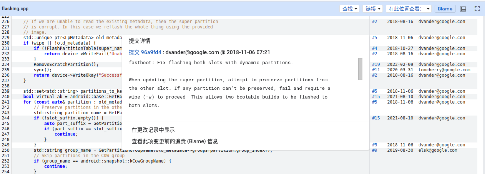

# Android Code Search

网址: https://cs.android.com/

注: 该地址访问需要使用代理

## 开始
官方公众号介绍: [Android 开源项目 (AOSP) 代码搜索工具正式发布](https://mp.weixin.qq.com/s?__biz=MzAwODY4OTk2Mg==&mid=2652051946&idx=1&sn=1f6a24be552948d83786300653f31703&chksm=808cb9afb7fb30b9fd2df2c77d7c535866ea0f18bae5f680566c05956eaa19cf4a3e187407a0&mpshare=1&scene=1&srcid=0513dUdsb2dJOFVqOYLQgOTX&sharer_sharetime=1652539269190&sharer_shareid=80e73b7d5843700d7731571a6808e97c&exportkey=AXLQsGIegQW0FPNyMIqHZHE%3D&acctmode=0&pass_ticket=RcUANwSTAoBaJi5FKwh9rUcT5c8ubF7w%2FTRm%2BX9l3geZPW9tXziiMs%2FH%2FoOWVFT3&wx_header=0#rd)  
网站界面:

## 浏览

整体分左右两部分, 分别是文件浏览和代码本身的内容.

## 源码浏览

大体可以看到分左右和底栏几部分

## 版本快速切换
在以下位置可以快速切换代码的: 分支/标记/提交(有数量限制)

## 文件内搜索
快捷键: `f` 支持正则表达式:

## 源码概览
网页的左边栏点击`概览`:

可以看到定义,可以选择按照文件呈现也可以选择按照名字排列.

## 提交历史记录

可以直接点击提交, 例如: `f248cc5`:

可以看到父提交为: `4058c5c`, 可以直接点击查看改动, 其中`Change-Id: I3e43a9a0f09b0587ec95de886705f03c1a430ef6`的[I3e43a9a0f09b0587ec95de886705f03c1a430ef6](https://android-review.googlesource.com/c/platform/system/core/+/1371397)是可以点击的, 跳转到: https://android-review.googlesource.com/ 站点查看具体的信息.

也可以查看当前文件在各个提交之间的差异. 例如当前的提交是`f248cc5`, 点击`DIFF (差异比较)` 可以查看其与上一个提交的差异:

如果想和过去的任何一个提交比较则只需要在合适的提交处点击相应的选项即可, 例如:

## 右键菜单
你可以点击右键查看一个函数的引用等信息:

## 折叠搜索结果
在查看函数的引用等信息时, 如果引用过多, 可以通过`全部收起`现在折叠结果, 展开关注项, 例如:

## 过滤测试代码
在搜索的结果中可能遇到一些测试类的代码, 例如上文的`调用层次结构`中有可能不关心的测试目录`test/vts-testcase/kernel/gki/vts_dlkm_partition_test.cpp`, 则可以选择排除, 点击`排除`:

可以看到一些测试文件已经被过滤

## 追责模式查看代码何时被添加的
例如`ReadMetadata()`方法, 它何时被加入到`system/core/fastboot/device/flashing.cpp`中的呢? 点击`Blame`进入追责模式, 然后可以看到:

可以看到此处的代码是在`96a9fd4`提交被添加进来的.

在`Blame`(追责模式)下, 底栏的提交历史会有相应的变化:

## 新增代码目录的溯源
关注一个库什么时候加入, 以及何时开始引用的, 比如`system/core/fs_mgr/liblp/`, 可以浏览到该路径, 然后在历史记录中可以看到提交, 我们找到最早的:

可以看到是`e238358`, 然后我们看它后边的那个`6590df2`, 点进去:

可以看到在`android/platform/system/core/fs_mgr/fs_mgr_dm_linear.cpp`中第一次引用了这个改动(子提交通常会引用父提交的部分内容)

## 函数调用的溯源
可以在上面的例子中看到`fs_mgr`对`liblp`的`ReadMetadata()`的调用:

我们回到`android/platform/system/core/fs_mgr`中, 直接鼠标<后退键>即可, 进入`fs_mgr_dm_linear.cpp`文件, 然后按`f`搜索一下`ReadMetdata()`:

可以定位到`ReadMetadata()`:

然后可以反过来看下还有什么地方引用了`ReadMetadata()`, 点击:`ReadMetadata()`函数名字, 底栏中:

可以看到在最新的`master`分支, 不少源码文件调用了`ReadMetadata()`, 我们打开`system/core/fastboot/device/flashing.cpp`看下:

